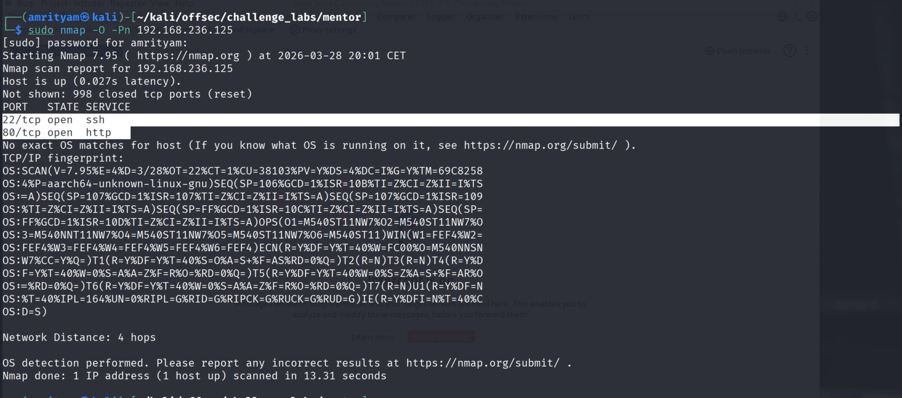

# **Mentor**

---
## **LOCAL.TXT**

## **Run Nmap to see running services**
```
sudo nmap -O -Pn 192.168.236.121
```
 

## **Run Gobuster for directory/file enumeration**
```
gobuster dir -u 192.168.236.121 -w /usr/share/seclists/Discovery/Web-Content/common.txt
```