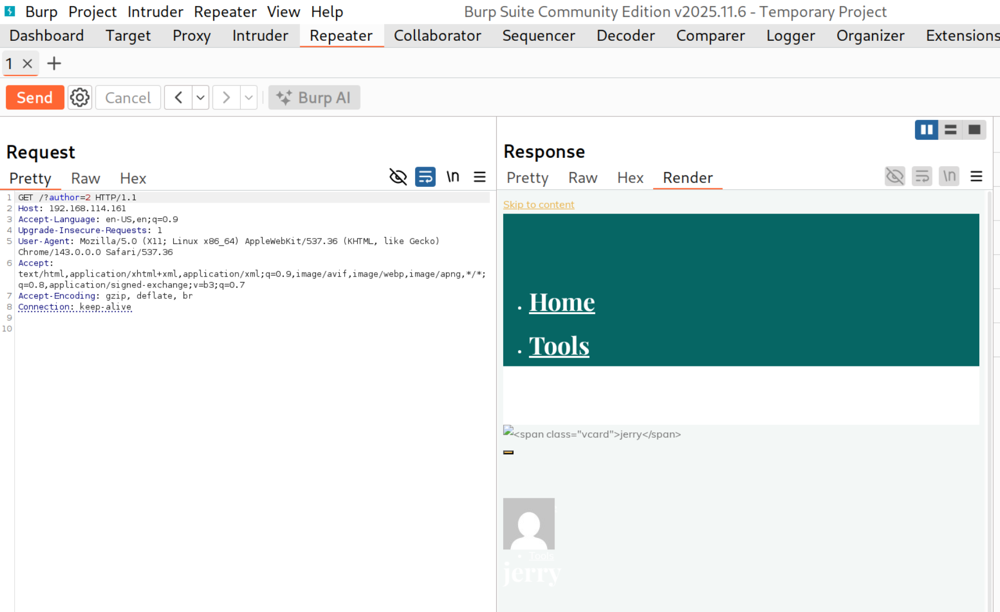
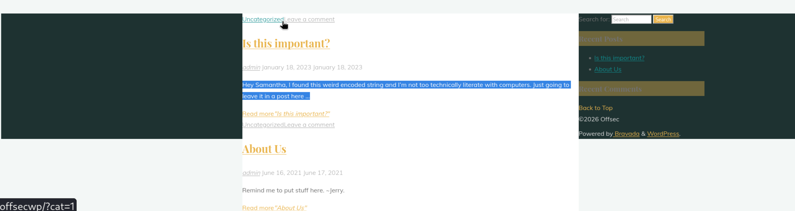
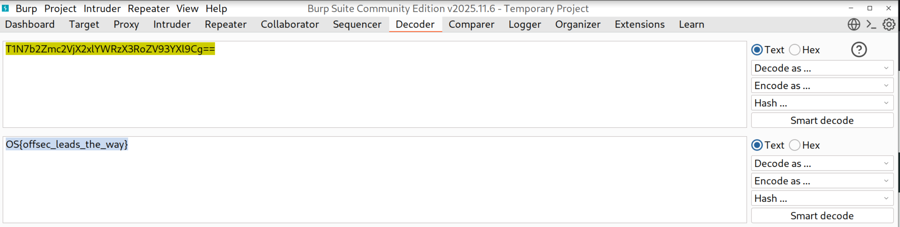

# **Introduction to Burp Suite**

### **Integrating Burp Suite with Other Browsers**
#### **Labs**
#### **Lab 1.** Using Your newly configured Firefox proxy settings, browse to http://offsecwp/burp_exercise.php and retrieve the flag. This page will only provide a flag if you are using the correct web browser for this section.

Answer - OS{browserOfChoiceIsUpToYou!}

### **Proxy and Scope**
#### **Labs**
#### **Lab 1.** If we define our target scope to only include https://www.MegaCorpOne.com, will Burp Suite's HTTP History tab display any resources or requests from http://offsecwp or other domains?

Answer - no

### **Repeater**
#### **Labs**
#### **Lab 1.** Intercept the request for http://offsecwp/?author=1 and demonstrate the ability to capture, move to Repeater, and modify GET parameters (author=) within Repeater. Who are the non-admin users present in the Wordpress site? Only one of the names is needed to receive credit for this exercise.

Answer - jerry

- Modify author=2 and click on send.

### **Comparer**
#### **Labs**
#### **Lab 1.** In Burp Suite's Comparer tool, what is one of the three possible types of changes or "differentiations" that Comparer will display and highlight?

Answer - modified or deleted or added (any one)

### **Decoder**
#### **Labs**
#### **Lab 1.** One of the strings in a post at http://offsecwp/ is an encoded base64 string. Use Burp Suite's Decoder to decode that string and provide the flag.

Answer - OS{offsec_leads_the_way}

