# **Introduction to SQL**

## **Basic SQL Syntax**

#### **Lab 1.** Use the SQL Console Sandbox to obtain the flag in the flags table in the MySQL database.

Answer - OS{MYSQLsecretFlag}
- Payload
```
select * from flags;
```
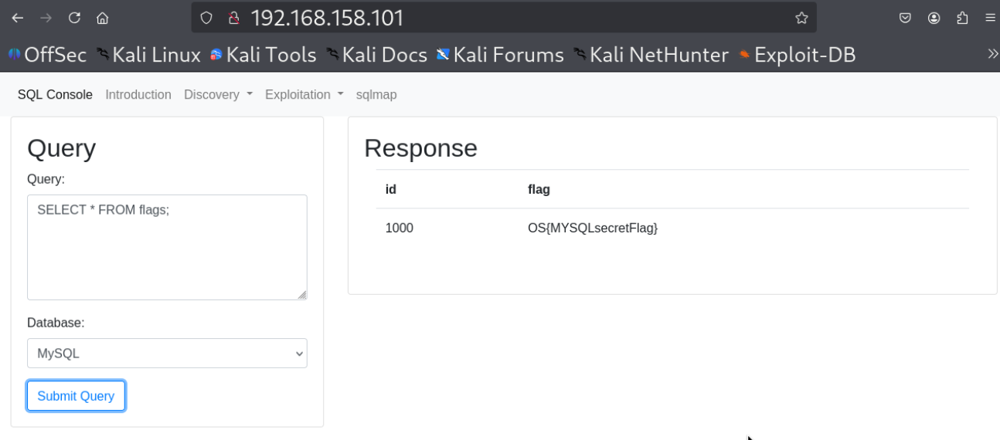


#### **Lab 2.** Use the SQL Console Sandbox to obtain the flag in the flags table in the PostgreSQL database.

Answer - OS{PostgreSQLsecretFlag}
- Payload
```
select * from flags;
```
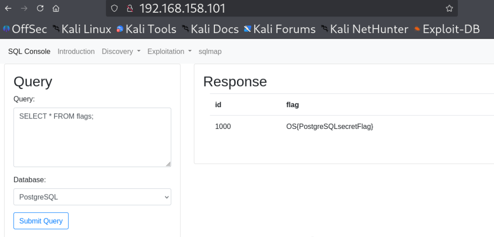


#### **Lab 3.** Use the SQL Console Sandbox to obtain the flag in the flags table in the Oracle database.

Answer - OS{OracleDBsecretFlag}
- Payload
```
SELECT * FROM sys.flags
```
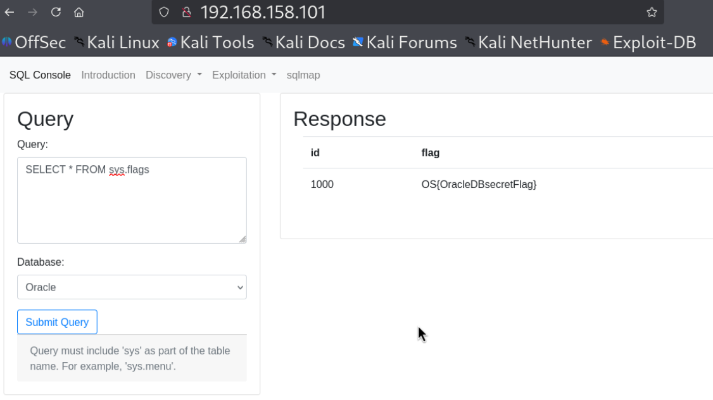


#### **Lab 4.** Use the SQL Console Sandbox to obtain the flag in the flags table in the SQL Server database.

Answer - OS{MSSQLsecretFlag}
- Payload
```
SELECT * FROM app.dbo.flags;
```


---
## **Enumerating MySQL Databases**

#### **Lab 1.** What is the version of the MySQL database used by the SQL Sandbox application?

Answer - 5.7.35
- Payload
```
select version();
```


#### **Lab 2.** Using the SQL Console, identify the secret table in the MySQL database. Select the contents of the table to obtain the flag.

Answer - OS{ooooh_a_hidden_table!}
- Payload
```
show tables;

select * from hiddenTable;
```
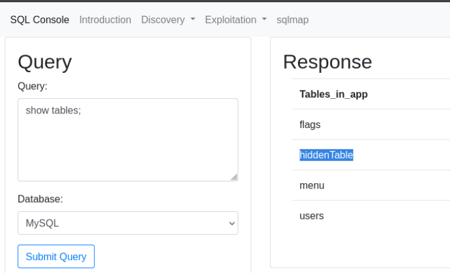

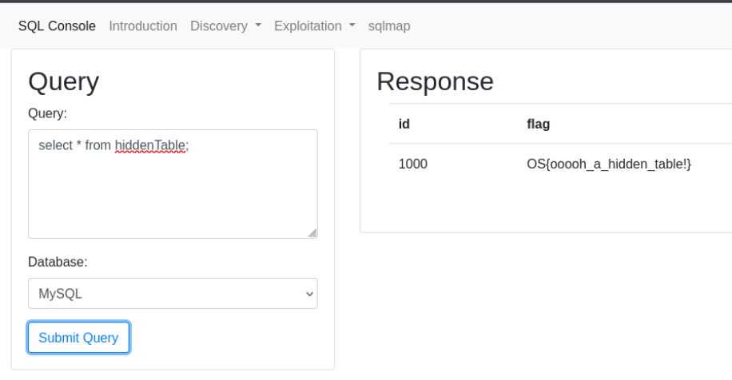

---
## **Enumerating Microsoft SQL Server Databases**

#### **Lab 1.** What is the version of the SQL Server database used by the SQL Sandbox application?

Answer - 2019 (RTM-CU11) (KB5003249) - 15.0.4138.2 (X64)
- Payload
```
select @@version;
```
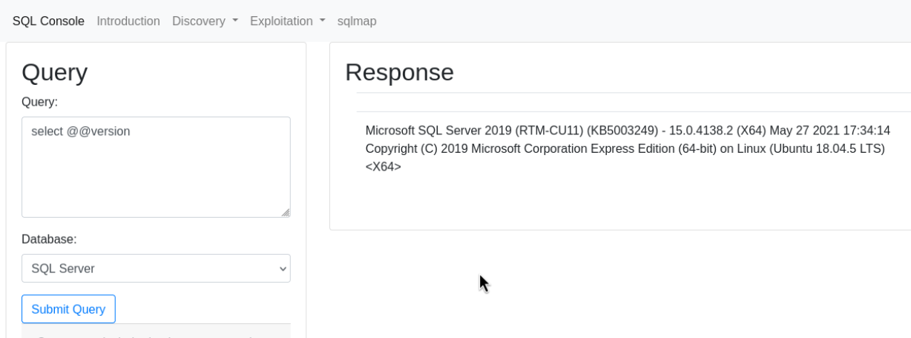


#### **Lab 2.** Using the SQL Console, identify the secret table in the SQL Server database. Select the contents of the table to obtain the flag.

Answer - OS{DontLookHere}
- Payload
```
select * from app.information_schema.tables;

select * from app.dbo.secretTable;
```
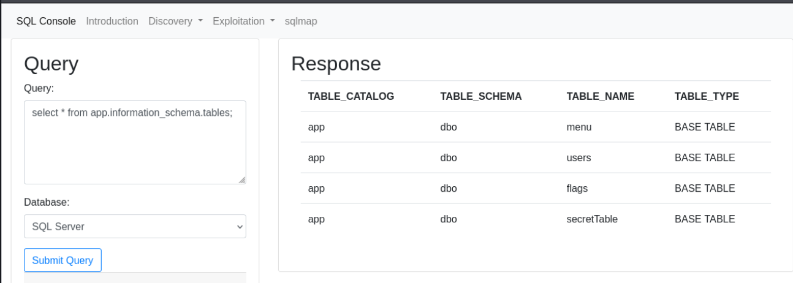


---
## **Enumerating PostgreSQL Databases**

#### **Lab 1.** What is the version of the PostgreSQL database used by the SQL Sandbox application?

Answer - 13.4
- Payload
```
select version();
```
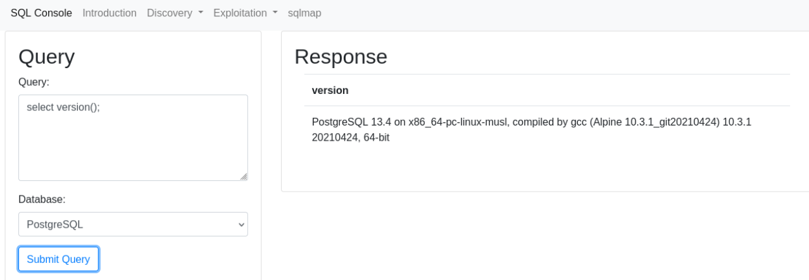


#### **Lab 2.** Using the SQL Console, identify the secret table in the PostgreSQL database. Select the contents of the table to obtain the flag.

Answer - OS{WhatIsYourClearanceLevel?}
- Payload
```
select * from app.information_schema.tables where table_schema='public';

select * from app.public.topsecret;
```
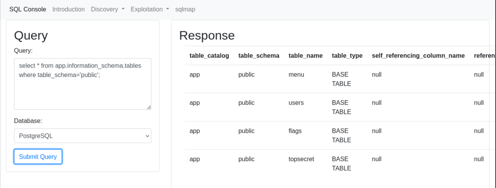


---
## **Enumerating Oracle Databases**

#### **Lab 1.** What is the version of the Oracle database used by the SQL Sandbox application?

Answer - 11.2.0.2.0
- Payload
```
select version();
```
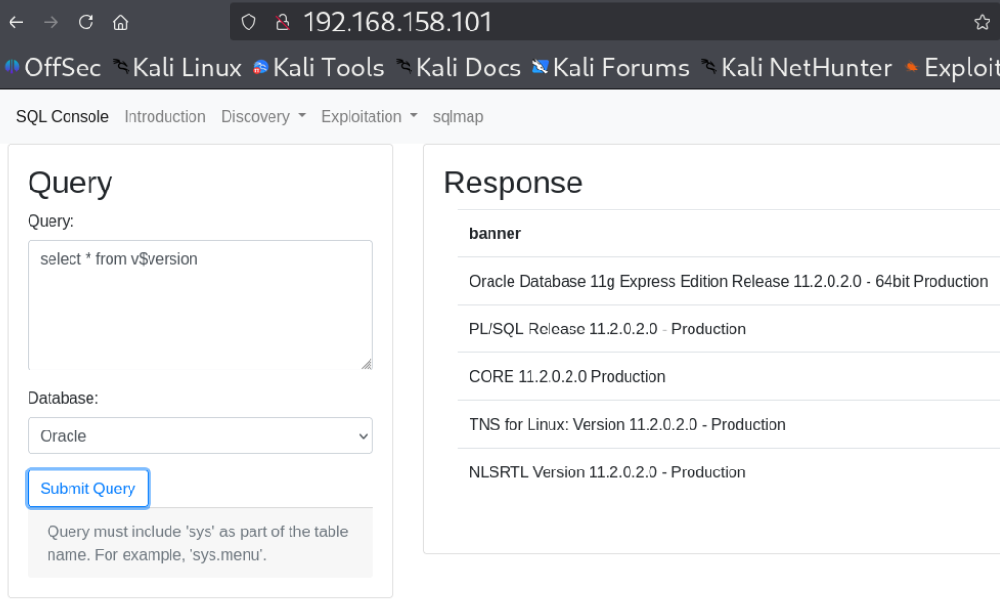


#### **Lab 2.** Using the SQL Console, identify the secret table in the Oracle database. Select the contents of the table to obtain the flag.

Answer - OS{ButItIsHiddenAndSecret!}
- Payload
```
select table_name from all_tables where owner = 'SYS' and table_name LIKE '%SECRET%'

select * from SYS.HIDDENSECRETTABLE
```
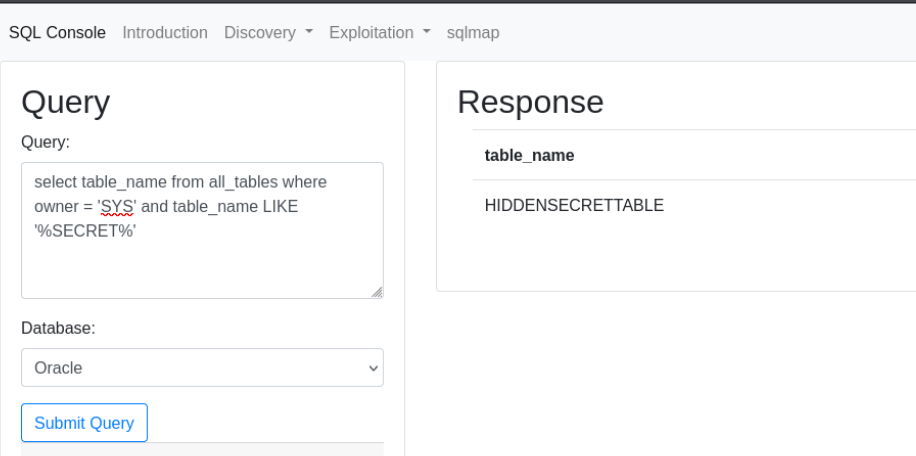

