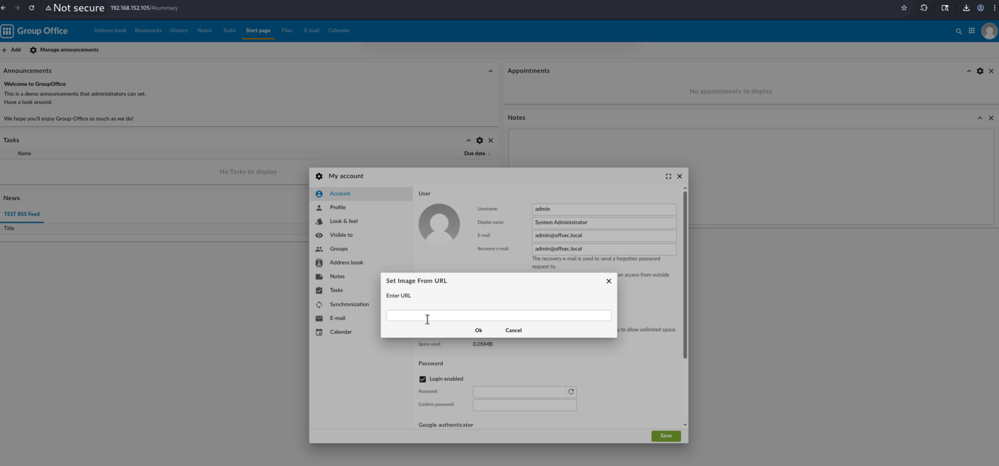
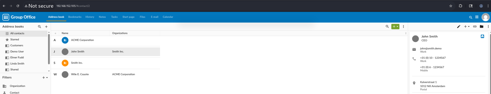
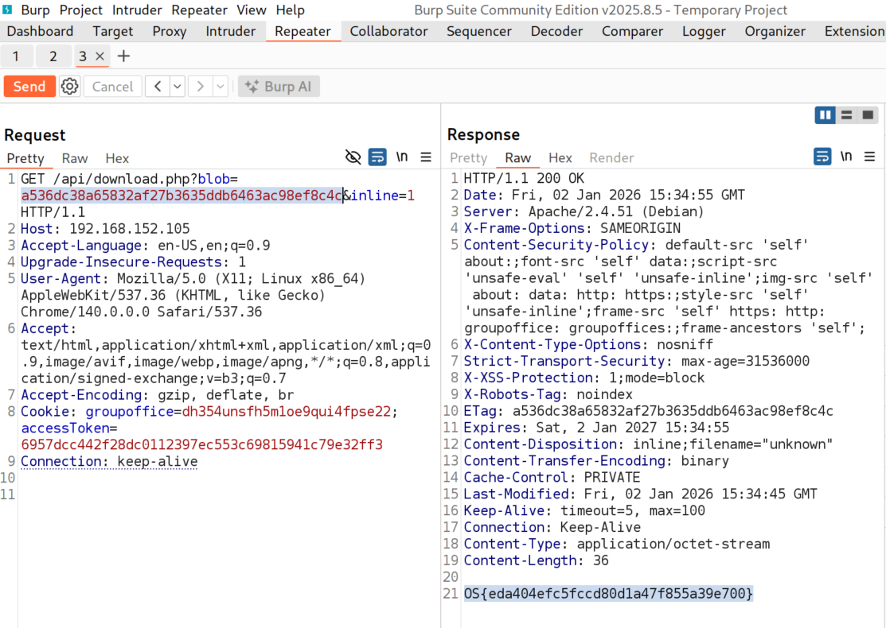
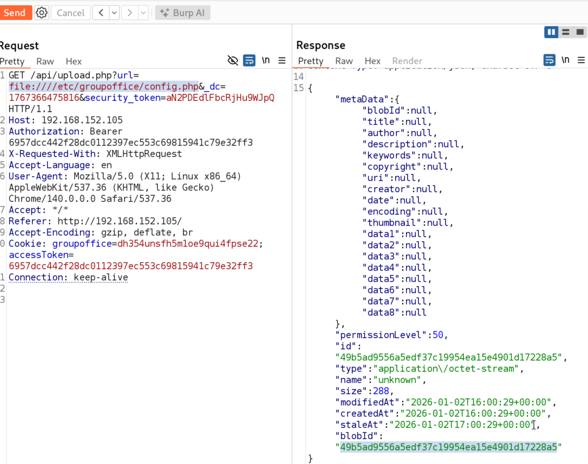

# **SSRF Case Study**

## **Group Office**

### **Discovering the SSRF Vulnerabilities**
#### **Labs**
#### **Lab 1.** Use the SSRF vulnerability in the RSS Feed functionality to access the hidden flag at http://flag/.

Answer - OS{7299df6b4bff259de04b17d3c2079c89}

- Test for SSRF payload in RSS feed feature.        


- Make sure we have Apache running.
```
sudo systemctl restart apache2
```  

- Check Apache log files with the tail command to get confirmation on SSRF.
```
sudo tail /var/log/apache2/access.log
```


- Intercept the request and modify feed parameter to http://flag/ and now you can find the flag.        


### **Exploiting the SSRF Vulnerabilities**
#### **Lab 1.** Use the techniques describe above to obtain the contents of /tmp/flag.txt.      

Answer - OS{eda404efc5fccd80d1a47f855a39e700}       

- Go to My Account -> Profile -> Change Profile Pic -> Upload from url      


- Intercept the request, update the url value to file:///tmp/flag and click on send. This will give the blobID.     


- Go to Addrerss books, click on a profile and then click on the profile picture, it will call api/download endpoint.       




- Intercept the api/download endpoint and replace the blob value obtained from previous step. CLick on send and now you can see the flag.       



#### **Lab 2.** Obtain the contents of the application's config file which can be found at /etc/groupoffice/config.php. What is the database password?

Answer - groupoffice




