# **Server-side Request Forgery**

### **Testing for SSRF**

#### **Labs**
#### **Lab 1.** Select "curl" in the Utility field. What is the user-agent on the request?

Answer - curl/7.79.1

- Make sure we have Apache running
```
sudo systemctl restart apache2
```     

- Submit Kali VM's IP address in the URL field.     
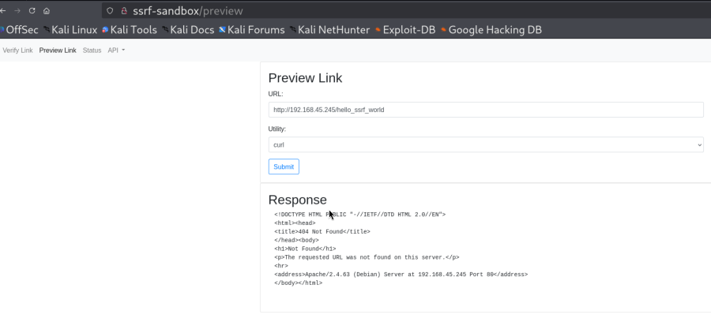

- Check Apache log files with the tail command.
```
sudo tail /var/log/apache2/access.log
```


#### **Lab 2.** Access the challenge page at /challenge and submit your Kali VM's IP address. Determine what resource the application is requesting and ensure it receives an HTTP 200 response to obtain the flag.

Answer - 


## **Exploiting SSRF**

### **Retrieving Data**
#### **Labs**

#### **Lab 1.** Using the information from the /Status page, obtain the flag from the Flags as a Service application. The flag is in the format OS{...}.

Answer - OS{throughTheLookingGlass}

- Access status endpoint but it gives access denied error.
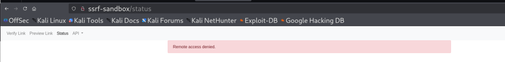

- Access status endpoint through SSRF, where you can get the IP of flags as a service application.      
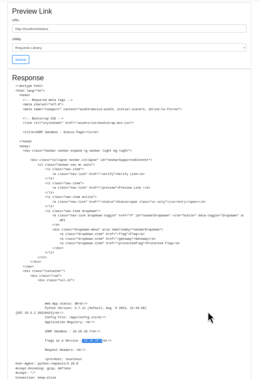

- Now access IP of flags as a service application through SSRF, which shows /flag endpoint.


- Now access /falg endpoint of flags as a service application through SSRF, which gives the flag.


#### **Lab 2.** Use the SSRF vulnerability to enumerate the services running on the host named backend and obtain the flag.

Answer - OS{throughTheLookingGlass}


### **Instance Metadata in Cloud**
#### **Labs**
#### **Lab 1.** The SSRF Sandbox has a mock metadata service available at metadata.web200.local. Access the service using the SSRF vulnerability and obtain the flag.

Answer - OS{bewareTheJabberwock}

To obtain the flag, you need to request the specific metadata path or resource that contains the flag information i.e, /latest/meta-data/flag.

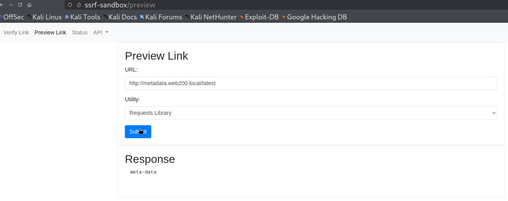

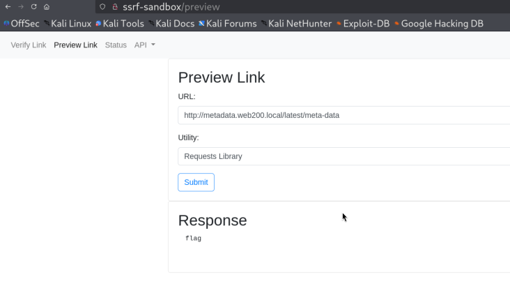

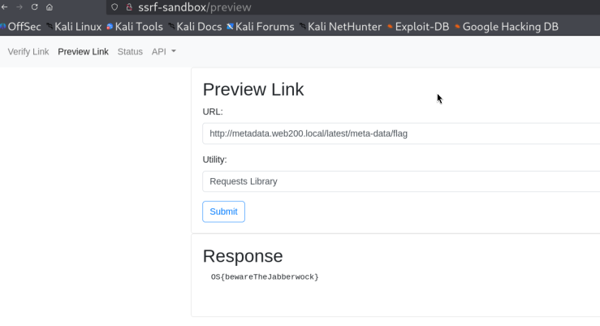


### **Bypassing Authentication in Microservices**
#### **Labs**
#### **Lab 1.** Use the SSRF vulnerability to access the API > Flag endpoint in the SSRF sandbox and obtain the flag.

Answer - OS{whatAliceFoundThere}

- Why try to access API->Flag, it gives error - "You must be authenticated to access to this endpoint."     
      

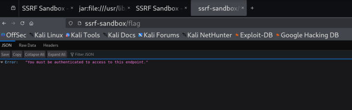


- Now try to access this endpoint through SSRF.     
Payload - ```http://localhost/flag```   


### **Alternative URL Schemes**
#### **Labs**
#### **Lab 1.** Use the SSRF vulnerability to access the API > Flag endpoint in the SSRF sandbox and obtain the flag.

Answer - OS{whatAliceFoundThere}


### **Alternative URL Schemes**
#### **Labs**
#### **Lab 1.** Use the file scheme to access the application's configuration file, then obtain the flag from the /protectedflag endpoint.

Answer - OS{theSlythyTovesDidGyreAndGymbleInTheWabe}

- Try to access the protectedflag endpoint directly, but it gives error - 'Missing password parameter'
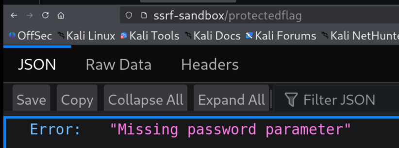

- Now try to access using password parameter using dummy value, but it gives invalid password.
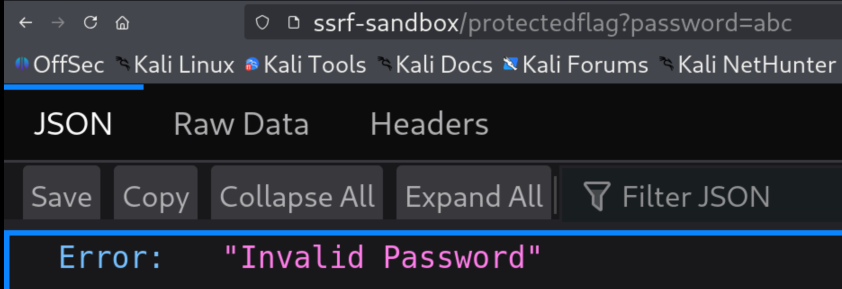

- Now we need to get the password, lets try to SSRF the status endpoint, here we can get the path of application configuration file.
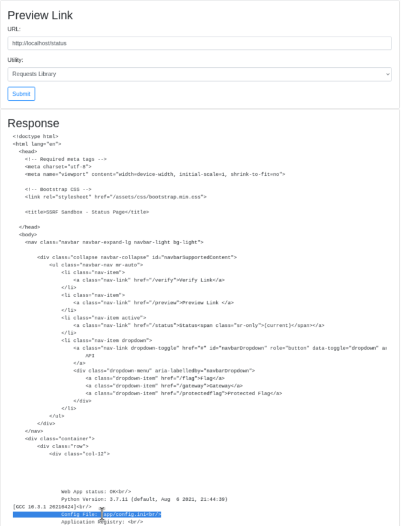

- Now try using the file scheme to access the application's configuration file.
```
file:///app/config.ini
```
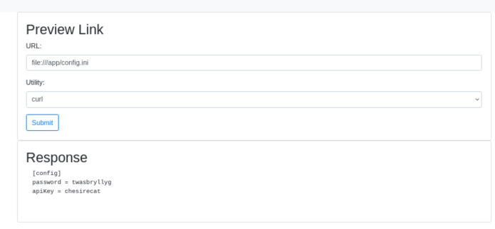

- Now we have the password available, so try to access the protected flag endpoint with password.
```
http://ssrf-sandbox/protectedflag?password=twasbryllyg
```


### **Extra Mile**
#### **Labs**
#### **Lab 1.** Use the SSRF vulnerability on the Preview Link page to enumerate the services running on the backend host. Use the Gopher protocol to send a POST request with the username "white.rabbit" and password "dontbelate" to the login endpoint to obtain a flag.

Answer - OS{followTheWhiteRabbit}

- Try to SSRF on backend endpoint. Here you can see the login endpoint is listed.
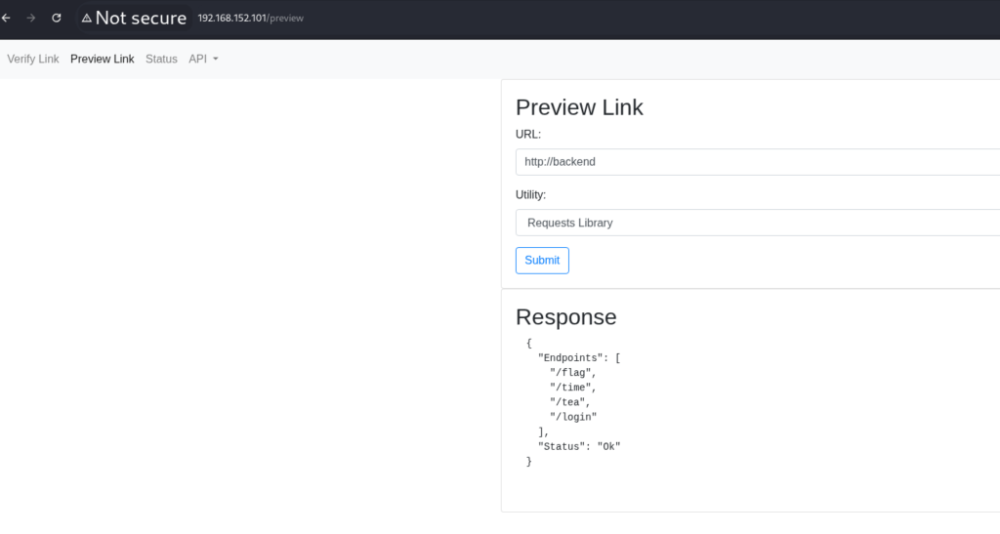

- Try using the Gopher protocol on the SSRF Sandbox for the login endpoint using the given username and password.
Payload: 

```
gopher://backend:80/_POST%20/login?username=white.rabbit&password=dontbelate%20HTTP/1.1%0a```
```

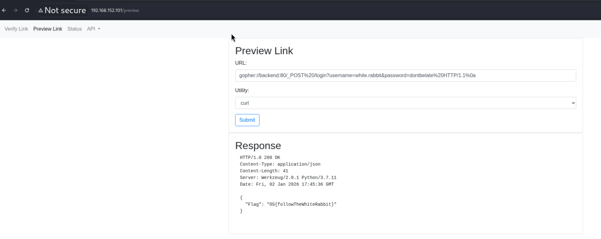

- If you decode using URL deocder:
```
gopher://backend:80/_POST /login?username=white.rabbit&password=dontbelate HTTP/1.1
```
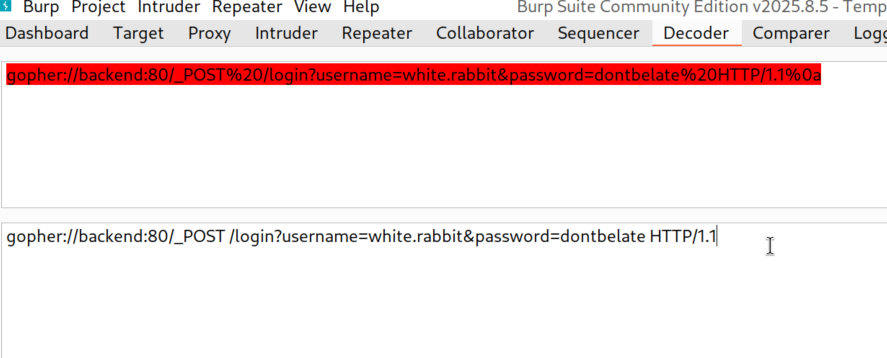

    

