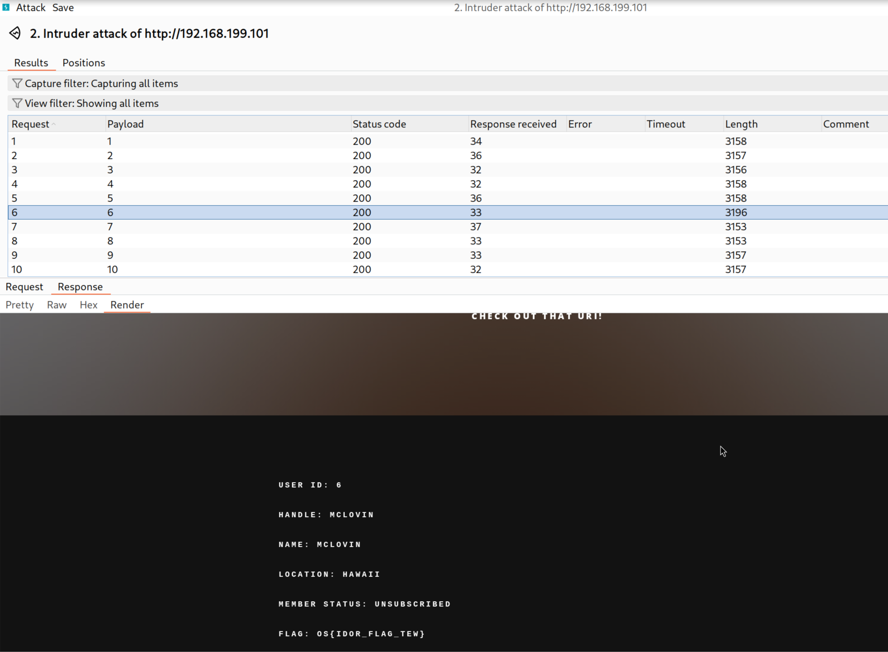
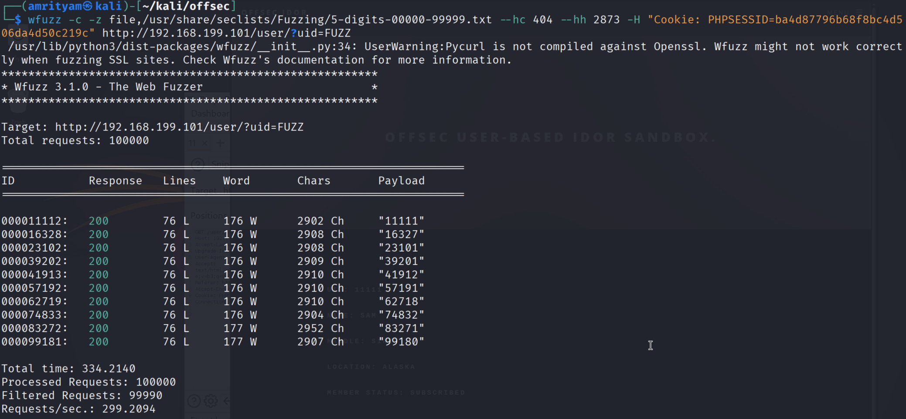
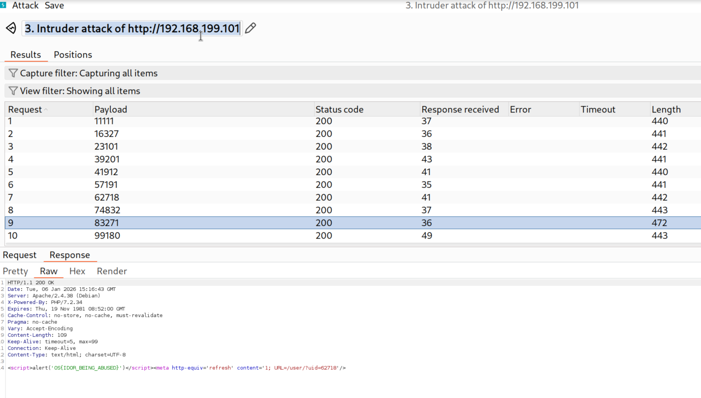
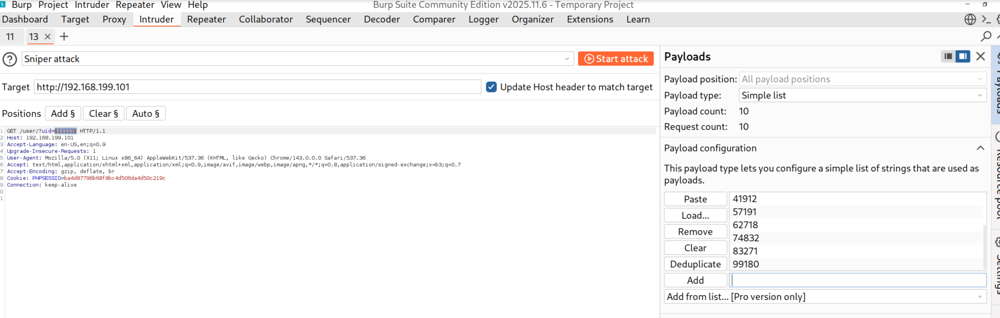

# **Insecure Direct Object Referencing (IDOR)**

### **Exploiting IDOR in the Sandbox**
#### **Exploiting Static File IDOR**
#### **Lab 1.** Exfiltrate the data from the system and retrieve the flag from the /docs/?f= URI.

Answer - OS{idor_flag_01}

- Intercept the request in Burp Suite and attack for IDOR using intruder for the 'f' parameter.


- Now you can find the flag for GET '/docs/?f=5.txt'.


#### **Exploiting ID-Based IDOR**
#### **Lab 1.** Exfiltrate what information you can from the database via ID-Based IDOR at the /customerPage/?custId= URI. One of these users will contain a flag.

Answer - OS{IDOR_FLAG_TEW}

- Intercept the request in Burp Suite and attack for IDOR using intruder for the 'custId' parameter.


- Now you can find the flag for GET '/customerPage/?custId=5.txt'.




#### **Exploiting More Complex IDOR**
#### **Lab 1.** Based upon what we have learned in this section, attempt to subscribe or unsubscribe a user with Burp Suite.

Answer - OS{decodeAndEncodeAllTheThings}

- Login with user 'Harb' and password 'RockFaceKingdom' in url - http://192.168.199.101/user/login.php.

- Intercept the request and copy cookie value PHPSESSID=ba4d87796b68f8bc4d506da4d50c219c.

- Use below curl command with authentcation header with cookie value and include a random UID value of "91191" to gather a known erroneous response size.

```
curl -s /dev/null http://192.168.199.101/user/?uid=91191 -w '%{size_download}' --header "Cookie: PHPSESSID=ba4d87796b68f8bc4d506da4d50c219c"
```

- This gives output as 2873. The response size for a logged-in session's erroneous output is 2873 bytes. We will make sure to exclude this value in our upcoming fuzzing attempts.

- Now Let's begin fuzzing with Wfuzz.
```
wfuzz -c -z file,/usr/share/seclists/Fuzzing/5-digits-00000-99999.txt --hc 404 --hh 2873 -H "Cookie: PHPSESSID=ba4d87796b68f8bc4d506da4d50c219c" http://192.168.199.101/user/?uid=FUZZ
```



- Using the UIDs obtains from previous step, point our browser to http://192.168.199.101/user/?uid=57191, using a UID collected from our fuzzing.


- Now intercept the request and click on toggle subscription button.

- Send the request to intruder to try with fuzzing uid with the uid values received from previous step.


- Attack through Intruder. Here you can find for payload 83271, it gives the flag.




#### **Extra Miles**
#### **Lab 1.** At the http://idor-sandbox:80/challenge/?uid=MQ== endpoint, modify the UID parameter values to retrieve the flag.

Answer - OS{decodeAndEncodeAllTheThings}

- In the url - http://192.168.199.101/challenge/?uid=MQ==, if you decode MQ== using base64, it gives 1. So lets try to use intruder with a list of base64 encoded values from 1 to 10.


- Intercept the request in Burp Suite and attack for IDOR using intruder for the 'uid' parameter.


- Based on the response length, Now you can find the flag for GET '?uid=Nw==' payload.


#### **Lab 2.** Exfiltrate user information from the database by iterating through possible User IDs with the /user/?uid= parameter. Repeat this until you discover a Unique Identifier corresponding to a flag.

Answer - OS{ITTERATE_THOSE_UIDS}

- Intercept the request - http://192.168.199.101/user/?uid=11111.

- Now attack for IDOR using intruder for the 'uid' parameter. The uid list was obtained in previous exercise.
```
11111                                                          
16327                                                          
23101                                                          
39201                                                          
41912                                                          
57191                                                          
62718                                                          
74832                                                          
83271                                                          
99180
```



- Attack through Intruder. Here you can find for payload 83271, it gives the flag.

