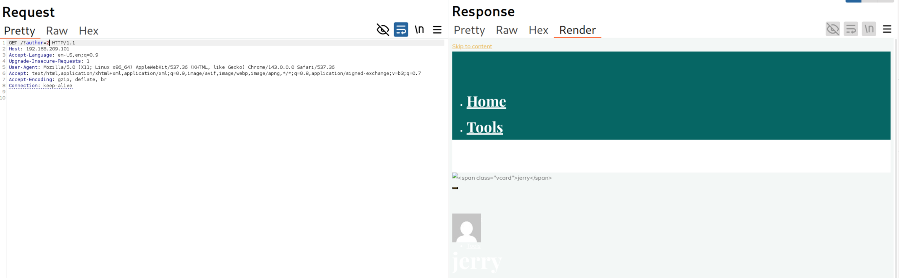

# **Tools**

## **Burp Suite**

#### **Lab 1.** Intercept the request for http://offsecwp/?author=1 and demonstrate the ability to capture, move to Repeater, and modify GET parameters (author=) within Repeater. Who are the non-admin users present in the Wordpress site? Provide only one user as an answer.

Answer - jerry

```
http://192.168.209.101/?author=2http://192.168.209.101/?author=2
```




## **Burp Suite**

#### **Lab 1.** Use another fuzzing wordlist provided by SecLists to test for Cross Site Scripting (XSS) with Wfuzz for a single parameter at the http://offsecwp/index.php?xss=FUZZ" endpoint of our lab machine. Then, browse to the URL in order to obtain this flag. Also use the --hh functionality of Wfuzz to "hush" or "suppress" erroneous responses.

Answer - OS{xss_flag}

- Payload
```
http://192.168.209.101/?xss=<script>alert(1)</script>
```
