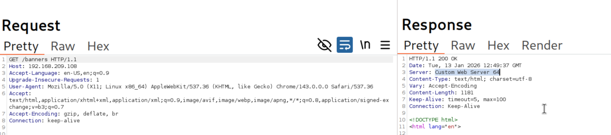
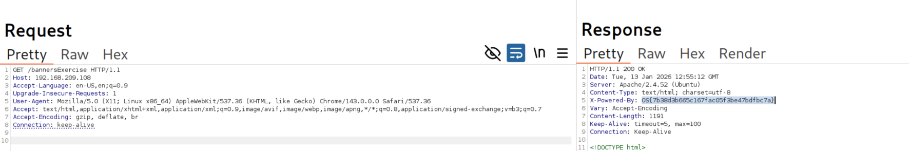
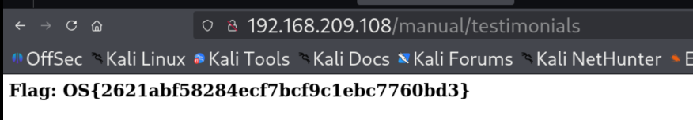
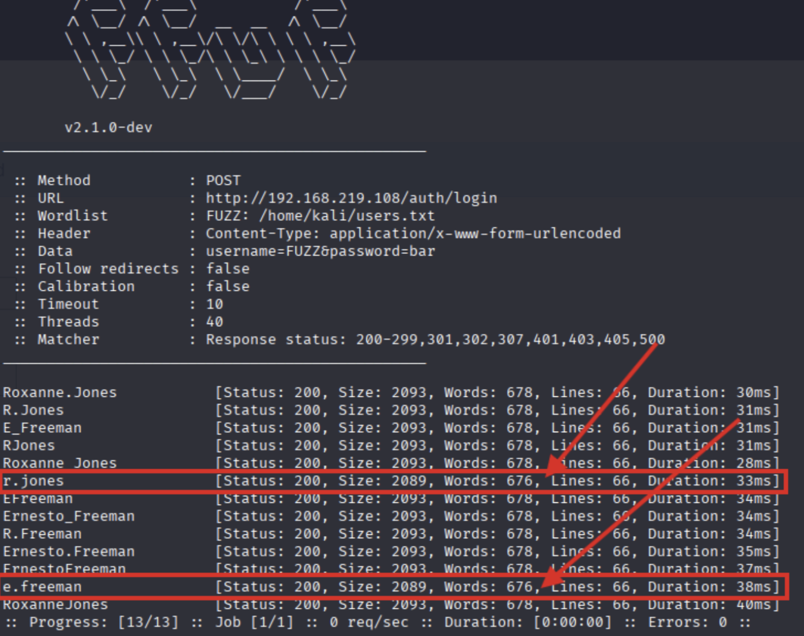
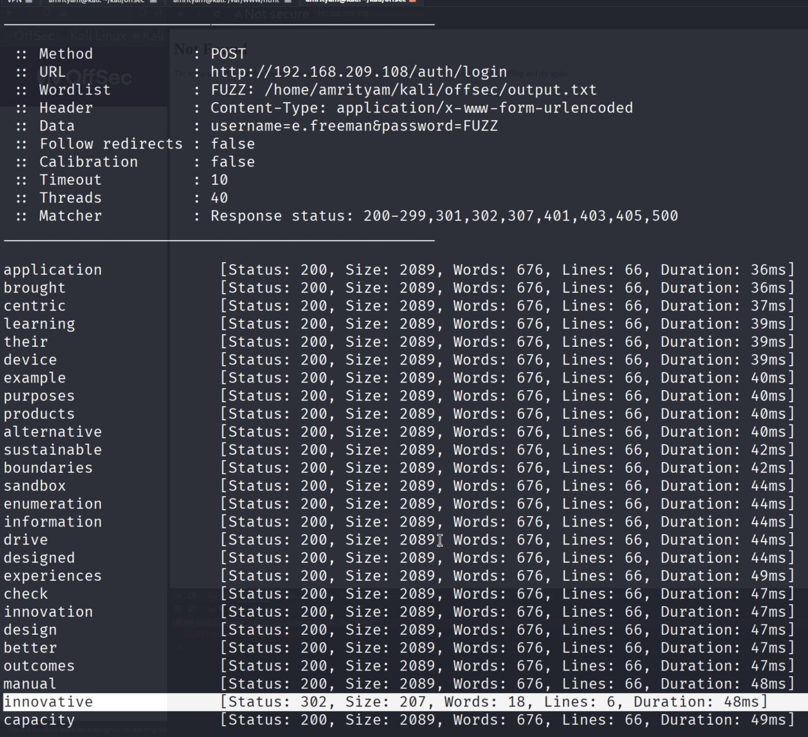

# **Web Application Enumeration Methodology**

## **Passive Information Gathering**
```
whois megacorpone.com
```
#### **Lab 1.** Who is the VP of Legal at MegaCorp One?

Answer - Mike Carlow
- Go to https://www.megacorpone.com/contact.html


## **Discovering Running Services**
```
nmap <IP>
nmap -sV <IP>
nmap -p 80 --script http-methods <IP>
```
#### **Lab 1.** Run an Nmap scan with the http-methods script on port 8080 of the Enumeration Sandbox VM. What HTTP methods are enabled?

Answer - GET HEAD

Payload:
```
nmap -p 8080 --script http-methods 192.168.209.108
```


## **Banner Grabbing**

#### **Lab 1.** Use a tool of your choice to check the response headers at http://enum-sandbox/banners. What is the value of the Server header?

Answer - Custom Web Server 64




#### **Lab 2.** Use a tool of your choice to check the response headers at http://enum-sandbox/bannersExercise and identify the flag.

Answer - OS{7b38d3b665c167fac05f3be47bdfbc7a}




## **Manual HTTP Endpoint Discovery**

#### **Lab 1.** Use a tool of your choice to check http://enum-sandbox/robots.txt and identify the flag.

Answer - OS{c28e42b0f9482200f477e2d5547edb32}


#### **Lab 2.** Explore the pages found at http://enum-sandbox/manual/ and identify the flag.

Answer - OS{2621abf58284ecf7bcf9c1ebc7760bd3}




## **Automated HTTP Endpoint Discovery**

#### **Lab 1.** Use DIRB with http://enum-sandbox/automated/ as your base URL. Explore the results in your browser to discover the flag.

Answer - OS{aff98e40e10a706e576aabfac8d00ad5}

- Payload
```
dirb http://192.168.209.108/automated
```


#### **Lab 2.** Use the information gathered from exploring the web application and the error messages from http://enum-sandbox/auth/ to discover a valid username.

Answer - r.jones

- Go to , about page - http://192.168.209.108/manual/about
here you can see two names - Roxanne Jones and Ernesto Freeman

- Add r.jones and e.freeman to the user.txt
- Payload
```
ffuf -w user.txt -u http://192.168.209.108/auth/login -X POST -d 'username=FUZZ&password=bar' -H 'Content-Type: application/x-www-form-urlencoded'
```




## **Creating Custom Wordlists**

#### **Lab 1.** Run CeWL on http://enum-sandbox with a minimum word length of 5 and covert the results to lowercase. What is the third word of the results?

Answer - enumeration

- Payload
```
cewl --write output.txt --lowercase -m 5 http://192.168.209.108/manual

cat  output.txt
```


## **Authentication Bypass**

#### **Lab 1.** Use a fuzzing tool to brute force the password for a valid username using a custom wordlist created with CeWL. Submit the password as the answer.

Answer - innovative

- Payload
```
ffuf -w output.txt -u http://192.168.209.108/auth/login -X POST -d 'username=e.freeman&password=FUZZ' -H 'Content-Type: application/x-www-form-urlencoded'
```




## **Remote Code Execution**

#### **Lab 1.** Using a shell on the server, access the contents of /home/student/flag.txt for the flag value.

Answer - OS{3840e40f2b3f9c0d2fe212b17c17c1cb}

- Bind Shell
```
netcat 192.168.209.108 9999
```

- Reverse Shell
```
netcat -vlp 9090

cat /home/student/flag.txt
```


